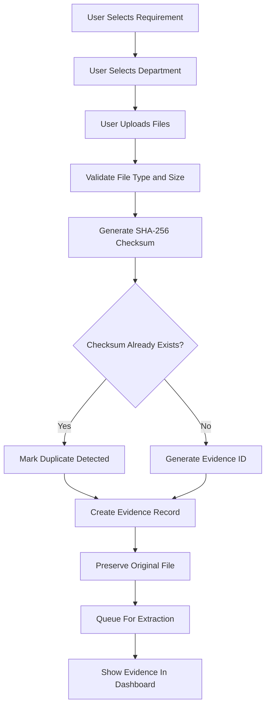

# Phase 1: Evidence Registry and Ingestion

## Goal

Allow ProofChain to accept documents and create controlled evidence records.

This phase is the first implementation base. It should make every uploaded or connected file traceable before extraction, mapping, or validation begins.

---

# 1. What We Build

Phase 1 builds:

- Manual file or folder upload
- Evidence ID generation
- File checksum generation
- Evidence metadata storage
- Department and requirement tagging
- Duplicate file detection
- Ingestion source tracking
- Evidence status lifecycle
- Basic evidence listing for dashboard/database visibility

---

# 2. Supported Inputs

The first version should support:

- PDF event reports
- PDF approval documents
- XLSX attendance sheets
- CSV attendance sheets
- Image evidence records, optional

Unsupported files should not break ingestion. They should be marked as unsupported with a clear reason.

---

# 3. Ingestion Sources

## 3.1 Manual Upload

Manual upload is the required first source.

The user should be able to upload:

- Individual files
- Multiple selected files
- Folder batches, if supported by the frontend

Manual uploads create evidence records with:

```text
source_type = manual_upload
```

## 3.2 Google Drive Connector

Google Drive is optional for Phase 1 implementation but must be represented in the data model.

Drive records should use:

```text
source_type = google_drive
```

The connector should be added after manual upload is working.

---

# 4. Evidence ID Format

Recommended format:

```text
EVD-{DEPARTMENT}-{YEAR}-{SEQUENCE}
```

Example:

```text
EVD-CSE-2026-00001
```

Rules:

- Department code should use uppercase short code.
- Year should use the ending year of the academic year.
- Sequence should be zero-padded.
- Evidence IDs should never be reused.

---

# 5. Evidence Record

Every uploaded file becomes an evidence record.

## 5.1 Required Fields

```json
{
  "evidence_id": "EVD-CSE-2026-00001",
  "original_filename": "AI_Workshop_Report.pdf",
  "stored_filename": "EVD-CSE-2026-00001.pdf",
  "department": "CSE",
  "academic_year": "2025-2026",
  "requirement_id": "C3.2.1",
  "source_type": "manual_upload",
  "source_reference": null,
  "mime_type": "application/pdf",
  "file_size_bytes": 284392,
  "checksum_sha256": "sha256-value",
  "status": "registered",
  "duplicate_of": null,
  "uploaded_by": "user-id",
  "uploaded_at": "2026-07-23T18:30:00Z"
}
```

## 5.2 Optional Google Drive Fields

```json
{
  "source_type": "google_drive",
  "source_reference": "https://drive.google.com/file/d/example",
  "drive_file_id": "google-drive-file-id",
  "drive_folder_id": "google-drive-folder-id",
  "drive_modified_at": "2026-07-23T18:10:00Z"
}
```

---

# 6. Evidence Status Lifecycle

Phase 1 only needs the first few statuses, but the full lifecycle should be reserved.

```text
uploaded
-> registered
-> duplicate_detected
-> unsupported
-> queued_for_extraction
-> extracted
-> mapped
-> under_verification
-> requires_correction
-> verified
-> approved
-> included_in_package
```

## Phase 1 Required Statuses

- uploaded
- registered
- duplicate_detected
- unsupported
- queued_for_extraction

---

# 7. Duplicate Detection

Duplicate detection should use SHA-256 checksum.

## Behavior

If a new file has the same checksum as an existing evidence record:

- Create a new evidence record or log the attempted upload, depending on policy.
- Set `duplicate_of` to the original evidence ID.
- Set status to `duplicate_detected`.
- Do not delete either file automatically.
- Show duplicate warning in the evidence list.

## Example

```json
{
  "evidence_id": "EVD-CSE-2026-00009",
  "status": "duplicate_detected",
  "duplicate_of": "EVD-CSE-2026-00001"
}
```

---

# 8. File Storage Rules

Original files must be preserved.

Recommended storage path:

```text
storage/evidence/{academic_year}/{department}/{evidence_id}/{original_filename}
```

Example:

```text
storage/evidence/2025-2026/CSE/EVD-CSE-2026-00001/AI_Workshop_Report.pdf
```

Rules:

- Do not modify original files.
- Do not overwrite uploaded files.
- Store new versions separately.
- Keep checksum for every version.

---

# 9. Validation Rules During Ingestion

Run lightweight checks only:

- Is file type supported?
- Is file empty?
- Is file size acceptable?
- Does checksum match an existing file?
- Is department provided?
- Is academic year provided?
- Is requirement selected or inferable?

Heavy document extraction and integrity validation happen in later phases.

---

# 10. Ingestion Workflow



---

# 11. API Contract Draft

These endpoints define the Phase 1 backend surface.

## 11.1 Upload Evidence

```text
POST /api/evidence/upload
```

Request:

```text
multipart/form-data
files[]
department
academic_year
requirement_id
source_type
```

Response:

```json
{
  "batch_id": "ING-2026-00001",
  "uploaded_count": 6,
  "registered_count": 5,
  "duplicate_count": 1,
  "unsupported_count": 0,
  "evidence": []
}
```

## 11.2 List Evidence

```text
GET /api/evidence
```

Filters:

- department
- academic_year
- requirement_id
- status
- source_type

## 11.3 Get Evidence Detail

```text
GET /api/evidence/{evidence_id}
```

## 11.4 Get Ingestion Batch

```text
GET /api/ingestion-batches/{batch_id}
```

---

# 12. Dashboard Visibility

After Phase 1, the dashboard or admin view should show:

- Total evidence uploaded
- Registered evidence count
- Duplicate evidence count
- Unsupported file count
- Files queued for extraction
- Evidence by department
- Evidence by requirement
- Latest ingestion batches

---

# 13. Audit Logging

Every ingestion action should create an audit log.

Events:

- evidence.upload_requested
- evidence.registered
- evidence.duplicate_detected
- evidence.unsupported
- evidence.queued_for_extraction
- ingestion.batch_completed

Example:

```json
{
  "actor_type": "user",
  "actor_id": "USR-001",
  "action": "evidence.registered",
  "entity_type": "evidence",
  "entity_id": "EVD-CSE-2026-00001",
  "timestamp": "2026-07-23T18:30:00Z"
}
```

---

# 14. Done Criteria

Phase 1 is complete when:

- Files can be uploaded.
- Every file receives a unique evidence ID.
- Duplicate files are detected.
- Original file metadata is preserved.
- Evidence records appear in the dashboard or database.
- Unsupported files are handled safely.
- Ingestion source is tracked.
- Upload batch summary is generated.
- Files are queued for extraction.
- Ingestion actions are audit logged.

---

# 15. Implementation Notes For Next Build

Recommended implementation order:

1. Create department and requirement seed data.
2. Create evidence schema.
3. Create ingestion batch schema.
4. Implement file upload handler.
5. Implement checksum utility.
6. Implement evidence ID generator.
7. Implement duplicate detection.
8. Store original files.
9. Save evidence records.
10. Add evidence list view.
11. Add audit logs.
12. Queue files for extraction.

