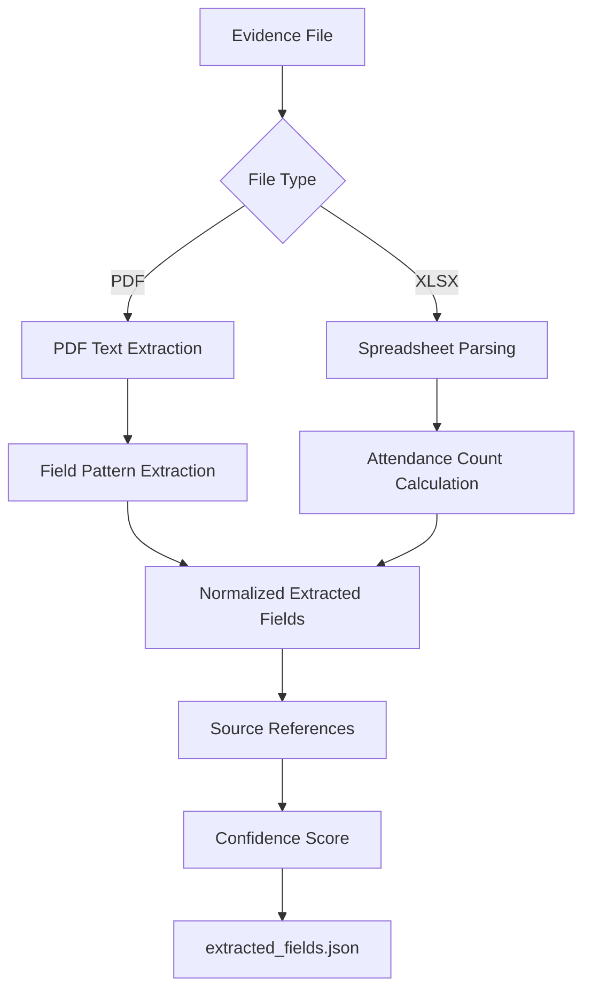

# Phase 3: Document Extraction

## Goal

Extract structured information from sample evidence files.

The extraction layer converts PDFs and spreadsheets into normalized JSON records that can later be used by mapping, rule validation, gap detection, and dashboard metrics.

---

# 1. What We Built

Phase 3 now has a working sample extraction utility:

```text
tools/extract_sample_documents.py
```

It reads generated sample evidence and produces:

```text
sample_data/extraction_outputs/extracted_fields.json
```

---

# 2. Supported Document Types

The current extractor supports:

- Event report PDFs
- Approval document PDFs
- Certificate PDFs
- Attendance XLSX spreadsheets

---

# 3. Extracted Fields

## 3.1 Event Report PDFs

Extracted fields:

- Event ID
- Accreditation requirement
- Mapped requirement
- Department
- Academic year
- Event title
- Event date
- Coordinator
- Reported participant count

## 3.2 Approval Document PDFs

Extracted fields:

- Approval status
- Signature presence
- Department
- Academic year
- Event title
- Event date

## 3.3 Certificate PDFs

Extracted fields:

- Student name, when available
- Department
- Event title
- Event date
- Academic year

## 3.4 Attendance Spreadsheets

Extracted fields:

- Event ID
- Event title
- Department
- Attendance row count
- Unique student count
- Duplicate roll numbers

---

# 4. Output Contract

Each extracted document produces a JSON record:

```json
{
  "file": "sample_data/departments/CSE/event_reports/EVT-CSE-001_CSE_C3.2.1_event_report.pdf",
  "document_type": "event_report",
  "extracted_fields": {
    "event_id": "EVT-CSE-001",
    "event_title": "Agentic AI Industry Workshop",
    "event_date": "2025-09-11",
    "department": "CSE",
    "academic_year": "2025-2026",
    "coordinator": "Dr. Kavya Srinivasan",
    "reported_participant_count": 120
  },
  "source_references": {
    "event_date": "page 1",
    "reported_participant_count": "page 1"
  },
  "confidence": 0.9
}
```

---

# 5. Extraction Workflow



---

# 6. Source References

The MVP extractor stores simple source references:

- PDFs use page references.
- Attendance sheets use sheet and cell range references.

Example:

```json
{
  "unique_student_count": "Attendance!B4:B111"
}
```

---

# 7. Confidence Score

Current confidence scoring is simple:

- 0.97 for structured attendance spreadsheets
- 0.90 for PDFs where expected fields are found
- 0.45 for documents where few or no fields are detected

Later versions should calculate confidence per field.

---

# 8. Done Criteria Status

| Done Criteria | Status |
|---|---|
| PDF values can be extracted | Complete |
| Spreadsheet participant counts can be calculated | Complete |
| Extracted values are stored | Complete |
| Extraction results include source references | Complete |

---

# 9. Next Improvements

Future extraction upgrades:

- Field-level confidence
- OCR fallback for scanned PDFs
- Better table extraction
- Signature region detection
- Photo metadata extraction
- LLM-assisted document type classification
- Human review for low-confidence fields

