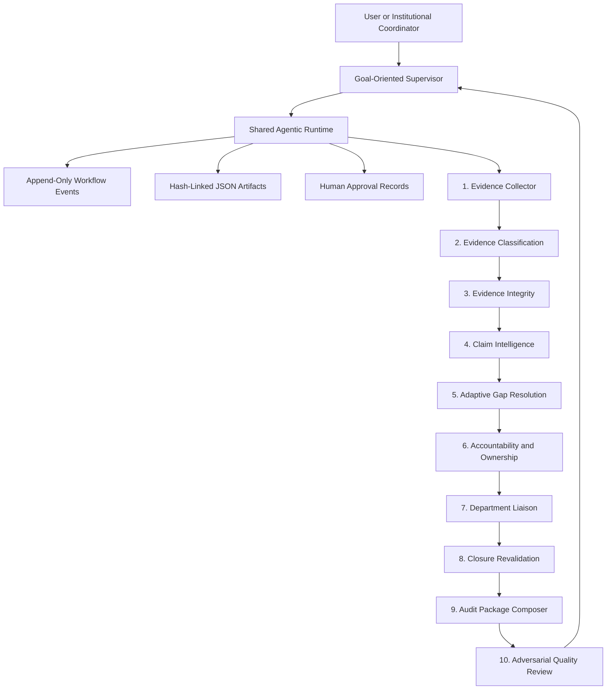
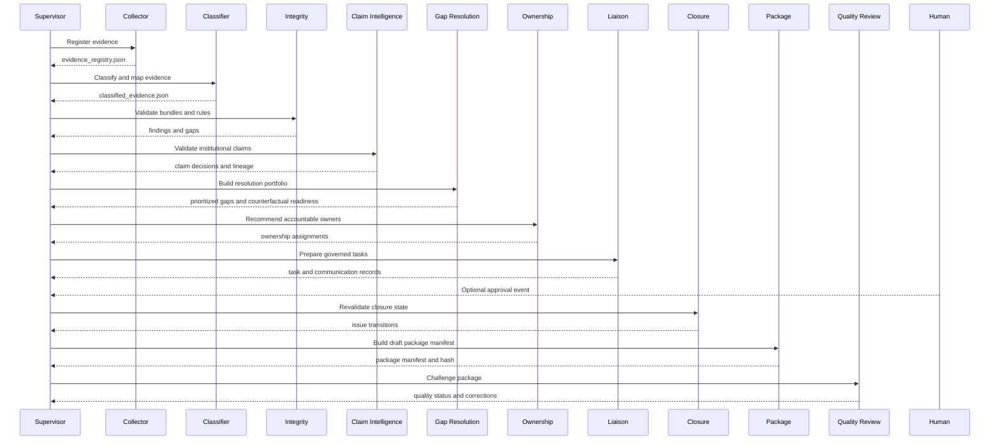

# ProofChain Advanced Ten-Agent Architecture and Workflow

## Document Purpose

This document is the complete current architecture record for ProofChain after
the governed agentic upgrades. It explains what has been implemented, how the
agents work, how the workflow moves from evidence discovery to adversarial audit
review, what artifacts are produced, and how to validate the project.

The current implementation is an advanced JSON-backed governed MVP. It has the
core architecture needed for an agentic accreditation evidence lifecycle:

```text
Discover -> Understand -> Verify -> Defend -> Plan -> Assign
-> Coordinate -> Revalidate -> Package -> Challenge -> Human Approval
```

## Current Validation Status

Latest validated run:

```text
RUN-20260724-3A4C
```

Validation commands executed:

```powershell
python -m compileall -q proofchain tests
python -m ruff check proofchain tests
python -m pytest -q
python -m proofchain.cli validate-run RUN-20260724-3A4C
```

Validation results:

- Python compilation: passed.
- Ruff linting: passed.
- Test suite: `63 passed`.
- Run validation: `valid: true`.
- Only warning: Windows could not write optional `.pytest_cache`; this does not
  affect correctness.

Fresh sample run outcome:

- Run status: `blocked`.
- Evidence registered: `15`.
- Documents classified: `15`.
- Integrity findings: `9`.
- Integrity gaps: `5`.
- Claims assessed: `1`.
- Resolution gaps: `9`.
- Ownership assignments: `9`.
- Canonical issues: `9`.
- Blocking canonical issues: `7`.
- Resolution tasks: `9`.
- Closure checks: `9`.
- Resolved issues: `0`.
- Package eligible evidence: `14`.
- Quality required corrections: `2`.

The blocked status is correct. The sample dataset intentionally contains missing
documents, duplicate evidence, unsigned evidence, duplicate attendance rows, and
participant-count contradictions. ProofChain correctly refuses to mark weak
evidence as audit-ready.

## Governance Hardening Implemented in This Revision

This revision moves the ten-agent implementation beyond a report-only MVP and
adds executable governance controls around the existing pipeline.

Implemented runtime modifications:

- Added seven deny-by-default, machine-readable policies under
  `proofchain/policies/`.
- Added `governance_policy_manifest.json`, including every policy checksum and
  one run-level policy fingerprint.
- Added `model_governance_manifest.json`. All ten current agents are explicitly
  recorded as deterministic, external model calls are `0`, unconfigured model
  use is blocked, and generated content is not evidence.
- Added auditable supervisor scheduling snapshots in `supervisor_rounds.json`.
  The scheduler records runnable, waiting, blocked-dependency, circular,
  coordination, terminal, and round-budget decisions.
- Corrected dependency semantics so a goal blocked or failed upstream does not
  make its dependent goal runnable.
- Strengthened `workflow_events.jsonl` with sequence numbers, previous event
  IDs, previous event hashes, per-event hashes, locked append, and chain
  validation.
- Added an explicit `RunCompleted` event and event-chain validation to
  `validate-run`.
- Replaced inferred approver authorization with an explicit actor, role, scope,
  and permission policy. Unknown actors are denied.
- Added recommendation hashes and access-decision audit records to approval
  processing.
- Added event-derived `resolution_task_state.json`. Approved task activation and
  evidence-submission responses update this projection without modifying the
  original synchronized liaison artifact.
- Added deterministic prompt-injection pattern scanning over extracted text and
  table cells. Findings are quarantined as data, recorded by evidence ID and
  content hash, and never executed.
- Expanded Agent 9 to create `audit_package_internal.zip` with stable ZIP
  timestamps, a JSON manifest, claim-evidence index, unresolved-issue
  disclosure, CSV evidence index, and eligible source evidence.
- Added bundle checksum verification. The bundle remains an internal draft and
  cannot authorize its own external submission.
- Added `observability_metrics.json` with component counts, checkpoint count,
  event count, goal outcomes, issue counts, coordination state, quality
  corrections, duration, and policy fingerprint.
- Added repository protocols for event, coordination, and artifact adapters so
  PostgreSQL and object-storage implementations can be added without changing
  agent contracts.

Reference-run governance results:

```json
{
  "run_id": "RUN-20260724-3A4C",
  "status": "blocked",
  "primary_agents": 10,
  "specialist_modules": 43,
  "checkpoints": 10,
  "workflow_events": 22,
  "supervisor_rounds": 1,
  "canonical_issues": 9,
  "unresolved_issues": 9,
  "quality_required_corrections": 2,
  "external_model_calls": 0,
  "run_validation": true
}
```

Production boundary:

- PostgreSQL, Alembic, Qdrant, Neo4j, and object-storage adapters are not
  configured in this repository.
- Email, Telegram, calendar, and enterprise identity integrations are not
  enabled.
- The generated ZIP is an internal review package. External submission still
  requires a separately governed human transition.
- Malware scanning still requires an external scanner adapter.

These boundaries are deliberate and are now represented in policy and
model-governance artifacts instead of being implicit assumptions.

## High-Level Architecture



The Supervisor creates a top-level institutional goal, decomposes it into agent
goals, activates each agent in dependency order, registers stage checkpoints,
processes coordination messages, and emits the final policy decision.

## Agentic Runtime

Every primary agent uses the same governed runtime:

- Receives a typed goal.
- Persists `goal.json`.
- Creates a plan in `plans.json`.
- Executes approved tools or specialist modules.
- Records tool calls in `coordination/tool_calls.jsonl`.
- Writes observations to `observations.jsonl`.
- Writes reflections to `reflections.jsonl`.
- Stores working memory in `working_memory.json`.
- Emits a completion decision.
- Publishes peer messages when another agent must act.

Important files:

- `proofchain/agentic/base_goal_agent.py`
- `proofchain/agentic/goal_manager.py`
- `proofchain/agentic/planner.py`
- `proofchain/agentic/tool_router.py`
- `proofchain/agentic/memory.py`
- `proofchain/agentic/policies.py`
- `proofchain/repositories/json_coordination_repository.py`

## Primary Agents vs Specialist Modules

ProofChain now explicitly distinguishes true goal agents from deterministic
specialist modules.

Primary goal agents have:

- Independent goal.
- Plan.
- State.
- Tool routing.
- Observations.
- Reflections.
- Completion decision.
- Replanning capability through the shared runtime.

Specialist modules are deterministic components inside a parent goal agent. They
do not count as independent agents.

The registry is written to:

```text
outputs/runs/{run_id}/component_registry.json
```

For `RUN-20260724-3A4C`:

- Primary goal agents: `10`.
- Deterministic specialist modules: `43`.

## Ten-Agent Pipeline

### Agent 1: Evidence Collector

Purpose:

- Discover files from approved source directories.
- Register supported evidence files.
- Assign stable evidence IDs.
- Compute SHA-256 checksums.
- Track source path, department, academic year, file type, and version metadata.
- Detect duplicate content.

Main implementation:

- `proofchain/agents/evidence_collector.py`
- `proofchain/services/file_scanner.py`
- `proofchain/services/checksum_service.py`
- `proofchain/services/duplicate_detector.py`
- `proofchain/repositories/json_evidence_repository.py`

Main output:

- `evidence_registry.json`

Governance boundary:

- The collector never interprets claims and never approves evidence quality.

### Agent 2: Evidence Classification

Purpose:

- Extract text and spreadsheet fields.
- Classify document type.
- Map evidence to accreditation requirements.
- Build event-level field consensus.
- Mark unresolved or low-confidence records for review.

Main implementation:

- `proofchain/agents/evidence_classification.py`
- `proofchain/services/document_extractor.py`
- `proofchain/services/document_classifier.py`
- `proofchain/services/field_extractor.py`
- `proofchain/services/requirement_mapper.py`
- `proofchain/services/spreadsheet_extractor.py`

Main output:

- `classified_evidence.json`

Governance boundary:

- Extracted document text is treated as untrusted data and cannot change agent
  instructions, permissions, or tool policy.

### Agent 3: Evidence Integrity

Purpose:

- Bundle evidence by event and requirement.
- Apply deterministic validation rules.
- Detect missing documents, duplicate files, missing signatures, duplicate
  attendance rows, and count mismatches.
- Produce findings, evidence gaps, integrity summaries, and blocking state.

Main implementation:

- `proofchain/agents/evidence_integrity.py`
- `proofchain/services/evidence_bundler.py`
- `proofchain/services/rule_engine.py`
- `proofchain/rules/*.yaml`

Main outputs:

- `integrity_result.json`
- `integrity_findings.json`
- `evidence_gaps.json`
- `integrity_summary.json`

Governance boundary:

- Integrity findings do not automatically close, waive, or approve evidence.

### Agent 4: Claim Intelligence and Defensibility

Purpose:

- Decompose institutional claims into atomic claims.
- Retrieve supporting and contradictory evidence.
- Investigate contradictions.
- Evaluate sufficiency by coverage, authority, consistency, and independence.
- Produce defensible claim wording and claim lineage.

Specialist modules:

- `claim_decomposer`
- `evidence_retriever`
- `contradiction_investigator`
- `sufficiency_evaluator`
- `defensibility_judge`

Main implementation:

- `proofchain/agents/claim_validation/agent.py`
- `proofchain/schemas/claims.py`

Main output:

- `claim_decisions.json`

Validated sample behavior:

- Original claim: `CSE conducted 12 industry programmes involving 120 students during 2025-2026 for C3.2.1.`
- Status: `partially_supported`.
- Confidence: `0.822`.
- Defensible wording: evidence currently supports one industry programme and
  108 unique students.

Governance boundary:

- The agent recommends defensible wording but does not rewrite institutional
  claims automatically.

### Agent 5: Adaptive Gap Resolution and Readiness Planning

Purpose:

- Normalize integrity findings, evidence gaps, and claim failures.
- Generate resolution strategies.
- Identify closure evidence.
- Simulate readiness.
- Prioritize the minimal resolution set.

Specialist modules:

- `gap_detector`
- `root_cause_analyzer`
- `resolution_planner`
- `readiness_simulator`
- `gap_prioritizer`

Main implementation:

- `proofchain/agents/gap_resolution/agent.py`
- `proofchain/schemas/gaps.py`

Main output:

- `gap_resolution_portfolio.json`

Counterfactual readiness model:

```json
{
  "current_verified_readiness": 73.0,
  "projected_readiness": 96.0,
  "projection_type": "counterfactual",
  "projection_confidence": 0.78,
  "not_an_approval": true
}
```

Governance boundary:

- Projected readiness is only a scenario. It is not current readiness and not an
  approval.

### Agent 6: Accountability, Ownership, and Escalation

Purpose:

- Resolve provenance and responsible roles.
- Match gaps to owners.
- Balance workload.
- Recommend primary owner, backup owner, and independent approver.
- Produce escalation plans.
- Validate permissions and privacy scope.

Specialist modules:

- `provenance_resolver`
- `responsibility_matcher`
- `workload_balancer`
- `escalation_planner`
- `assignment_validator`

Main implementation:

- `proofchain/agents/ownership/agent.py`
- `proofchain/schemas/ownership.py`
- `config/organisation_roles.yaml`

Main output:

- `ownership_assignments.json`

Governance boundary:

- The agent recommends assignments but does not assign work or send messages.

### Agent 7: Governed Department Liaison and Task Execution

Purpose:

- Convert governed recommendations into auditable task decisions.
- Draft least-disclosure communications.
- Block unapproved task activation.
- Initialize response intake and SLA monitoring.

Specialist modules:

- `communication_scope`
- `task_composer`
- `message_drafter`
- `approval_gate`
- `dispatcher`
- `response_intake`
- `sla_escalation`

Main implementation:

- `proofchain/agents/liaison/agent.py`
- `proofchain/schemas/tasks.py`
- `proofchain/schemas/communications.py`

Main outputs:

- `resolution_tasks_detailed.json`
- `communications.json`

Validated sample behavior:

- Created `9` task decisions.
- Activated `0` tasks because no approval event existed.
- Recorded warnings such as `Task has no approval event`.

Governance boundary:

- No task is activated without approval.
- No message is sent without policy approval.
- Communication uses minimum necessary disclosure fields.

### Agent 8: Evidence Closure and Continuous Revalidation

Purpose:

- Evaluate whether submitted closure evidence can close issues.
- Run targeted revalidation state checks.
- Produce formal issue transitions.
- Keep unresolved issues open when evidence is missing or still defective.

Specialist modules:

- `submission_intake`
- `evidence_difference`
- `targeted_revalidation`
- `closure_verifier`
- `regression_detector`
- `issue_state_decider`

Main implementation:

- `proofchain/agents/closure/agent.py`
- `proofchain/schemas/closure.py`
- `proofchain/schemas/issues.py`

Main output:

- `closure_revalidation_report.json`

Closure requirements:

- Closure evidence must be submitted.
- Evidence must be registered.
- Classification must complete.
- Relevant integrity rules must pass.
- Affected claims must be revalidated.
- Closure policy must be satisfied.

Validated sample behavior:

- Closure checks: `9`.
- Resolved issues: `0`.
- Blocking issues still unresolved: `7`.

Governance boundary:

- Uploading or referencing evidence alone never closes an issue.

### Agent 9: Audit Package Composer and Evidence Manifest

Purpose:

- Build a reproducible draft audit package manifest.
- Select eligible evidence.
- Exclude duplicate or ineligible evidence with explanation.
- Build claim-to-evidence lineage.
- Disclose unresolved warnings.
- Create a stable package hash.

Specialist modules:

- `scope_resolver`
- `evidence_selector`
- `evidence_orderer`
- `narrative_composer`
- `index_builder`
- `privacy_redactor`
- `package_assembler`
- `package_integrity`

Main implementation:

- `proofchain/agents/audit_package/agent.py`
- `proofchain/schemas/packages.py`

Main output:

- `audit_package_manifest.json`

Validated sample behavior:

- Package status: `DRAFT_READY_FOR_QUALITY_REVIEW`.
- Eligible evidence: `14`.
- Unresolved warning disclosures included.

Governance boundary:

- Generated narrative is not treated as evidence.
- Original evidence is never altered.
- The package is a draft and is not submitted externally.

### Agent 10: Adversarial Quality Review and Audit Simulation

Purpose:

- Challenge the draft package before human approval.
- Test required package components.
- Resolve references.
- Challenge each material claim.
- Detect reuse and omission risks.
- Simulate reviewer friction.
- Score audit failure risk.
- Return the package for correction if necessary.

Specialist modules:

- `completeness_reviewer`
- `reference_reviewer`
- `claim_challenger`
- `reuse_auditor`
- `policy_reviewer`
- `reviewer_simulator`
- `risk_scorer`

Main implementation:

- `proofchain/agents/quality_review/agent.py`
- `proofchain/schemas/quality.py`

Main output:

- `quality_review_report.json`

Validated sample behavior:

- Quality status: `return_for_correction`.
- Required corrections: `2`.
- Audit failure risk: `0.44`.
- Claim challenges: `1`.

Governance boundary:

- The quality agent cannot approve external submission.
- It cannot modify the package directly.
- It cannot suppress adverse findings.

## Canonical Issue Model

ProofChain now separates raw findings from actionable issues.

Raw inputs:

- Integrity findings.
- Evidence gaps.
- Claim failures.
- Resolution gaps.

Canonical output:

- `canonical_issues.json`

Canonical issue fields:

- `issue_id`
- `issue_type`
- `root_entity_type`
- `root_entity_id`
- `source_finding_ids`
- `source_gap_ids`
- `source_claim_ids`
- `affected_requirement_ids`
- `affected_evidence_ids`
- `severity`
- `blocking`
- `status`
- `resolution_task_ids`

Lifecycle states:

- `OPEN`
- `PLANNED`
- `ASSIGNED_PENDING_APPROVAL`
- `ASSIGNED`
- `IN_PROGRESS`
- `EVIDENCE_SUBMITTED`
- `UNDER_REVALIDATION`
- `RESOLVED`
- `REJECTED`
- `REOPENED`
- `WAIVED_WITH_APPROVAL`
- `CANCELLED`

Sample issue counts:

```json
{
  "raw_findings": 9,
  "claim_failures": 1,
  "raw_gaps": 5,
  "canonical_issues": 9,
  "blocking_canonical_issues": 7,
  "resolution_tasks": 9
}
```

This prevents misleading double-counting between findings, gaps, claim failures,
and tasks.

## Human Approval and State Transitions

Human approvals are append-only governance records. They do not mutate original
evidence or original decisions.

Approval flow:

```text
Approval command
-> target validation
-> explicit actor, role, scope, and permission checks
-> recommendation hash capture
-> ApprovalRecorded event
-> StateTransitionAuthorized event
-> permitted transition made available to downstream agents
-> derived task-state activation without changing the original task artifact
```

Approval states:

- `REQUESTED`
- `APPROVED`
- `REJECTED`
- `EXPIRED`
- `SUPERSEDED`
- `REVOKED`
- `EXECUTED`

Supported approval types:

- `claim_revision`
- `gap_resolution_strategy`
- `ownership_assignment`
- `escalation`

Command:

```powershell
python -m proofchain.cli approve-decision RUN-ID `
  --type ownership_assignment `
  --target ASSIGNMENT-ID `
  --decision approved `
  --decided-by iqac-chair `
  --reason "Authorized department coordinator."
```

The approver must exist in `proofchain/policies/approval_policy.yaml`. The
default effect is deny. Approval activation is materialized separately:

```powershell
python -m proofchain.cli activate-resolution-task RUN-ID --gap RGAP-0001
```

The derived state is written to `resolution_task_state.json`. This preserves the
checksum of `resolution_tasks_detailed.json` and keeps the ten-stage
synchronization chain valid.

## Synchronization and Hash Chain

Every stage writes a checkpoint into:

```text
outputs/runs/{run_id}/synchronization.json
```

The current ten synchronized stages are:

1. `collection`
2. `classification`
3. `integrity`
4. `claim_intelligence`
5. `adaptive_gap_resolution`
6. `accountability_ownership`
7. `department_liaison`
8. `closure_revalidation`
9. `audit_package_composer`
10. `adversarial_quality_review`

Each checkpoint records:

- Run ID.
- Stage name.
- Stage status.
- Input snapshot hash.
- Output artifact path.
- Output SHA-256.
- Upstream SHA-256.
- Started and completed timestamps.

`validate-run` checks artifact presence, checksum correctness, and upstream hash
continuity.

## Event-Sourced MVP Layer

ProofChain now writes an append-only workflow event stream:

```text
outputs/runs/{run_id}/workflow_events.jsonl
```

Implemented event examples:

- `RunStarted`
- `RunCompleted`
- `ApprovalRecorded`
- `StateTransitionAuthorized`
- `TaskActivated`
- `ApprovalRequested`
- `ClosureRejected`
- `GapResolved`
- `PackageGenerated`
- `QualityReviewFailed`
- `QualityReviewPassed`
- `RunResumed`
- `EvidenceSubmitted`
- `TaskResponseRecorded`
- `PromptInjectionFindingRecorded`

Current persistence model:

- JSON files are the operational MVP state and audit exports.
- `workflow_events.jsonl` provides replayable, sequence-numbered event history.
- Each new event links the previous event ID and event hash.
- Locked append and `validate-run` detect malformed, reordered, or altered events.
- PostgreSQL remains the recommended production persistence adapter for
  concurrency, long-running workflows, dashboards, and external integrations.

## Security and Privacy Artifacts

The current run writes baseline security governance artifacts:

- `security_scan_result.json`
- `prompt_injection_findings.json`
- `pii_redaction_manifest.json`
- `access_decision_log.jsonl`

Current implemented controls:

- Unsupported files are skipped.
- Source path is constrained to approved input scope.
- Extracted text is treated as untrusted data.
- Instruction-like extracted content is scanned, quarantined, and recorded by
  evidence ID and content hash.
- Spreadsheet content is extracted, not executed.
- Approver access decisions are written to `access_decision_log.jsonl`.
- Original evidence remains unchanged.
- Package redaction is represented as a manifest policy, not destructive editing.

Recommended next expansion:

- Malware scanning.
- Formula-injection tests.
- Cross-department access tests.
- Broader prompt-injection and tool-argument test corpora.
- PII redaction policy enforcement.
- Tool argument injection checks.

## Main Output Directory

Each run writes artifacts under:

```text
outputs/runs/{run_id}/
```

Important files:

- `run_manifest.json`
- `pipeline_result.json`
- `pipeline_trace.jsonl`
- `synchronization.json`
- `goal_graph.json`
- `final_decision.json`
- `evidence_registry.json`
- `classified_evidence.json`
- `integrity_result.json`
- `integrity_findings.json`
- `evidence_gaps.json`
- `claim_decisions.json`
- `gap_resolution_portfolio.json`
- `ownership_assignments.json`
- `canonical_issues.json`
- `resolution_tasks_detailed.json`
- `resolution_task_state.json` after governed task activation
- `communications.json`
- `closure_revalidation_report.json`
- `audit_package_manifest.json`
- `audit_package_internal.zip`
- `quality_review_report.json`
- `claim_resolution_ownership_report.json`
- `workflow_events.jsonl`
- `component_registry.json`
- `governance_policy_manifest.json`
- `model_governance_manifest.json`
- `supervisor_rounds.json`
- `observability_metrics.json`

Each primary agent also writes:

- `goal.json`
- `plans.json`
- `observations.jsonl`
- `reflections.jsonl`
- `working_memory.json`
- `completion_decision.json`

## CLI Commands

Run the full ten-agent pipeline:

```powershell
python -m proofchain.cli run-pipeline `
  --source sample_data/departments `
  --departments CSE `
  --academic-year 2025-2026 `
  --requirements C3.2.1 C5.1.3 C6.3.2 C7.1.1 C1.2.1 `
  --objective "Determine whether the CSE evidence and institutional claims are audit-ready." `
  --claim "CSE conducted 12 industry programmes involving 120 students during 2025-2026 for C3.2.1."
```

Validate a run:

```powershell
python -m proofchain.cli validate-run RUN-YYYYMMDD-XXXX
```

Record approval:

```powershell
python -m proofchain.cli approve-decision RUN-ID `
  --type ownership_assignment `
  --target ASSIGNMENT-ID `
  --decision approved `
  --decided-by iqac-chair `
  --reason "Authorized department coordinator."
```

Lifecycle commands:

```powershell
python -m proofchain.cli activate-resolution-task RUN-ID --gap RGAP-0001
python -m proofchain.cli record-task-response RUN-ID --task TASK-RGAP-0001 --response evidence_submitted --artifact PATH
python -m proofchain.cli revalidate-closure RUN-ID --task TASK-RGAP-0001
python -m proofchain.cli build-audit-package RUN-ID --requirement C3.2.1
python -m proofchain.cli review-audit-package RUN-ID --package PKG-RUN-ID
python -m proofchain.cli resume-run RUN-ID
python -m proofchain.cli replay-run RUN-ID
```

Run validation checks:

```powershell
python -m compileall -q proofchain tests
python -m ruff check proofchain tests
python -m pytest -q
```

## End-to-End Workflow



## Current Governance Boundaries

ProofChain intentionally does not:

- Rewrite original claims automatically.
- Modify original evidence.
- Close gaps because a user uploaded a file.
- Activate tasks without approval.
- Send external communications without policy approval.
- Hide unresolved warnings from packages.
- Approve its own audit package.
- Submit evidence externally.
- Treat generated narrative as evidence.

These boundaries are central to accreditation governance.

## What Is Implemented vs Recommended Next

Implemented now:

- Ten primary goal agents.
- Forty-three deterministic specialist modules.
- Canonical issue model.
- Counterfactual readiness projection.
- Approval event and transition authorization records.
- Resolution task decisions.
- Closure checks and issue transitions.
- Reproducible package manifest.
- Deterministic internal ZIP package with JSON and CSV indexes.
- Adversarial quality review.
- Tamper-evident, append-only workflow events.
- Hash-linked ten-stage synchronization chain.
- Component registry.
- Machine-readable governance policies and run policy fingerprint.
- Explicit model-governance manifest.
- Deny-by-default approval identities, permissions, and scopes.
- Immutable task drafts plus event-derived task state.
- Prompt-injection quarantine scanning.
- Supervisor scheduling and deadlock audit records.
- Run observability metrics.
- CLI lifecycle commands.
- Sixty-three workflow, governance, integration, and unit tests.

Recommended next production expansion:

- PostgreSQL operational store.
- API server endpoints.
- Real notification integrations.
- Enterprise identity provider integration.
- Dual approval policy.
- True partial re-execution by artifact fingerprint.
- Process resume with waiting states.
- Malware scanning and a larger adversarial security corpus.
- Redacted derivative package files.
- PDF/XLSX presentation derivatives for the internal ZIP package.
- Dashboard over goals, events, issues, and tasks.

## How to Verify the Current Architecture

From the project root:

```powershell
cd C:\SideQuest\ProofChain
python -m compileall -q proofchain tests
python -m ruff check proofchain tests
python -m pytest -q
python -m proofchain.cli validate-run RUN-20260724-3A4C
```

Then inspect:

```text
outputs/runs/RUN-20260724-3A4C/pipeline_result.json
outputs/runs/RUN-20260724-3A4C/claim_resolution_ownership_report.json
outputs/runs/RUN-20260724-3A4C/canonical_issues.json
outputs/runs/RUN-20260724-3A4C/resolution_tasks_detailed.json
outputs/runs/RUN-20260724-3A4C/closure_revalidation_report.json
outputs/runs/RUN-20260724-3A4C/audit_package_manifest.json
outputs/runs/RUN-20260724-3A4C/audit_package_internal.zip
outputs/runs/RUN-20260724-3A4C/quality_review_report.json
outputs/runs/RUN-20260724-3A4C/component_registry.json
outputs/runs/RUN-20260724-3A4C/governance_policy_manifest.json
outputs/runs/RUN-20260724-3A4C/model_governance_manifest.json
outputs/runs/RUN-20260724-3A4C/supervisor_rounds.json
outputs/runs/RUN-20260724-3A4C/observability_metrics.json
outputs/runs/RUN-20260724-3A4C/synchronization.json
```

Expected high-level result:

```json
{
  "status": "blocked",
  "total_canonical_issues": 9,
  "total_resolution_tasks": 9,
  "total_closure_checks": 9,
  "resolved_issues": 0,
  "package_eligible_evidence": 14,
  "quality_required_corrections": 2
}
```

This confirms the intended behavior: ProofChain plans, reasons, coordinates,
preserves traceability, creates governed tasks and package drafts, challenges
its own output, and refuses to falsely approve defective evidence.
