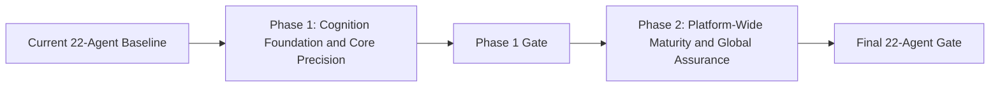

# ProofChain Agentic Maturity and Precision Upgrade
## Two-Phase Implementation Plan

## Document Purpose

This document converts the seven implementation stages in
`ProofChain_Advanced_Agentic_Maturity_Modifications_and_Precision_Upgrade_Plan.md`
into two controlled delivery phases.

The split is designed for the current ProofChain baseline:

```text
Primary goal agents: 22
Deterministic specialist modules: 132
Fingerprint governance policies: 16
Current automated tests: 80
Validated reference run: RUN-20260727-0F23
```

No new primary agents are introduced. The work deepens the reasoning, transparency,
coordination, and completion discipline of the existing 22 agents.

---

## 1. Review Outcome

The source maturity plan is directionally correct and addresses genuine runtime gaps.

ProofChain already has:

- Typed goals
- Explicit plans
- Tool allowlists
- Structured observations
- Reflections
- Bounded retries and replans
- Coordination messages
- Working memory
- Completion decisions
- Event sourcing and recovery
- Security, identity, tenancy, submission, evaluation, and retrieval governance

The current runtime does not yet provide these as first-class, consistently enforced
contracts:

- Goal interpretation before planning
- Input validation as a planning gate
- Structured context snapshots
- Explicit competing hypotheses
- Advanced plans with fallback, risk, and branching
- Plan criticism before execution
- Information-gain action selection
- Normalized observations for every tool
- Structured measurable reflection
- Decomposed uncertainty
- Peer-request acceptance conditions
- Shared contradiction resolution
- Machine-readable completion proof
- Standard decision explanation
- Governed validated-case memory
- Agentic behavior release metrics

The implementation should therefore deepen the existing runtime instead of adding
more agents.

---

## 2. Two-Phase Boundary



### Phase 1

Build the shared advanced cognition layer and apply it completely to Agents 1–10.

### Phase 2

Apply the mature runtime to Agents 11–22, upgrade the supervisors, add global
contradiction and replanning controls, activate validated experience memory, and
enforce agentic release gates.

This boundary is intentional:

- Agents 1–10 provide the richest evidence and contradiction scenarios for proving
  the cognition runtime.
- Agents 11–22 contain higher-impact operational actions and should migrate only after
  completion proofs, uncertainty policy, and plan criticism are stable.
- The current runtime remains available through a compatibility profile during Phase 1.
- Phase 2 removes the compatibility profile only after all 22 agent contracts pass.

---

# Phase 1
## Cognition Foundation and Core Agent Precision

## 3. Phase 1 Objective

Create one reusable cognition lifecycle and make Agents 1–10 use it end to end.

Target lifecycle:

```text
Receive Goal
    -> Interpret Goal
    -> Validate Inputs
    -> Build Context
    -> Form Hypotheses
    -> Create Advanced Plan
    -> Critique Plan
    -> Select Action
    -> Execute Allowlisted Tool
    -> Normalize Observation
    -> Reflect
    -> Calibrate Uncertainty
    -> Continue, Retry, Replan, Ask Peer, Ask Human, Block, or Complete
    -> Prove Completion
    -> Explain Decision
```

---

## 4. Phase 1 Scope

### 4.1 New Runtime Schemas

Create:

```text
proofchain/schemas/interpreted_goal.py
proofchain/schemas/input_validation.py
proofchain/schemas/agent_context.py
proofchain/schemas/hypotheses.py
proofchain/schemas/advanced_plans.py
proofchain/schemas/plan_critiques.py
proofchain/schemas/uncertainty.py
proofchain/schemas/peer_contracts.py
proofchain/schemas/contradiction_resolution.py
proofchain/schemas/completion_proofs.py
proofchain/schemas/decision_explanations.py
proofchain/schemas/validated_cases.py
proofchain/schemas/agentic_evaluation.py
```

Required contracts:

- `InterpretedGoal`
- `InputValidationResult`
- `AgentContext`
- `Hypothesis`
- `AdvancedAgentPlan`
- `AdvancedPlanStep`
- `PlanCritique`
- `UncertaintyAssessment`
- `AgentRequest`
- `ContradictionResolution`
- `CompletionProof`
- `DecisionExplanation`
- `ValidatedCase`
- `AgenticScorecard`

Every schema receives:

- Explicit `schema_version`
- Stable identifiers
- Run and goal linkage
- Pydantic validation
- JSON serialization tests

### 4.2 Shared Cognition Runtime

Create:

```text
proofchain/agentic/goal_interpreter.py
proofchain/agentic/input_validator.py
proofchain/agentic/context_builder.py
proofchain/agentic/hypothesis_manager.py
proofchain/agentic/planning_engine.py
proofchain/agentic/plan_critic.py
proofchain/agentic/action_selector.py
proofchain/agentic/observation_normalizer.py
proofchain/agentic/reflection_engine.py
proofchain/agentic/uncertainty_calibrator.py
proofchain/agentic/peer_negotiator.py
proofchain/agentic/contradiction_resolver.py
proofchain/agentic/completion_prover.py
proofchain/agentic/decision_explainer.py
proofchain/agentic/experience_memory.py
proofchain/agentic/state_machine.py
```

### 4.3 Base Runtime Upgrade

Upgrade:

```text
proofchain/agentic/base_goal_agent.py
proofchain/agentic/planner.py
proofchain/agentic/memory.py
proofchain/agentic/tool_router.py
proofchain/repositories/json_coordination_repository.py
proofchain/schemas/agentic.py
```

The upgraded `BaseGoalAgent` must enforce:

1. Interpretation before planning
2. Input gate before context construction
3. Context completeness threshold
4. Hypothesis formation for non-trivial goals
5. Plan critique before execution
6. Allowlisted action selection
7. Observation normalization
8. Reflection after meaningful action
9. Uncertainty policy before positive decisions
10. Completion proof before completion
11. Standard decision explanation

### 4.4 Compatibility Profile

Add a versioned cognition profile:

```python
class CognitionProfile(BaseModel):
    profile_version: str
    goal_interpretation_required: bool
    input_gate_required: bool
    hypotheses_required: bool
    plan_critique_required: bool
    uncertainty_proof_required: bool
    completion_proof_required: bool
```

During Phase 1:

- Agents 1–10 use the advanced profile.
- Agents 11–22 continue using the current governed lifecycle.
- Both profiles use the same event, policy, and tool boundaries.
- The profile used by each goal is persisted.

This prevents a partially migrated runtime from changing operational agents silently.

---

## 5. Phase 1 Runtime Behavior

### 5.1 Goal Interpretation Gate

Interpret:

- Department
- Academic year
- Requirement and version
- Claim scope
- Evidence scope
- Applicable policy
- Prohibited actions
- Success and failure conditions
- Human approval boundary

Planning is blocked when mandatory scope is unresolved.

### 5.2 Input Validation Gate

Validate:

- Artifact existence
- Checksum
- Upstream checkpoint
- Schema version
- Current version
- Tenant and department
- Approval
- Policy version

Every invalid input is classified as:

```text
recoverable
peer_required
human_required
blocking
```

Invalid inputs cannot be silently ignored.

### 5.3 Context Construction

Build one immutable context snapshot from:

- Goal
- Run state
- Validated artifacts
- Policies and rules
- Open messages
- Prior observations
- Human decisions
- Validated cases
- Budgets and blockers

The context must disclose missing information and a completeness score.

### 5.4 Hypothesis Management

For non-trivial goals:

- Generate at least two plausible explanations when evidence permits
- Record support and contradiction
- Select actions that discriminate between hypotheses
- Reject, weaken, support, or leave unresolved
- Escalate when hypotheses cannot be safely distinguished

### 5.5 Advanced Planning and Criticism

Every advanced plan step records:

- Preferred tool
- Fallback tools
- Required inputs
- Expected observations
- Success and failure conditions
- Risk
- Reversibility
- Approval requirement
- Success, failure, and uncertainty routes

The critic rejects plans that:

- Miss success conditions
- Use stale inputs
- Ignore contradictions
- Select unauthorized tools
- Lack fallback for recoverable actions
- Duplicate an irreversible action
- Omit required approval
- Cannot prove completion

### 5.6 Uncertainty Policy

Store separately:

```text
input_confidence
tool_confidence
interpretation_confidence
decision_confidence
completion_confidence
```

Default action thresholds:

```text
0.90-1.00: continue automatically
0.75-0.89: continue with warning
0.50-0.74: retrieve context or ask peer
0.30-0.49: request human review
0.00-0.29: prohibit positive decision
```

Deterministic blocking policy always overrides confidence.

### 5.7 Completion Proof

Completion requires:

- Every success condition evaluated
- Mandatory inputs valid
- Required peer contracts resolved
- No blocking policy conflict
- Output schema valid
- Artifact and evidence references present
- Completion confidence calibrated

Executing every plan step is not sufficient.

---

## 6. Phase 1 Agent Modifications

### Agent 1: Evidence Collector

Add:

- Evidence acquisition strategy
- Expected evidence coverage matrix
- Authorized source priority
- Source exhaustion proof
- Duplicate version lineage
- Collection confidence
- Explicit completeness proof

Completion must show which expected evidence categories were found, missing, or
unavailable after authorized-source exhaustion.

### Agent 2: Evidence Classification

Add:

- Multiple document-type hypotheses
- Extraction strategy plan
- Native parser, OCR, table, spreadsheet, and human-review alternatives
- Field-level provenance
- Confidence calibration
- Contradiction-aware requirement mapping
- Human correction feedback

Completion must identify the selected hypothesis and why alternatives were rejected.

### Agent 3: Evidence Integrity

Add:

- Dynamic rule applicability
- Verification coverage matrix
- False-positive checks
- Root-cause grouping
- Historical and cross-year comparison
- Standard rule explanations

Completion must prove which applicable rules executed and why non-applicable rules were
excluded.

### Agent 4: Claim Intelligence

Add:

- Atomic claim dependency graph
- Claim fragility score
- Ranked contradictions
- Minimal evidence-set confidence
- Alternative claim simulation
- Claim version lineage
- Counterfactual repair plan

Completion must prove the decision using both supporting and contradicting evidence.

### Agent 5: Adaptive Gap Resolution

Add:

- Resolution success probability
- Effort and resource estimates
- Deadline-aware scenarios
- Fallback strategy
- Portfolio optimization
- Closure-outcome feedback

Completion must explain why the selected action set is the smallest safe portfolio.

### Agent 6: Accountability and Ownership

Add:

- Explainable responsibility graph
- Availability and workload forecast
- Delegation chain
- Historical task performance
- Conflict probability
- Backup depth
- Responsibility confidence

Completion must link actor, role, department, permission, workload, and evidence scope.

### Agent 7: Department Liaison

Add:

- Communication strategy
- Task understandability check
- Message clarity score
- Language adaptation
- Follow-up and fallback channel plan
- Assignment dispute handling
- Escalation simulation

Completion must prove the recipient can understand the problem, action, evidence,
submission method, and deadline.

### Agent 8: Closure Revalidation

Add:

- Competing closure hypotheses
- Evidence-delta explanation
- Targeted rule coverage
- Regression probability
- Partial-resolution score
- Reopen rationale
- Closure proof bundle

Completion requires a closure proof, not merely new evidence.

### Agent 9: Audit Package Composer

Add:

- Reviewer journey plan
- Minimal-package score
- Evidence redundancy analysis
- Citation quality
- Reproducibility proof
- Package version comparison
- Privacy completeness proof

Completion must demonstrate requirement-to-claim-to-evidence-to-verification lineage.

### Agent 10: Adversarial Quality Review

Add:

- Independent context isolation
- Independent count reproduction
- Omission challenge
- Source-authority challenge
- Reviewer confusion analysis
- Package-version challenge
- Privacy challenge

Completion must show the package was challenged independently rather than trusting its
summaries.

---

## 7. Phase 1 Artifacts

Use the new canonical path:

```text
outputs/runs/{run_id}/agents/{agent_name}/{goal_id}/
```

Write:

```text
goal.json
interpreted_goal.json
input_validation.json
context_snapshot.json
hypotheses.json
plans.json
plan_critiques.json
action_proposals.jsonl
tool_calls.jsonl
observations.jsonl
reflections.jsonl
peer_requests.jsonl
uncertainty_assessments.jsonl
completion_proof.json
completion_decision.json
decision_explanation.json
```

During migration, existing agent artifact aliases remain readable.

Add the cross-agent append-only ledger:

```text
outputs/runs/{run_id}/agent_decisions.jsonl
```

---

## 8. Phase 1 Tests

Create:

```text
tests/cognition/test_goal_interpreter.py
tests/cognition/test_input_validator.py
tests/cognition/test_context_builder.py
tests/cognition/test_hypothesis_manager.py
tests/cognition/test_advanced_planning.py
tests/cognition/test_plan_critic.py
tests/cognition/test_action_selector.py
tests/cognition/test_observation_normalizer.py
tests/cognition/test_reflection_engine.py
tests/cognition/test_uncertainty_calibrator.py
tests/cognition/test_completion_prover.py
tests/cognition/test_decision_explainer.py
tests/cognition/test_experience_memory.py
tests/cognition/test_core_agent_contracts.py
```

Required scenarios:

- Ambiguous objective
- Missing department or academic year
- Unsupported requirement version
- Missing artifact
- Invalid checksum
- Stale artifact
- Wrong tenant
- Plan missing a success condition
- Unauthorized tool
- Missing fallback
- Contradictory observation
- Recoverable retry
- Replan with explicit change reason
- Peer request with acceptance criteria
- Human escalation at low confidence
- Completion blocked by an open request
- Completion-proof mismatch
- Invalid experience rejected

---

## 9. Phase 1 Acceptance Criteria

Phase 1 is complete only when:

1. All new schemas validate and version correctly.
2. The advanced state machine is event-backed.
3. Agents 1–10 use the advanced cognition profile.
4. Agents 11–22 continue unchanged under the compatibility profile.
5. Every non-trivial plan receives a persisted critique.
6. Every action has a selection reason and alternatives.
7. Every tool result becomes a normalized observation.
8. Every decision has decomposed uncertainty.
9. Every Agents 1–10 completion has a valid proof.
10. Existing deterministic rule outcomes remain unchanged.
11. Existing human approval and security boundaries remain intact.
12. Core runs pass both legacy run validation and advanced cognition validation.
13. Compilation, lint, old tests, and new Phase 1 tests pass.

### Phase 1 Release Gate

Block release for:

- Unauthorized selected tool
- Plan without success-condition coverage
- Positive completion without proof
- Goal ambiguity silently ignored
- Invalid input silently ignored
- Existing claim, integrity, closure, or package regression

---

# Phase 2
## Platform-Wide Maturity and Global Assurance

## 10. Phase 2 Objective

Apply the proven cognition layer to Agents 11–22 and make the supervisors validate
cross-agent reasoning, contradictions, completion proofs, global replanning, and
agentic behavior quality.

Phase 2 begins only after the Phase 1 release gate passes.

---

## 11. Phase 2 Scope

### 11.1 Migrate Agents 11–22

Every operational and institutional agent receives:

- Interpreted goal
- Input validation
- Context snapshot
- Hypotheses when non-trivial
- Advanced plan
- Plan critique
- Information-gain action selection
- Normalized observations
- Structured reflection
- Uncertainty assessment
- Completion proof
- Decision explanation

### 11.2 Peer Negotiation Contracts

Replace informal peer requests with `AgentRequest`.

Every request includes:

- Requested outcome
- Required inputs
- Related entities
- Acceptance conditions
- Priority
- Deadline
- Blocking status

States:

```text
OPEN
ACKNOWLEDGED
ACCEPTED
DECLINED
NEEDS_CLARIFICATION
IN_PROGRESS
RESOLVED
EXPIRED
CANCELLED
```

Resolution is prohibited until acceptance conditions pass.

### 11.3 Shared Contradiction Resolution

Implement:

```text
Identify contradiction
    -> Gather observations
    -> Rank source authority
    -> Compare versions and time
    -> Compare tenant and department scope
    -> Form alternative explanations
    -> Request targeted validation
    -> Resolve or escalate
```

Persist every `ContradictionResolution`.

### 11.4 Validated Experience Memory

Store only cases that are:

- Terminal
- Validation-passed
- Explicitly marked reusable
- Not expired
- Tenant-compatible
- Policy-version compatible

Experience may influence planning but cannot override current evidence, deterministic
rules, policy, approvals, or tenant boundaries.

---

## 12. Phase 2 Agent Modifications

### Agent 11: Persistence and Recovery

Add corruption hypotheses, recovery-plan criticism, transaction-risk assessment,
cross-store reconciliation, disaster simulation, snapshot confidence, and state
reconstruction proof.

### Agent 12: Continuation and Partial Re-Execution

Add rerun cost, cache-safety proof, duplicate-action prediction, critical-path
recalculation, resume-readiness proof, and a minimal-safe-rerun explanation.

### Agent 13: Identity and Authorization

Add authority confidence, delegation-chain reasoning, temporal and emergency access,
dual-approval planning, separation-of-duties proof, and authorization explanation graph.

### Agent 14: Integration and Notification

Add channel-success prediction, preference and sensitivity reasoning, rate-limit
awareness, fallback planning, response-correlation confidence, and duplicate proof.

### Agent 15: Security Inspection

Add suspicious-content hypotheses, multi-stage scanning plan, sandbox adapter boundary,
security confidence, quarantine explanation, risk propagation, and evidence trust envelope.

### Agent 16: Reliability and Incident Response

Add failure prediction, incident-hypothesis ranking, blast-radius analysis, recovery
simulation, post-incident learning, and recovery safety proof.

### Agent 17: Schema Evolution

Add schema dependency graph, migration risk, historical sampling, rollback plan,
compatibility proof, deployment confidence, and migration shadow run.

### Agent 18: Policy Lifecycle

Add ambiguity detection, conflict explanation, scenario simulation, effective-date
planning, open-run impact, human-readable change summary, and counterfactual simulator.

### Agent 19: Tenant Governance

Add tenant context proof, cross-tenant collaboration workflow, share expiry handling,
tenant-policy comparison, isolation verification, data residency, and boundary explanation.

### Agent 20: External Submission

Add dry-run submission, payload completeness, portal health, deadline risk, receipt
confidence, rejection interpretation, and resubmission plan.

Dry-run mode must exercise every validation and payload-building step without transmitting
the package.

### Agent 21: Continuous Evaluation

Add per-agent cognition scorecards, scenario generation, policy regression, calibration
history, release risk, failure clustering, and agentic behavior release gates.

### Agent 22: Governed Retrieval

Add query interpretation, source diversity, authority confidence, contradiction retrieval,
freshness proof, citation completeness, retrieval uncertainty, and evidence-aware context.

---

## 13. Supervisor Upgrade

Upgrade:

```text
proofchain/agents/supervisor.py
proofchain/production/supervisor.py
proofchain/production/phase_two_supervisor.py
proofchain/agentic/scheduler.py
proofchain/agentic/dependency_manager.py
proofchain/agentic/conflict_resolver.py
```

Add:

- Interpretation validation for every subgoal
- Global plan review
- Critical-path calculation
- Priority and fairness scheduling
- Global budget allocation
- Plan conflict detection
- Cross-agent contradiction detection
- Deadlock prevention and diagnosis
- Completion-proof verification
- Consolidated human-review queue
- Multi-run fairness
- Global replan reason and impact

Global replan triggers:

- Critical goal failure
- Policy version change
- Quality-review failure
- Security incident
- Tenant boundary change
- Submission deadline change
- Schema migration block
- New contradictory evidence

The supervisor may invalidate stale work. It may not alter original evidence or human
decisions.

---

## 14. Agentic Evaluation and Release Gates

Extend Agent 21 to measure:

```text
goal_interpretation_accuracy
input_validation_accuracy
plan_completeness
plan_critique_effectiveness
tool_selection_accuracy
replan_success_rate
peer_request_usefulness
uncertainty_calibration
completion_proof_accuracy
decision_explanation_quality
human_escalation_precision
```

Create:

```text
agentic_scorecards.json
agentic_release_decision.json
agentic_failure_clusters.json
```

Release must be blocked when:

- False approvals increase
- False closures increase
- Completion proof is invalid
- Unauthorized tools are selected
- Goal interpretation regresses
- Cross-tenant leakage occurs
- Human approval is bypassed
- Peer requests are falsely resolved
- Experience memory overrides current policy

---

## 15. Phase 2 Tests

Create:

```text
tests/cognition/test_peer_negotiation.py
tests/cognition/test_contradiction_resolution.py
tests/cognition/test_validated_experience_memory.py
tests/cognition/test_operational_agent_contracts.py
tests/cognition/test_institutional_agent_contracts.py
tests/workflow/test_global_replanning.py
tests/workflow/test_completion_proof_validation.py
tests/workflow/test_cross_agent_contradictions.py
tests/workflow/test_multi_run_fairness.py
tests/evaluation/test_agentic_scorecards.py
tests/evaluation/test_agentic_release_gates.py
```

Required scenarios:

- Persistence recovery plan rejected by critic
- Continuation excludes a required rerun
- Expired delegation
- Notification provider degradation
- Security contradiction between scanners
- Recovery would duplicate an action
- Breaking migration without rollback
- Ambiguous policy effective date
- Expired cross-tenant share
- Submission dry-run with stale hash
- Agentic metric regression
- Retrieval source contradiction
- Circular peer requests
- Peer request falsely marked resolved
- Global replan after policy change
- Completion proof contradicts decision
- Invalid validated case
- Stale experience ignored

---

## 16. Phase 2 Acceptance Criteria

Phase 2 is complete only when:

1. Agents 11–22 use the advanced cognition profile.
2. All 22 agents emit the full advanced artifact set.
3. Peer requests have acceptance-tested lifecycles.
4. Contradictions are resolved or explicitly escalated.
5. Every replan records trigger, changed assumptions, invalidated steps, and new scope.
6. Experience memory contains only validated reusable cases.
7. Supervisor validates all completion proofs.
8. Global replanning responds to every defined trigger.
9. Critical-path scheduling and multi-run fairness are tested.
10. Agent 21 produces 22 agentic scorecards.
11. Agentic release gates block unsafe behavior regression.
12. Existing task-accuracy gates remain active.
13. All 22 agents preserve deterministic and human-governance boundaries.
14. Complete core, Phase 1, and Phase 2 runs validate successfully.
15. Compilation, lint, all prior tests, and all new tests pass.

### Final Release Gate

The advanced cognition compatibility profile may be removed only when:

- Every agent contract test passes
- Every agent completion proof validates
- No unauthorized tool call is observed
- False approval and false closure remain at or below baseline
- Tenant leakage tests pass
- Submission remains human-controlled
- Run replay reconstructs every advanced state transition

---

## 17. Implementation Order

### Phase 1 Order

```text
1. Versioned cognition schemas
2. Advanced state machine
3. Goal interpreter
4. Input validator
5. Context builder
6. Hypothesis manager
7. Advanced planning engine
8. Plan critic
9. Action selector
10. Observation normalizer
11. Reflection engine
12. Uncertainty calibrator
13. Completion prover
14. Decision explainer
15. Decision ledger
16. Convert Agents 1-3
17. Convert Agents 4-10
18. Phase 1 contract and regression suite
```

### Phase 2 Order

```text
1. Peer negotiation contracts
2. Contradiction resolver
3. Validated experience memory
4. Convert Agents 11-16
5. Convert Agents 17-22
6. Upgrade core Supervisor
7. Upgrade Phase 1 and Phase 2 Supervisors
8. Add global replan and fairness
9. Add completion-proof supervisor gate
10. Extend Agent 21 scorecards
11. Add agentic release gates
12. Complete 22-agent demonstration
```

---

## 18. Validation Commands

Run after every meaningful implementation group:

```powershell
python -m compileall -q proofchain tests
python -m ruff check proofchain tests
python -m pytest -q
```

End-to-end:

```powershell
python -m proofchain.cli run-pipeline `
  --source sample_data/departments/CSE `
  --departments CSE `
  --academic-year 2025-2026 `
  --requested-by maturity-validation `
  --claim "CSE maintained complete evidence for criterion C3.2.1."

python -m proofchain.cli run-phase-one RUN-YYYYMMDD-XXXX

python -m proofchain.cli run-phase-two RUN-YYYYMMDD-XXXX `
  --tenant-id default-institution `
  --department-id CSE

python -m proofchain.cli validate-run RUN-YYYYMMDD-XXXX
```

Add an advanced validation command during Phase 1:

```powershell
python -m proofchain.cli validate-agentic-run RUN-YYYYMMDD-XXXX
```

It must validate:

- Advanced artifact presence
- Schema versions
- State transition event chain
- Plan critique approval
- Peer acceptance conditions
- Uncertainty policy
- Completion proof
- Decision explanation
- Decision ledger linkage

---

## 19. Deliverables

### Phase 1 Deliverables

- Shared advanced cognition schemas
- Shared cognition runtime
- Advanced state machine
- Compatibility profile
- Agents 1–10 precision upgrades
- Per-goal advanced artifact structure
- Agent decision ledger
- Core-agent contract tests
- Phase 1 implementation report

### Phase 2 Deliverables

- Agents 11–22 precision upgrades
- Peer negotiation lifecycle
- Shared contradiction resolution
- Validated experience memory
- Global supervisor reasoning and replanning
- Completion-proof supervisor gate
- Agentic scorecards and release gates
- Complete 22-agent advanced demonstration
- Final maturity implementation and operations report

---

## 20. Explicit Non-Goals

Neither phase should:

- Add primary agents
- Replace deterministic rules with generated reasoning
- Store unrestricted hidden chain-of-thought
- Allow retrieval to become decision authority
- Let experience memory override current evidence
- Remove human approval from high-impact actions
- Weaken tenant isolation
- Rewrite historical events or artifacts
- Submit packages autonomously

Persist concise structured decision summaries instead of private reasoning traces.

---

## 21. Final Two-Phase Definition

```text
Phase 1
    Shared Cognition Foundation
        +
    Agents 1-10 Precision Upgrade
        +
    Core Completion-Proof Validation

Phase 2
    Agents 11-22 Precision Upgrade
        +
    Peer and Contradiction Governance
        +
    Supervisor Global Replanning
        +
    Experience Memory
        +
    Agentic Evaluation and Release Gates
```

This split keeps the project understandable and testable while covering every
modification in the source maturity plan.
