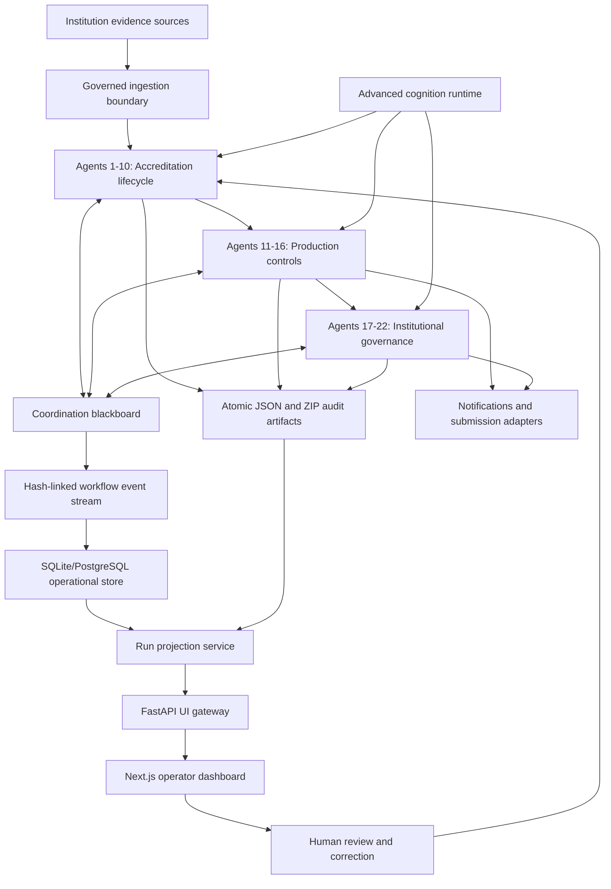

# ProofChain Current Implementation, Agent Workflow, and Feature Record

## Purpose

This document explains what has been built in ProofChain so far, what each agent does, what goals each agent completes, how the agents are connected, which synchronization protocol holds the system together, what the end-to-end workflow looks like, what features the project currently has, and who the project is built for.

ProofChain is now implemented as a governed agentic accreditation evidence platform. It is designed to inspect institutional evidence, reason about accreditation claims, find missing or contradictory proof, assign corrective work, revalidate fixes, compose audit packages, review quality, and block unsafe or unsupported decisions.

The current system has:

- 22 primary governed goal agents.
- 132 deterministic specialist modules.
- A shared advanced cognition runtime.
- Hash-linked workflow events.
- Atomic JSON audit artifacts.
- SQLite/PostgreSQL persistence contracts.
- A FastAPI UI gateway.
- A live Next.js operator dashboard.
- Three-department sample institution data for AIML, AIDS, and CSE.
- No frontend runtime mock-data dependency in the current dashboard flow.

## What Has Been Built

### 1. Project Foundation

The repository now contains a structured Python backend under `proofchain/`, a FastAPI gateway under `ui_gateway/`, a Next.js frontend under `frontend/`, generated sample institution data under `sample_data/mock_institution/`, and run outputs under `outputs/runs/`.

The backend is organized around:

- schemas;
- repositories;
- deterministic services;
- primary goal agents;
- production supervisors;
- governance policies;
- command-line workflows;
- validation and test suites.

The frontend is organized around:

- live data-provider contracts;
- gateway-backed API fetching;
- operator pages;
- agent detail pages;
- workflow dashboards;
- governance, evidence, claims, issues, tasks, approvals, packages, runs, and system-health views.

### 2. Agentic Runtime

All 22 primary agents use the `advanced-cognition-platform` profile. Each primary agent behaves as a real goal agent, not just a deterministic helper.

Each agent performs:

1. Goal interpretation.
2. Pre-plan input validation.
3. Context construction.
4. Hypothesis generation.
5. Advanced planning.
6. Plan criticism.
7. Information-gain action selection.
8. Deterministic tool execution.
9. Observation normalization.
10. Structured reflection.
11. Uncertainty decomposition.
12. Peer coordination.
13. Completion proof generation.
14. Decision explanation.
15. Decision ledger append.

The main runtime artifacts are written under:

```text
outputs/runs/{run_id}/agents/{agent_name}/{goal_id}/
```

Typical artifacts include:

```text
interpreted_goal.json
input_validation.json
context_snapshot.json
hypotheses.json
plans/plan_revision_1.json
critiques/critique_revision_1.json
action_selections.jsonl
normalized_observations.jsonl
structured_reflections.jsonl
uncertainty_assessments.jsonl
final_uncertainty.json
completion_proof.json
decision_explanation.json
agentic_scorecard.json
core_precision_assessment.json
```

### 3. Evidence and Sample Data

The project includes a generated mock institution dataset for three departments:

- AIML
- AIDS
- CSE

Each department has 30 students, including male and female students. The sample data includes structured student records and accreditation evidence bundles in supported formats such as PDF, XLSX, CSV, TSV, DOCX, TXT, Markdown, JSON, XML, HTML, and image files.

The dataset is intentionally useful for validation because it contains both good evidence and governed problem cases such as:

- missing required documents;
- duplicate evidence;
- participant-count contradictions;
- missing signatures;
- unsupported or metadata-only files;
- evidence requiring human review.

This allows ProofChain to prove that it can approve only defensible outputs and block unsafe conclusions.

### 4. Frontend and Backend Wiring

The frontend is wired to the backend through the FastAPI UI gateway. The dashboard does not use frontend mock data for the current run views. It reads persisted artifacts through gateway endpoints.

Important UI gateway endpoints include:

```text
GET /ui-api/health
GET /ui-api/runs
GET /ui-api/runs/{run_id}
GET /ui-api/runs/{run_id}/metrics
GET /ui-api/runs/{run_id}/workflow-status
GET /ui-api/runs/{run_id}/agents
GET /ui-api/runs/{run_id}/agents/{agent_id}
GET /ui-api/runs/{run_id}/governance
GET /ui-api/runs/{run_id}/events
GET /ui-api/runs/{run_id}/messages
GET /ui-api/runs/{run_id}/evidence
GET /ui-api/runs/{run_id}/claims
GET /ui-api/runs/{run_id}/issues
GET /ui-api/runs/{run_id}/tasks
GET /ui-api/runs/{run_id}/approvals
GET /ui-api/runs/{run_id}/package
GET /ui-api/ingestion/capabilities
POST /ui-api/ingestion/inspect
```

The frontend pages include:

- `/dashboard`
- `/agents`
- `/agents/{agent_id}`
- `/evidence`
- `/claims`
- `/issues`
- `/tasks`
- `/approvals`
- `/packages`
- `/governance`
- `/runs`
- `/runs/closure`
- `/system-health`
- `/settings`

## Complete 22-Agent Architecture



## Synchronization Protocol

ProofChain uses a governed artifact and event synchronization protocol. The protocol is not a network protocol like HTTP alone. It is the internal coordination contract that keeps all agents consistent.

### 1. Atomic Artifact Protocol

Every major stage writes a canonical JSON artifact with:

- stage identity;
- agent identity;
- schema version;
- output path;
- content hash;
- record counts;
- timestamp;
- validation state.

This prevents downstream agents from relying on partial or untracked output.

### 2. Hash-Linked Event Protocol

Every workflow event is appended to `workflow_events.jsonl`. Each event links to the previous event through hash fields. This creates a tamper-evident run history.

Events capture:

- stage started;
- stage completed;
- issue discovered;
- task created;
- approval requested;
- correction submitted;
- revalidation performed;
- package frozen;
- submission refused or allowed;
- persistence synchronized.

### 3. Coordination Blackboard Protocol

Agents communicate through a versioned run blackboard. It stores:

- active goals;
- completed goals;
- blocked goals;
- human-review goals;
- current plans;
- peer messages;
- blockers;
- completion claims;
- supervisor round state.

This lets the Supervisor reason about the run as a coordinated system rather than as isolated scripts.

### 4. Completion-Proof Protocol

Every primary agent must emit a completion proof. A proof records:

- what goal was attempted;
- what evidence or state was used;
- which success conditions passed;
- which blockers remain;
- whether human review is required;
- whether the agent can safely mark its goal complete.

The Supervisor validates the proof before treating the agent as complete.

### 5. Decision Ledger Protocol

Agent decisions are appended to:

```text
outputs/runs/{run_id}/agent_decisions.jsonl
```

The ledger provides a cross-agent timeline of decisions, confidence, rationale, and completion state.

### 6. Persistence Synchronization Protocol

Agent 11 synchronizes the append-only event stream into:

```text
outputs/runs/{run_id}/operational_state.db
```

SQLite is used locally. PostgreSQL is supported through the same event repository interface for production deployment.

Agent 11 runs after production controls and again after institutional governance so the final operational state includes all 22 agents.

## The 22 Primary Agents

| No. | Agent | Goal Completed | What It Does | Main Output |
|---:|---|---|---|---|
| 1 | Evidence Collector | Build the evidence foundation | Discovers in-scope files, records durable IDs, computes checksums, tracks versions, marks duplicates, and records ingestion capability | `evidence_registry.json` |
| 2 | Evidence Classification | Understand the evidence | Extracts supported content, classifies document types, maps evidence to requirements, extracts fields, and flags ambiguity | `classified_evidence.json` |
| 3 | Evidence Integrity | Verify evidence defensibility | Bundles related records, applies rules, detects contradictions, missing proof, unsigned evidence, duplicates, and integrity risks | `integrity_result.json` |
| 4 | Claim Intelligence | Judge institutional claims | Decomposes claims, retrieves support and counter-evidence, evaluates sufficiency, contradiction, lineage, and claim alternatives | `claim_decisions.json` |
| 5 | Adaptive Gap Resolution | Turn findings into fixable gaps | Normalizes issues, assigns canonical issue IDs, analyzes root causes, dependencies, priorities, and counterfactual readiness | `gap_resolution_portfolio.json` |
| 6 | Accountability and Ownership | Assign accountable people or roles | Maps issues to responsible departments/roles, validates workload, conflicts, backups, and escalation routes | `ownership_assignments.json` |
| 7 | Department Liaison | Activate correction workflow | Converts approved gaps into tasks, drafts governed communications, records responses, and tracks SLA state | `resolution_tasks_detailed.json` |
| 8 | Closure Revalidation | Validate corrections before closure | Registers submitted fixes, performs targeted revalidation, and decides resolved, rejected, waiting, or reopened states | `closure_revalidation_report.json` |
| 9 | Audit Package Composer | Build reproducible audit package | Selects eligible evidence, excludes unsafe or unresolved records, freezes lineage, creates manifest hash and ZIP bundle | `audit_package_manifest.json` |
| 10 | Adversarial Quality Review | Challenge the package before release | Simulates reviewer scrutiny, checks omissions, weak claims, privacy risk, reference mismatch, and release risk | `quality_review_report.json` |
| 11 | Operational Persistence | Persist and reconstruct state | Stores events in SQLite/PostgreSQL, validates hashes, creates snapshots, reconciles JSON exports, and supports recovery | `persistence_recovery_report.json` |
| 12 | Workflow Continuation | Resume and partially rerun work | Computes fingerprints, detects stale scope, reuses safe outputs, plans partial re-execution, and prevents duplicate work | `continuation_reexecution_plan.json` |
| 13 | Identity and Authorization | Govern operator permissions | Evaluates identity assertions, role scope, delegation, separation of duties, conflicts, and dual approval | `authorization_decision.json` |
| 14 | Integration and Notification | Deliver approved messages safely | Sends or records notifications with idempotency, fallback handling, correlation IDs, and approval gates | `notification_delivery_report.json` |
| 15 | Security Inspection | Protect the system from unsafe evidence | Checks path boundaries, file size, archives, formulas, prompt injection, PII, signatures, restrictions, quarantine, and rejection | `phase_one_security_report.json` |
| 16 | Reliability and Incident Response | Monitor and recover platform execution | Correlates telemetry, classifies incidents, applies retry budgets, pause/failover decisions, and escalation state | `incident_reliability_report.json` |
| 17 | Schema Evolution | Keep data contracts compatible | Checks schema drift, backward compatibility, migration safety, and blocks unsafe schema activation | `schema_evolution_report.json` |
| 18 | Policy Lifecycle | Govern policy changes | Parses policies, detects conflicts, simulates impact, versions policies, and keeps activation human-controlled | `policy_lifecycle_report.json` |
| 19 | Multi-Tenant Governance | Enforce institution boundaries | Resolves tenant and department scope, enforces isolation, and controls cross-boundary sharing | `tenant_access_decision.json` |
| 20 | External Submission | Decide whether external handoff is allowed | Checks package hash, quality result, approval, readiness, confirmation, and idempotent submission/refusal | `external_submission_report.json` |
| 21 | Continuous Evaluation | Validate the platform before release | Runs golden scenarios, checks false approvals and false closures, aggregates scorecards, and gates release | `continuous_evaluation_report.json` |
| 22 | Governed Knowledge Retrieval | Provide cited advisory support | Retrieves approved knowledge, ranks authority, records citations and freshness, and remains advisory-only | `governed_knowledge_retrieval_report.json` |

## How Agents Are Related

Agents 1-10 form the accreditation reasoning lifecycle.

```text
Evidence Collector
  -> Evidence Classification
  -> Evidence Integrity
  -> Claim Intelligence
  -> Adaptive Gap Resolution
  -> Accountability and Ownership
  -> Department Liaison
  -> Closure Revalidation
  -> Audit Package Composer
  -> Adversarial Quality Review
```

Agents 11-16 surround the workflow with production controls.

```text
Operational Persistence
  -> Workflow Continuation
  -> Identity and Authorization
  -> Integration and Notification
  -> Security Inspection
  -> Reliability and Incident Response
```

Agents 17-22 add institutional governance and release assurance.

```text
Schema Evolution
  -> Policy Lifecycle
  -> Multi-Tenant Governance
  -> External Submission
  -> Continuous Evaluation
  -> Governed Knowledge Retrieval
```

Agent 11 performs final synchronization after the complete run:

```text
Agents 1-10
  -> Agents 11-16
  -> Agents 17-22
  -> Agent 11 final persistence resynchronization
```

This is why a full reference run can contain 22 primary agents but 23 agent executions.

## Complete Workflow

The complete ProofChain workflow is:

```text
Discover
  -> Understand
  -> Verify
  -> Defend
  -> Plan
  -> Assign
  -> Coordinate
  -> Correct
  -> Revalidate
  -> Package
  -> Challenge
  -> Authorize
  -> Submit or Refuse
  -> Evaluate
  -> Synchronize
  -> Present to operator
```

In practical accreditation terms:

1. Institution provides department evidence.
2. Agent 1 registers everything and computes hashes.
3. Agent 2 extracts and classifies supported documents.
4. Agent 3 checks integrity, consistency, and required-document rules.
5. Agent 4 tests claims against evidence.
6. Agent 5 converts problems into canonical fixable gaps.
7. Agent 6 assigns owners and escalation routes.
8. Agent 7 creates governed department tasks and communications.
9. Agent 8 revalidates submitted corrections.
10. Agent 9 composes an audit package from eligible evidence.
11. Agent 10 challenges the package before approval.
12. Agent 13 checks whether the actor can approve or submit.
13. Agent 20 decides whether external submission is eligible.
14. Agent 21 runs assurance scenarios.
15. Agent 11 synchronizes the final state.
16. The gateway and frontend expose the run to operators.

## Important Governance Boundaries

ProofChain is intentionally conservative. It does not pretend that incomplete evidence is ready.

The platform can be technically complete while the accreditation decision is blocked. This is expected behavior when:

- required evidence is missing;
- a document is unsigned;
- participant counts contradict each other;
- duplicates are unresolved;
- corrections have not passed revalidation;
- approval is missing;
- quality review returns the package for correction;
- external submission is not eligible.

Readiness values are separated into:

- current verified readiness;
- projected readiness;
- counterfactual readiness assumptions.

Projected readiness is not treated as real readiness until corrections are submitted, revalidated, approved, and synchronized.

## Main Project Features

### Evidence Management

- Filesystem evidence discovery.
- Durable evidence IDs.
- SHA-256 checksums.
- Duplicate detection.
- Version tracking.
- Native extraction for supported formats.
- Metadata-only registration for images.
- Explicit unsupported/rejected outcomes.
- Evidence-to-requirement mapping.

### Claim and Integrity Reasoning

- Claim decomposition.
- Support and counter-evidence retrieval.
- Contradiction detection.
- Missing-document detection.
- Participant-count validation.
- Signature and approval checks.
- Rule-based defensibility scoring.
- Canonical issue IDs.

### Gap and Task Workflow

- Gap normalization.
- Root-cause analysis.
- Dependency mapping.
- Priority and readiness simulation.
- Owner assignment.
- Department task creation.
- SLA status.
- Human-review routing.
- Closure revalidation.
- Reopen/reject states.

### Audit Packaging

- Eligible evidence selection.
- Exclusion recording.
- Lineage preservation.
- Manifest hashing.
- Reproducible ZIP package creation.
- Privacy and warning disclosure.
- Quality challenge before release.

### Governance and Security

- Identity and authorization checks.
- Role and scope validation.
- Delegation checks.
- Separation-of-duties checks.
- Dual approval support.
- Tenant and department isolation.
- Policy lifecycle validation.
- Schema evolution validation.
- Security inspection for untrusted content.
- Quarantine and rejection rules.

### Reliability and Persistence

- Append-only workflow event stream.
- Hash-linked event chain.
- SQLite local operational store.
- PostgreSQL repository contract.
- Snapshot reconstruction.
- Replay support.
- Continuation and partial rerun planning.
- Retry and incident classification.
- Platform health checks.

### Evaluation and Assurance

- Agentic completion proof validation.
- Agent scorecards.
- Golden scenario suite.
- False-approval checks.
- False-closure checks.
- Release gate.
- Platform-wide assurance report.

### API and Dashboard

- FastAPI gateway for operator data.
- Live Next.js dashboard.
- Run selector.
- Agent directory.
- Individual agent pages for all 22 agents.
- Evidence, claims, issues, tasks, approvals, packages, governance, runs, closure, and system-health pages.
- Live state from persisted run artifacts.
- No frontend runtime mock data for the current operator workflow.

## Who ProofChain Is Built For

ProofChain is built for educational institutions that must prepare, verify, and defend accreditation evidence.

Primary users include:

- accreditation coordinators;
- IQAC teams;
- department heads;
- faculty evidence owners;
- institutional administrators;
- compliance officers;
- internal audit teams;
- external audit preparation teams.

The system is especially useful when an institution must answer:

- Which evidence do we have?
- Which evidence is missing?
- Which claims are actually defensible?
- Which documents contradict each other?
- Who owns each correction?
- Which corrections are still pending?
- Which evidence is safe to include in an audit package?
- Why did the system block readiness or submission?
- What exact artifacts support every decision?

## What the Project Does End to End

ProofChain turns raw institutional evidence into a governed audit-readiness decision.

It can:

1. Ingest evidence from department folders.
2. Register every file with a durable identity and checksum.
3. Extract structured information from supported formats.
4. Classify evidence by document type and requirement.
5. Validate consistency and sufficiency.
6. Evaluate institutional claims.
7. Detect gaps, contradictions, duplicates, and missing approvals.
8. Assign correction tasks to accountable owners.
9. Route human approvals without rewriting original artifacts.
10. Revalidate corrections before closing issues.
11. Compose a reproducible audit package.
12. Challenge the package through adversarial review.
13. Decide whether external submission is eligible.
14. Persist and replay the full run.
15. Show all state transparently through the dashboard.

## Current Validation Status

The latest implementation work validated:

- Python test suite: 107 tests passing.
- Ruff linting: passed.
- Frontend linting: passed.
- Frontend production build: passed.
- Gateway contract smoke test: passed.
- Rich detail endpoint validation for all 22 agents: passed.
- Desktop dashboard and key pages: verified.
- Mobile dashboard and key pages: verified.
- No body-level horizontal overflow in tested desktop/mobile views.

The most recent UI-focused verified run was:

```text
RUN-20260728-B4AE
```

That run exposed:

- 22 agents;
- 75 evidence records;
- 15 claims;
- 12 workflow events in the operator projection;
- one real pending package approval gate;
- detailed per-agent goal, plan, proof, observation, reflection, and coordination data.

## How to Run Locally

From the repository root:

```powershell
cd C:\SideQuest\ProofChain
.\.venv\Scripts\Activate.ps1
```

Run the complete 22-agent lifecycle:

```powershell
proofchain run-complete `
  --source sample_data/mock_institution/departments `
  --departments AIML AIDS CSE `
  --academic-year 2025-2026 `
  --requirements C3.2.1 C5.1.3 C6.3.2 C7.1.1 C1.2.1 `
  --objective "Validate three-department accreditation evidence through the complete governed lifecycle." `
  --claim "The institution conducted student and industry activities with complete evidence support during 2025-2026." `
  --tenant-id default-institution `
  --department-id CSE
```

Validate a run:

```powershell
proofchain validate-run RUN-ID
proofchain validate-agentic-run RUN-ID
proofchain health-check --run-id RUN-ID
proofchain project-run RUN-ID
```

Run backend tests:

```powershell
python -m pytest -q
python -m ruff check proofchain tests ui_gateway
```

Run the gateway:

```powershell
cd C:\SideQuest\ProofChain\ui_gateway
..\.venv\Scripts\python.exe -m uvicorn app.main:app --port 8000 --reload
```

Run the frontend:

```powershell
cd C:\SideQuest\ProofChain\frontend
npm install
npm run dev
```

Open:

```text
http://localhost:3000/dashboard
```

## Final Current-State Summary

ProofChain has been built into a complete governed local reference implementation for accreditation evidence workflows. The project now has a full 22-agent architecture, advanced cognition artifacts for each primary agent, synchronization through atomic artifacts, hash-linked events, blackboard coordination, completion proofs, persistence synchronization, human-review routing, security controls, policy controls, institutional governance, external-submission refusal/eligibility logic, continuous evaluation, and a live dashboard wired to backend artifacts.

The system is built to be trustworthy under incomplete or contradictory evidence. Its most important behavior is not simply producing an answer. Its important behavior is producing the right kind of answer: approve only when proof exists, block when proof is insufficient, explain why, and preserve the evidence trail.
