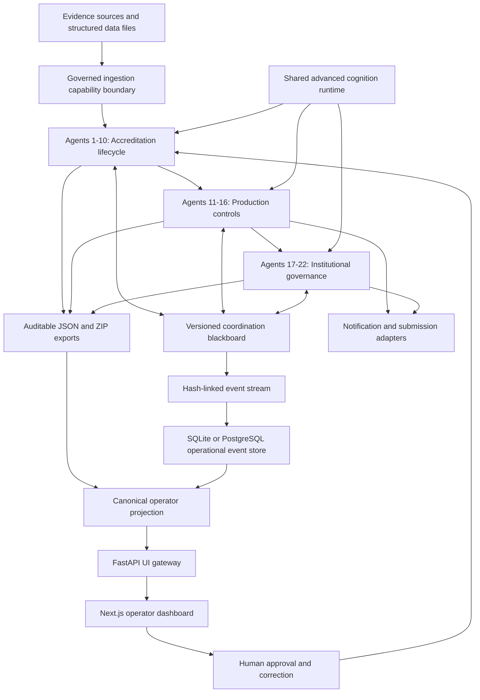

# ProofChain Final 22-Agent Completion, Architecture, Validation, and Operations

## 1. Document Purpose

This document is the final implementation record for the governed ProofChain
reference platform. It explains:

- what is implemented;
- how all 22 primary agents are connected;
- how planning, reasoning, execution, reflection, completion proof, and
  synchronization work;
- how heterogeneous data is ingested;
- how the API and frontend obtain persisted truth;
- how to run and validate the complete lifecycle;
- what the final validation proves;
- which boundaries still depend on external production infrastructure.

This document does not claim that every binary file can be understood
semantically. ProofChain guarantees an explicit governed outcome for every
discovered file: process, process with warning, request conversion, quarantine,
or reject.

## 2. Final Technical Status

The governed local reference implementation is complete for the defined
22-agent lifecycle.

Latest complete validation run:

```text
Run ID: RUN-20260727-416B
Primary agents: 22
Agent executions: 23
Deterministic specialist modules: 132
Completion proofs expected/found: 23/23
Distinct agent scorecards: 22
Golden scenarios: 10
Golden scenario accuracy: 100%
Standard run validation: PASS
Advanced agentic validation: PASS
Agentic release gate: PASS
Platform health checks: 8/8 healthy
Hash-linked workflow events: 32
Persistence synchronized: yes
Python tests: 100 passed
Ruff: passed
Frontend lint: zero errors
Frontend production build: passed
Gateway integration: passed
```

The accreditation domain decision for this run is `blocked`. This is correct.
The supplied sample evidence still contains missing required documents, a
missing signature, participant-count contradictions, unresolved issues, and
tasks without human approval. ProofChain refused to declare the evidence
audit-ready and refused external submission.

Technical completion and accreditation readiness are separate:

```text
Platform execution: technically complete and healthy
Accreditation readiness: blocked by evidence and governance conditions
External submission: not eligible
```

## 3. Complete Architecture



## 4. Shared Agentic Cognition Lifecycle

All 22 primary agents use the `advanced-cognition-platform` profile. A primary
agent is distinct from a deterministic specialist because it owns an
independent goal, plan, state, bounded execution loop, reflection, coordination,
and completion decision.

Every primary goal follows this lifecycle:

```text
Receive governed goal
  -> interpret objective, scope, constraints, and success conditions
  -> validate inputs before planning
  -> build immutable context snapshot
  -> form explicit competing hypotheses
  -> create risk-aware advanced plan
  -> critique plan against safety and completion policy
  -> revise plan when critique is not approved
  -> select next action by expected information gain
  -> execute only allowlisted deterministic tools
  -> normalize observations
  -> update hypotheses and uncertainty
  -> reflect on progress, blockers, and contradictions
  -> negotiate peer requests and acceptance conditions
  -> replan when evidence changes the state
  -> evaluate success conditions
  -> generate canonical completion proof
  -> generate decision explanation
  -> append synchronized decision ledger entry
```

The principal cognition artifacts are written under:

```text
outputs/runs/{run_id}/agents/{agent_name}/{goal_id}/
```

Representative artifacts include:

```text
interpreted_goal.json
input_validation_report.json
context_snapshot.json
hypotheses.json
advanced_plan.json
plan_critique.json
normalized_observations.jsonl
structured_reflections.jsonl
uncertainty_report.json
peer_contracts.json
completion_proof.json
decision_explanation.json
experience_candidate.json
```

Cross-agent decisions are appended to:

```text
outputs/runs/{run_id}/agent_decisions.jsonl
```

## 5. The 22 Primary Agents

| No. | Primary agent | Governed responsibility | Principal output |
|---:|---|---|---|
| 1 | Evidence Collector | Discover every in-scope file, assign durable identity, checksum, version, duplicate state, and ingestion capability | `evidence_registry.json` |
| 2 | Evidence Classification | Extract deterministic content, classify document type, extract fields, map requirements, and route ambiguity | `classified_evidence.json` |
| 3 | Evidence Integrity | Bundle related evidence, apply versioned rules, identify contradictions and missing proof, and calculate defensibility | `integrity_result.json` |
| 4 | Claim Intelligence | Decompose institutional claims, retrieve support and counter-evidence, evaluate sufficiency, and produce defensible alternatives | `claim_decisions.json` |
| 5 | Adaptive Gap Resolution | Normalize findings into canonical resolution gaps, analyze causes, model dependencies, and calculate counterfactual readiness | `gap_resolution_portfolio.json` |
| 6 | Accountability and Ownership | Resolve authorized owner, backup, approver, workload, conflicts, and escalation path | `ownership_assignments.json` |
| 7 | Department Liaison | Convert approved recommendations into governed tasks, communications, responses, and SLA state | `resolution_tasks_detailed.json` |
| 8 | Closure Revalidation | Register corrections, perform targeted revalidation, and resolve, reject, wait, or reopen issues | `closure_revalidation_report.json` |
| 9 | Audit Package Composer | Select eligible evidence, record exclusions and warnings, freeze lineage, and build a reproducible ZIP package | `audit_package_manifest.json` |
| 10 | Adversarial Quality Review | Challenge claims, references, omissions, reuse, privacy, and reviewer friction before approval | `quality_review_report.json` |
| 11 | Operational Persistence | Persist hash-linked events, snapshots, and reconstruction state in SQLite or PostgreSQL | `persistence_recovery_report.json` |
| 12 | Workflow Continuation | Compare fingerprints, identify stale scope, reuse safe outputs, and construct partial reruns | `continuation_reexecution_plan.json` |
| 13 | Identity and Authorization | Evaluate identity assertions, roles, delegation, scope, separation of duties, and dual approval | `authorization_decision.json` |
| 14 | Integration and Notification | Deliver approved communications idempotently through recording, SMTP, Teams, Slack, or HTTPS adapters | `notification_delivery_report.json` |
| 15 | Security Inspection | Inspect paths, size, archives, spreadsheets, prompt injection, PII, and signatures; restrict or quarantine unsafe evidence | `phase_one_security_report.json` |
| 16 | Reliability and Incident Response | Correlate telemetry, classify incidents, enforce retry budgets, pause, fail over, and escalate | `incident_reliability_report.json` |
| 17 | Schema Evolution | Measure compatibility, plan migration, protect historical artifacts, and block unsafe schema deployment | `schema_evolution_report.json` |
| 18 | Policy Lifecycle | Parse policies, detect conflicts, replay impact, version changes, and keep activation human-controlled | `policy_lifecycle_report.json` |
| 19 | Multi-Tenant Governance | Resolve institution and department boundaries, enforce isolation, and require approved sharing | `tenant_access_decision.json` |
| 20 | External Submission | Verify quality, freeze package hash, require independent approval and confirmation, submit idempotently, and persist receipt or refusal | `external_submission_report.json` |
| 21 | Continuous Evaluation | Run ten production-policy golden scenarios, measure accuracy and false approvals/closures, and gate release | `continuous_evaluation_report.json` |
| 22 | Governed Knowledge Retrieval | Retrieve only approved sources, provide citations and freshness state, and remain advisory | `governed_knowledge_retrieval_report.json` |

## 6. Specialist Modules

The final registry contains 132 deterministic specialist modules. These modules
do not claim independent agent status. They run inside a parent agent and
provide bounded capabilities such as:

- checksum and metadata inspection;
- document extraction and classification;
- requirement mapping;
- evidence bundling and rule evaluation;
- claim decomposition and support linking;
- root-cause analysis and readiness simulation;
- role matching and workload checks;
- task, communication, and response handling;
- targeted closure verification;
- package reference, omission, and risk review;
- event reconstruction and database checks;
- identity, tenant, schema, policy, and submission decisions;
- evaluation metrics and source-authority checks.

This separation prevents deterministic utilities from being misreported as
autonomous agents.

## 7. Synchronization and Persistence

ProofChain uses several synchronized layers:

### 7.1 Atomic artifacts

Each stage writes an immutable JSON artifact through an atomic store. The
artifact reference records:

- stage name;
- path;
- SHA-256;
- record count;
- schema version;
- agent execution identity;
- commit timestamp.

### 7.2 Stage checkpoints

The core ten-agent pipeline records input and output hashes for every stage.
Each downstream checkpoint references the upstream artifact hash.

### 7.3 Coordination blackboard

The blackboard tracks:

- active, completed, blocked, and human-review goals;
- current plans;
- open peer messages;
- completion claims;
- blockers and unresolved questions;
- supervisor round and monotonic state version.

### 7.4 Event stream

`workflow_events.jsonl` is append-only and hash-linked. Every event includes its
own hash and the previous event identity and hash.

### 7.5 Operational database

Agent 11 synchronizes events into:

```text
outputs/runs/{run_id}/operational_state.db
```

SQLite is the zero-configuration backend. PostgreSQL is supported through the
same event repository contract when `--backend postgres` and
`PROOFCHAIN_DATABASE_URL` are supplied.

### 7.6 Final synchronization

Agent 11 runs once after Phase 1 and once after Phase 2. The second execution
ensures that Agents 17-22 and their events are included in reconstructed
operational state. This is why a complete run has 22 distinct primary agents
and 23 completion proofs.

## 8. Heterogeneous Data Ingestion

### 8.1 Native deterministic extraction

| Format | Extractor |
|---|---|
| PDF | `pdfplumber` |
| XLSX | `openpyxl` |
| CSV | bounded delimited-text extractor |
| TSV | bounded tab-delimited extractor |
| DOCX | read-only Office XML extraction |
| TXT | bounded UTF-8 text extraction |
| Markdown | bounded UTF-8 text extraction |
| JSON | parsed and canonicalized JSON |
| XML | parsed text nodes |
| HTML/HTM | HTML text parser |

### 8.2 Metadata-only processing

PNG, JPG, and JPEG files are registered, checksummed, and inspected through
image metadata. Deterministic OCR is not configured, so a positive conclusion
cannot depend on unextracted image text.

### 8.3 Unsupported files

Unknown formats and archives are not silently dropped. ProofChain:

1. registers the file identity and checksum;
2. marks its capability `unsupported`;
3. excludes it from positive evidence conclusions;
4. requests a governed conversion or approved extraction workflow;
5. sends archives through security inspection.

### 8.4 Rejected files

Executable and script extensions such as EXE, DLL, MSI, BAT, CMD, PowerShell,
VBS, JavaScript, and JAR are registered as `rejected` and cannot enter ordinary
classification.

### 8.5 Meaning of “any type”

The implemented guarantee is:

```text
Every discovered file receives a durable identity and explicit governed outcome.
```

The system does not claim:

```text
Every possible binary format can be semantically understood.
```

Unsupported, encrypted, corrupted, proprietary, or unsafe content returns a
complete refusal/conversion result instead of an invented interpretation.

Inspect capabilities with:

```powershell
proofchain ingestion-capabilities `
  evidence.pdf `
  roster.tsv `
  policy.json `
  archive.zip `
  unsafe.exe
```

## 9. Agent 21 Golden Scenarios

Agent 21 now executes these mandatory policy scenarios through production
specialists:

| Scenario | Expected decision |
|---|---|
| Fully supported claim | `supported` |
| Partially supported claim | `partially_supported` |
| Contradicted claim | `contradicted` |
| Missing evidence | `insufficient_evidence` |
| Corrected evidence | `resolved` |
| Reopened issue | `REOPENED` |
| Failed package review | `failed` |
| Successful package review | `passed` |
| Authorized submission | `ELIGIBLE` |
| Rejected submission | `NOT_ELIGIBLE` |

Every scenario records:

- category;
- expected decision;
- observed decision;
- component under test;
- rationale;
- observed confidence;
- deterministic fixture hash.

The final run produced 10/10 correct decisions, zero false approvals, zero false
closures, and release decision `PASS`.

## 10. One-Command Complete Lifecycle

From the repository root:

```powershell
proofchain run-complete `
  --source sample_data/departments `
  --departments CSE `
  --academic-year 2025-2026 `
  --requirements C3.2.1 C5.1.3 C6.3.2 C7.1.1 C1.2.1 `
  --objective "Validate CSE evidence through the complete governed lifecycle." `
  --claim "CSE conducted 12 industry programmes involving 120 students during 2025-2026 for C3.2.1." `
  --tenant-id default-institution `
  --department-id CSE
```

`run-complete` performs:

```text
Agents 1-10
  -> Agents 11-16
  -> Agents 17-22
  -> final Agent 11 synchronization
  -> standard run validation
  -> advanced agentic validation
  -> platform health inspection
  -> canonical operator projection
  -> complete_run_summary.json
```

The command returns success when the platform is technically valid, even when
the domain decision is responsibly blocked by evidence.

## 11. Installation and Local Operation

### 11.1 Python backend and API

```powershell
cd C:\SideQuest\ProofChain
python -m venv .venv
.\.venv\Scripts\Activate.ps1
python -m pip install --upgrade pip
pip install -e ".[dev,full]"
```

### 11.2 Run the gateway

```powershell
cd C:\SideQuest\ProofChain\ui_gateway
..\.venv\Scripts\python.exe -m uvicorn app.main:app --port 8000 --reload
```

Gateway URL:

```text
http://localhost:8000/ui-api/health
```

### 11.3 Run the frontend

```powershell
cd C:\SideQuest\ProofChain\frontend
npm install
$env:NEXT_PUBLIC_GATEWAY_URL="http://localhost:8000/ui-api"
npm run dev
```

Frontend URL:

```text
http://localhost:3000
```

Gateway mode is now the normal default. Set
`NEXT_PUBLIC_DATA_MODE=mock` only for explicit UI development without the
backend.

## 12. REST and Operator Projection

Important read endpoints:

```text
GET /ui-api/health?run_id={run_id}
GET /ui-api/runs
GET /ui-api/runs/{run_id}
GET /ui-api/runs/{run_id}/metrics
GET /ui-api/runs/{run_id}/workflow-status
GET /ui-api/runs/{run_id}/agents
GET /ui-api/runs/{run_id}/agents/{agent_id}
GET /ui-api/runs/{run_id}/goals
GET /ui-api/runs/{run_id}/events
GET /ui-api/runs/{run_id}/events/stream
GET /ui-api/runs/{run_id}/messages
GET /ui-api/runs/{run_id}/evidence
GET /ui-api/runs/{run_id}/claims
GET /ui-api/runs/{run_id}/issues
GET /ui-api/runs/{run_id}/tasks
GET /ui-api/runs/{run_id}/approvals
GET /ui-api/runs/{run_id}/package
GET /ui-api/ingestion/capabilities
POST /ui-api/ingestion/inspect
```

Governed command execution:

```text
POST /ui-api/commands/{allowlisted_command}
GET  /ui-api/jobs/{job_id}
```

The command executor:

- rejects undeclared command names;
- rejects undeclared body fields;
- validates required fields;
- uses an argument array and `shell=False`;
- reports queued, running, completed, or failed;
- returns the real exit code, output, error, and parsed JSON result;
- does not fabricate success.

The operator workflow projection answers:

- what happened;
- what is happening now;
- what is blocked;
- what the user must do;
- what happens next;
- which readiness value is current;
- which readiness value is counterfactual.

## 13. Validation Commands

```powershell
proofchain validate-run RUN-20260727-416B
proofchain validate-agentic-run RUN-20260727-416B
proofchain health-check --run-id RUN-20260727-416B
proofchain project-run RUN-20260727-416B
proofchain replay-run RUN-20260727-416B
python -m pytest -q
python -m ruff check proofchain tests ui_gateway
cd frontend
npm run lint
npm run build
```

Expected final reference results:

```text
validate-run: valid=true
validate-agentic-run: valid=true
health-check: healthy
pytest: 100 passed
ruff: passed
frontend lint: zero errors
frontend build: passed
```

## 14. How to Read a Complete Run

Start with:

```text
complete_run_summary.json
```

Then inspect:

```text
final_decision.json
human_review_queue.json
quality_review_report.json
external_submission_report.json
continuous_evaluation_report.json
completion_proof_audit.json
agentic_release_decision.json
supervisor_assurance_report.json
observability_metrics.json
```

Interpretation:

- `technically_complete=true` means orchestration, proofs, synchronization, and
  platform checks passed.
- `core_domain_status=blocked` means the evidence or governance conditions do
  not justify a positive accreditation decision.
- `persistence_synchronized=true` means the final institutional events were
  reconstructed in the operational store.
- `quality_status=return_for_correction` means the package exists but cannot be
  approved.
- `eligibility_decision=NOT_ELIGIBLE` means external handoff was safely refused.

## 15. Completion Acceptance Matrix

| Requirement | Status | Proof |
|---|---|---|
| All 22 agents use advanced lifecycle | Complete | 22 distinct agent decisions and scorecards |
| Goal interpretation | Complete | per-goal `interpreted_goal.json` |
| Pre-plan input validation | Complete | per-goal validation report |
| Context and explicit hypotheses | Complete | context and hypothesis artifacts |
| Plan critique before execution | Complete | approved critique required by validator |
| Information-gain action selection | Complete | ranked action records |
| Normalized observations and reflection | Complete | JSONL observation/reflection artifacts |
| Decomposed uncertainty | Complete | uncertainty reports and completion gates |
| Peer contracts and acceptance | Complete | coordination messages and peer contracts |
| Replanning changes state | Complete | revision and global-replan audits |
| Canonical completion proof | Complete | 23/23 proof audit |
| Evidence/rule/policy citations | Complete | decision explanations and policy fingerprints |
| Pause/resume and partial rerun | Complete | continuation agent and replayable event state |
| Human approvals do not rewrite artifacts | Complete | append-only approval transitions |
| Identity, roles, delegation, and separation of duties | Complete | Agent 13 decision |
| Idempotent notification | Complete | notification idempotency ledger |
| Unsafe evidence blocked | Complete | explicit reject/quarantine decisions |
| Reproducible package | Complete | manifest hash and deterministic ZIP |
| Adversarial quality challenge | Complete | quality corrections and risk score |
| Hash-bound submission approval | Complete | Agent 20 eligibility and receipt policy |
| Continuous evaluation | Complete | 10 scenarios and release gate |
| Clear frontend state | Complete | live run, workflow, action, agent, and health projections |

## 16. Production Deployment Boundary

The repository is a complete governed local reference implementation. A
production certification still requires environment-specific acceptance for:

- enterprise OIDC/SAML identity-provider integration;
- API authentication and perimeter policy;
- PostgreSQL deployment, backup, restore, and failover;
- a durable multi-process or managed queue instead of the local gateway worker;
- live SMTP, Teams, Slack, or webhook credentials;
- live regulator portal credentials and provider receipt verification;
- malware-scanner service integration;
- secrets management, TLS termination, and network policy;
- load, concurrency, disaster-recovery, and penetration testing;
- institution-specific accreditation rules and legal review.

The code contains PostgreSQL, notification, HTTPS submission, identity,
multi-tenant, and reliability contracts, but external services cannot be
certified without their actual infrastructure and credentials.

## 17. Final Verdict

ProofChain is complete as the defined advanced governed 22-agent reference
platform. All agents are wired, all primary executions use the advanced
cognition lifecycle, synchronization and proof validation pass, the API and
frontend read persisted truth, heterogeneous files receive explicit governed
outcomes, and the current defective evidence is correctly blocked.

The system is not a universal parser and should not be described as one. Its
stronger guarantee is that it never needs to silently discard or invent an
answer for unknown data: it can process, warn, request conversion, quarantine,
or reject while preserving a traceable decision.
