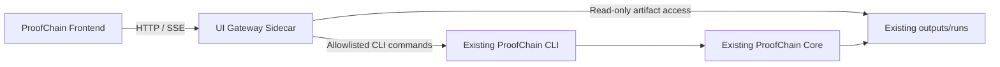

# ProofChain Frontend
## Modern Transparent Agentic UI, Dashboard Architecture, and Backend Integration Plan

**Document Type:** Frontend implementation blueprint  
**Project:** ProofChain — Governed Accreditation Evidence Intelligence  
**Frontend Goal:** Make the complete multi-agent workflow visible, understandable, controllable, and auditable without modifying the existing ProofChain core backend  
**Recommended Delivery:** Web application with a separate read-only/command-gateway adapter  
**Core Backend Rule:** The existing ProofChain engine, agents, CLI commands, JSON artifacts, event stream, schemas, and workflow logic must remain unchanged  

---

# 1. Document Purpose

This document defines the complete implementation plan for the ProofChain frontend.

The frontend must do more than display charts. It must help institutional users understand:

- What goal ProofChain is currently trying to achieve
- Which agent is active
- What plan the agent created
- Which tools it used
- What observations it produced
- Why the agent made a decision
- Which agent requested help from another agent
- Which evidence supports or contradicts a claim
- Which issues are blocking audit readiness
- Which tasks require human approval
- How evidence moves from discovery to final audit package
- Why the final run was completed, blocked, or returned for correction

The UI must make the backend agentic workflow transparent without exposing unsafe internal reasoning or modifying backend behavior.

The frontend should become the human control plane for the existing ProofChain system.

---

# 2. Existing ProofChain Workflow

The current core system already implements:

```text
Discover
    -> Understand
    -> Verify
    -> Defend
    -> Plan
    -> Assign
    -> Coordinate
    -> Revalidate
    -> Package
    -> Challenge
    -> Human Approval
```

The ten existing primary agents are:

1. Evidence Collector
2. Evidence Classification
3. Evidence Integrity
4. Claim Intelligence
5. Adaptive Gap Resolution
6. Accountability and Ownership
7. Department Liaison
8. Closure Revalidation
9. Audit Package Composer
10. Adversarial Quality Review

The frontend must visualize this complete lifecycle rather than treating the project as a normal document dashboard.

---

# 3. Frontend Product Vision

## 3.1 Product Statement

> ProofChain UI is a transparent institutional evidence control center that allows users to observe, understand, govern, and validate how multiple AI agents collaborate to transform raw evidence into a defensible audit package.

## 3.2 Main Experience Goals

The UI should make users feel that they are operating:

- A digital evidence command center
- A transparent agent collaboration workspace
- A continuous accreditation-readiness platform
- A governed audit preparation system

It should not feel like:

- A generic chatbot
- A file manager
- A static admin template
- A black-box AI dashboard
- A complicated developer monitoring console

## 3.3 Core UX Principles

### Transparency First

Every important outcome should answer:

- What happened?
- Which agent did it?
- Why did it happen?
- Which evidence and rules were used?
- What must happen next?

### Human Governance First

Users should always see:

- What requires approval
- What the AI is recommending
- What the AI is prohibited from doing
- Which action will change workflow state
- Which actions are irreversible

### Evidence-Centered Design

The UI should connect every:

```text
Requirement
    -> Claim
    -> Atomic Claim
    -> Evidence
    -> Finding
    -> Canonical Issue
    -> Resolution Task
    -> Approval
    -> Closure
    -> Package
```

### Progressive Disclosure

The dashboard should be understandable at three levels:

1. Executive overview
2. Operational details
3. Full technical trace

### Calm Institutional Design

The design should communicate:

- Trust
- Precision
- Governance
- Auditability
- Institutional seriousness

Avoid excessive futuristic neon effects or game-like animations.

---

# 4. Recommended Frontend Technology Stack

The frontend should be implemented as a separate application.

## 4.1 Main Stack

```text
Framework: Next.js with TypeScript
UI Components: shadcn/ui or an equivalent accessible component system
Styling: Tailwind CSS
Agent and lineage graphs: React Flow
Server-state management: TanStack Query
Local UI state: Zustand
Forms: React Hook Form
Runtime validation: Zod
Charts: Recharts
Tables: TanStack Table
Animations: Framer Motion
Icons: Lucide
Testing: Vitest, React Testing Library, Playwright
```

Do not tightly couple the frontend to a specific framework feature that makes migration difficult.

## 4.2 Why a Web Application

A web UI supports:

- Multiple institutional users
- Role-based views
- Central deployment
- Responsive layouts
- Dashboard monitoring
- Approval workflows
- Task coordination
- Audit package downloads
- Future multi-tenant support

## 4.3 Recommended Project Location

Create the frontend as a separate top-level package:

```text
ProofChain/
├── proofchain/                 # Existing backend: unchanged
├── outputs/                    # Existing run artifacts: unchanged
├── docs/
├── tests/
│
├── frontend/                   # New frontend application
│   ├── src/
│   ├── public/
│   ├── tests/
│   └── package.json
│
└── ui_gateway/                 # Optional separate integration sidecar
    ├── app/
    ├── tests/
    └── pyproject.toml
```

The frontend must not be placed inside the existing Python agent packages.

---

# 5. Non-Negotiable Backend Compatibility Rule

The frontend implementation must not:

- Rewrite existing agents
- Change agent behavior
- Change current JSON schemas without a formal adapter
- Directly edit workflow artifacts
- Directly modify completion decisions
- Directly mutate issue states
- Bypass existing CLI governance
- Create approvals without using the current approval command or repository
- Execute arbitrary shell commands
- Treat frontend state as the system of record

The ProofChain backend remains the source of truth.

The frontend is:

```text
Read
    -> Visualize
    -> Explain
    -> Request governed actions
    -> Display resulting backend events
```

It is not:

```text
Directly mutate backend files
```

---

# 6. Frontend-to-Backend Connection Architecture

The current ProofChain core is JSON-backed and CLI-driven.

A browser cannot safely read local run folders or execute Python commands directly.

The recommended solution is a separate **UI Gateway Sidecar**.

## 6.1 Sidecar Architecture



## 6.2 Why This Does Not Modify the Backend

The gateway:

- Lives in a separate package
- Imports no private agent logic unless explicitly necessary
- Reads existing output artifacts
- Tails existing JSONL events
- Calls existing CLI commands through an allowlist
- Does not edit ProofChain core files
- Does not duplicate business rules
- Does not become a second source of truth

The existing backend continues to operate exactly as it does now.

## 6.3 Gateway Responsibilities

The UI Gateway should:

- List run directories
- Read run artifacts
- Validate artifact paths
- Normalize JSON into frontend response objects
- Stream workflow events
- Execute allowlisted CLI commands
- Capture command output
- Return job status
- Prevent path traversal
- Prevent arbitrary command execution
- Apply frontend access controls
- Produce UI-specific errors

## 6.4 Allowed Gateway Commands

Only expose commands that already exist in ProofChain:

```text
run-pipeline
validate-run
approve-decision
activate-resolution-task
record-task-response
revalidate-closure
build-audit-package
review-audit-package
resume-run
replay-run
```

Each command must use typed request validation.

Never expose:

```text
shell
python -c
arbitrary command arguments
file deletion
artifact rewriting
```

---

# 7. Frontend Data Provider Abstraction

The frontend should not directly depend on the UI Gateway implementation.

Create a provider interface.

```typescript
export interface ProofChainDataProvider {
  listRuns(): Promise<RunSummary[]>;
  getRun(runId: string): Promise<RunDetail>;
  getAgents(runId: string): Promise<AgentExecution[]>;
  getGoals(runId: string): Promise<GoalNode[]>;
  getEvents(runId: string, cursor?: string): Promise<EventPage>;
  getEvidence(runId: string): Promise<EvidenceRecord[]>;
  getClaims(runId: string): Promise<ClaimDecision[]>;
  getIssues(runId: string): Promise<CanonicalIssue[]>;
  getTasks(runId: string): Promise<ResolutionTask[]>;
  getApprovals(runId: string): Promise<ApprovalRecord[]>;
  getPackage(runId: string): Promise<PackageSummary>;
  getQualityReview(runId: string): Promise<QualityReview>;
  executeCommand(command: UiCommand): Promise<CommandJob>;
}
```

## 7.1 Provider Implementations

Create:

```text
GatewayDataProvider
MockDataProvider
StaticArtifactDataProvider
```

### GatewayDataProvider

Used in normal operation.

### MockDataProvider

Used for frontend development and demos without running the backend.

### StaticArtifactDataProvider

Used for read-only demonstrations from a copied run directory.

This allows frontend development without changing backend code.

---

# 8. Existing Artifact-to-UI Mapping

The frontend should derive its screens from existing artifacts.

| Existing Artifact | Frontend Use |
|---|---|
| `run_manifest.json` | Run identity, scope, objective, timestamps |
| `pipeline_result.json` | Executive status and totals |
| `goal_graph.json` | Goal dependency visualization |
| `pipeline_trace.jsonl` | Stage timeline |
| `workflow_events.jsonl` | Live event stream and replay |
| `component_registry.json` | Agent and specialist registry |
| `synchronization.json` | Hash-chain and checkpoint view |
| `evidence_registry.json` | Evidence explorer |
| `classified_evidence.json` | Classification and extraction panels |
| `integrity_findings.json` | Findings table |
| `evidence_gaps.json` | Raw gap details |
| `claim_decisions.json` | Claim defensibility workspace |
| `gap_resolution_portfolio.json` | Readiness and resolution plans |
| `ownership_assignments.json` | Owner recommendations |
| `canonical_issues.json` | Main issue center |
| `resolution_tasks_detailed.json` | Task workspace |
| `communications.json` | Communication history |
| `closure_revalidation_report.json` | Closure verification screen |
| `audit_package_manifest.json` | Package workspace |
| `quality_review_report.json` | Adversarial review screen |
| `governance_policy_manifest.json` | Governance policy center |
| `model_governance_manifest.json` | Model transparency panel |
| `supervisor_rounds.json` | Supervisor execution rounds |
| `observability_metrics.json` | Operational health dashboard |
| `security_scan_result.json` | Evidence security screen |
| `prompt_injection_findings.json` | Prompt-injection findings |
| `pii_redaction_manifest.json` | Redaction preview |
| `access_decision_log.jsonl` | Authorization timeline |

---

# 9. Visual Theme

## 9.1 Theme Name

**Institutional Evidence Graph**

The visual identity should combine:

- Chain links
- Evidence nodes
- Institutional governance
- Digital audit trails
- Verified checkpoints

## 9.2 Design Keywords

```text
Trustworthy
Structured
Modern
Transparent
Calm
Technical
Institutional
Auditable
Evidence-driven
```

## 9.3 Color System

### Primary

```text
Deep Navy:       #0B1F33
Evidence Blue:   #2563EB
Slate:           #475569
```

### Semantic

```text
Verified Green:  #16A34A
Warning Amber:   #D97706
Blocked Red:     #DC2626
Review Purple:   #7C3AED
Information Cyan:#0891B2
```

### Background

```text
App Background:  #F6F8FB
Panel Background:#FFFFFF
Dark Background: #09131F
Border:          #D9E1EA
```

Use semantic colors consistently.

Do not use red for decorative elements.

## 9.4 Typography

Recommended:

```text
Interface: Inter or another highly readable sans-serif
Technical values: JetBrains Mono or equivalent monospace
Headings: Semibold
Body: Regular
Metrics: Medium or Semibold
```

## 9.5 Visual Motif

Use a subtle **linked-node pattern** representing the ProofChain:

```text
Requirement — Claim — Evidence — Finding — Issue — Resolution — Package
```

This motif can appear in:

- Login background
- Empty states
- Page headers
- Loading animations
- Agent graph

Avoid overusing literal chain icons.

---

# 10. Global Application Layout

## 10.1 Desktop Layout

```text
┌───────────────────────────────────────────────────────────────┐
│ Top Bar: Institution | Run Selector | Search | Alerts | User │
├───────────────┬───────────────────────────────────────────────┤
│               │                                               │
│ Side Navigation│              Main Workspace                  │
│               │                                               │
│ Dashboard     │                                               │
│ Runs          │                                               │
│ Agent Center  │                                               │
│ Evidence      │                                               │
│ Claims        │                                               │
│ Issues        │                                               │
│ Tasks         │                                               │
│ Approvals     │                                               │
│ Packages      │                                               │
│ Governance    │                                               │
│ System Health │                                               │
│               │                                               │
└───────────────┴───────────────────────────────────────────────┘
```

## 10.2 Responsive Behavior

### Tablet

- Collapsible navigation
- Two-column dashboards
- Simplified agent graph

### Mobile

Mobile should support:

- Task acknowledgement
- Approvals
- Alerts
- Run status
- Evidence upload
- Issue summaries

Complex lineage graphs should open in focused full-screen mode.

---

# 11. Information Architecture

## 11.1 Main Routes

```text
/
├── dashboard
├── runs
│   └── [runId]
│       ├── overview
│       ├── agents
│       ├── goals
│       ├── timeline
│       ├── evidence
│       ├── claims
│       ├── findings
│       ├── issues
│       ├── tasks
│       ├── approvals
│       ├── closure
│       ├── package
│       ├── quality
│       ├── governance
│       └── technical-trace
│
├── evidence
├── claims
├── issues
├── tasks
├── approvals
├── packages
├── governance
├── system-health
└── settings
```

## 11.2 Role-Based Navigation

### IQAC Administrator

Full access to:

- Dashboard
- Runs
- Approvals
- Packages
- Governance
- Quality review
- System health

### Department Coordinator

Focus on:

- Department readiness
- Issues
- Assigned tasks
- Evidence
- Claim corrections

### Evidence Owner

Focus on:

- Assigned tasks
- Required evidence
- Submission history
- Deadlines

### Internal Reviewer

Focus on:

- Claims
- Evidence lineage
- Package
- Quality findings

### Auditor or Read-Only User

Focus on:

- Approved package
- Evidence references
- Decision history
- Hash verification

---

# 12. Main Dashboard

The dashboard should answer:

> Is the institution audit-ready, what is blocking it, which agents are working, and what requires human attention?

## 12.1 Dashboard Header

Display:

- Institution
- Department filter
- Academic year
- Framework
- Selected run
- Run status
- Last updated
- Run actions

Example:

```text
CSE Accreditation Readiness
Academic Year 2025–2026
Run RUN-20260724-3A4C
Status: Blocked
Last activity: 2 minutes ago
```

## 12.2 Executive Metric Cards

Recommended first row:

```text
Current Verified Readiness
Projected Readiness
Open Canonical Issues
Blocking Issues
Claims Requiring Review
Pending Human Approvals
```

Every card should support:

- Click to filter
- Trend
- Explanation tooltip
- Source artifact reference

Projected readiness must be clearly labeled:

```text
Counterfactual projection — not an approval
```

## 12.3 Agent Pipeline Overview

Display the ten-agent lifecycle as connected stages.

```text
Collector
   ✓
Classification
   ✓
Integrity
   !
Claim Intelligence
   !
Gap Resolution
   ✓
Ownership
   ✓
Liaison
   Waiting
Closure
   Blocked
Package
   Draft
Quality Review
   Returned
```

Each node shows:

- Status
- Duration
- Plan progress
- Warnings
- Peer requests
- Completion confidence

Clicking opens the Agent Detail Drawer.

## 12.4 Current Activity Panel

Show live activity such as:

```text
Integrity Agent evaluated rule EVT-COUNT-001.
Claim Intelligence found a participant-count contradiction.
Gap Resolution created issue ISSUE-009.
Quality Review returned package PKG-001 for two corrections.
```

Never expose hidden chain-of-thought.

Display structured decision rationales only.

## 12.5 Top Blockers

Display:

- Issue
- Severity
- Affected criterion
- Owner
- Current state
- Required action
- Due date
- Readiness impact

## 12.6 Human Attention Queue

Display:

- Approvals required
- Assignment disputes
- Human-review claims
- Expiring tasks
- Failed package review
- Security quarantines

## 12.7 Readiness by Requirement

Use horizontal progress bars or a matrix:

| Requirement | Verified | Projected | Blocking Issues | Package Status |
|---|---:|---:|---:|---|
| C3.2.1 | 73% | 96% | 2 | Correction required |
| C5.1.3 | 88% | 94% | 1 | Draft |
| C6.3.2 | 100% | 100% | 0 | Ready |

## 12.8 Dashboard Wireframe

```text
┌─────────────────────────────────────────────────────────────────┐
│ CSE Readiness | AY 2025–2026 | RUN-... | BLOCKED | Validate Run │
├────────────┬────────────┬────────────┬────────────┬─────────────┤
│ Verified   │ Projected  │ Open Issues│ Blockers   │ Approvals   │
│ 73%        │ 96%        │ 9          │ 7          │ 9           │
├─────────────────────────────────────────────────────────────────┤
│ Agent Workflow                                                   │
│ [1 ✓]—[2 ✓]—[3 !]—[4 !]—[5 ✓]—[6 ✓]—[7 ○]—[8 ✕]—[9 ◐]—[10 ↩] │
├──────────────────────────────────┬──────────────────────────────┤
│ Top Blockers                     │ Human Attention              │
│ Missing approval letter          │ 9 ownership approvals        │
│ Participant mismatch             │ 1 claim review               │
│ Missing signature                │ 2 package corrections         │
├──────────────────────────────────┴──────────────────────────────┤
│ Live Agent Activity                                              │
│ 14:32 Integrity executed EVT-COUNT-001                           │
│ 14:33 Claim Agent marked CLM-001 partially supported             │
│ 14:34 Quality Agent returned PKG-001                             │
└─────────────────────────────────────────────────────────────────┘
```

---

# 13. Agent Collaboration Center

This is the most important unique screen.

## 13.1 Purpose

Allow users to clearly see how agents collaborate to achieve the top-level goal.

## 13.2 Three Visualization Modes

### Pipeline Mode

Shows the ten-agent lifecycle.

### Goal Graph Mode

Shows dynamic goals and dependencies.

### Message Flow Mode

Shows peer requests and responses.

Users can switch between them.

## 13.3 Agent Node Design

Each agent card should show:

- Agent number
- Name
- Goal
- Status
- Current plan step
- Progress
- Confidence
- Tool calls
- Open peer requests
- Duration
- Completion decision

Example:

```text
4. Claim Intelligence
Goal: Validate claim CLM-C3.2.1-001
Status: Needs Human Review
Plan revision: 2
Completed steps: 4 / 5
Confidence: 82.2%
Requested from Integrity: 1 clarification
```

## 13.4 Agent Detail Drawer

Tabs:

```text
Overview
Goal
Plan
Actions
Observations
Reflections
Peer Messages
Outputs
Completion
Technical
```

### Overview

Plain-language description.

### Goal

Shows:

- Objective
- Success conditions
- Constraints
- Dependencies
- Current status

### Plan

Show an ordered plan:

```text
✓ Decompose claim
✓ Retrieve supporting evidence
✓ Retrieve counter-evidence
✓ Compare values
○ Produce final defensibility decision
```

Every replan should be visible as a revision.

### Actions

Show tool calls:

| Tool | Purpose | Status | Duration | Output |
|---|---|---|---:|---|

### Observations

Show safe summaries:

```text
Attendance evidence contains 108 unique student identifiers.
Event report states 120 participants.
```

### Reflections

Show structured decision records:

```text
Decision: Request human review
Reason: The stronger claim is not supported by the current evidence.
```

Do not display unrestricted private model reasoning.

### Peer Messages

Show:

```text
Claim Agent -> Integrity Agent
Request: Reconfirm unique participant count
Status: Resolved
```

### Completion

Show:

- Final status
- Conditions met
- Conditions unmet
- Blockers
- Confidence
- Supporting artifacts

## 13.5 Agent Status Model

Use consistent labels:

```text
Created
Planning
Running
Waiting for Peer
Waiting for Human
Waiting for External Response
Replanning
Completed
Completed with Warnings
Blocked
Failed
Cancelled
```

---

# 14. Goal Explorer

## 14.1 Purpose

Show how the top-level institutional objective is decomposed into agent goals.

## 14.2 Goal Tree Example

```text
Determine whether C3.2.1 is audit-ready
│
├── Acquire evidence
├── Understand evidence
├── Verify integrity
├── Validate institutional claim
├── Resolve blocking gaps
│   ├── Obtain approval letter
│   └── Resolve participant mismatch
├── Assign responsible users
├── Coordinate approved tasks
├── Revalidate submitted evidence
├── Build package
└── Challenge package
```

## 14.3 Goal Detail

Display:

- Goal ID
- Parent goal
- Assigned agent
- Priority
- Status
- Success conditions
- Dependencies
- Open blockers
- Created dynamically or initially
- Completion decision

## 14.4 Unique Feature: Goal Satisfaction Map

Use a matrix:

| Success Condition | Status | Evidence |
|---|---|---|
| Required evidence registered | Passed | Registry checkpoint |
| Claims defensible | Failed | CLM-001 |
| No blocking issues | Failed | ISSUE-002, ISSUE-004 |
| Package quality passed | Failed | QR-001 |

This explains why the overall run is blocked.

---

# 15. Live Run Timeline

## 15.1 Purpose

Display the workflow event chain in chronological order.

## 15.2 Event Categories

- Run events
- Agent lifecycle
- Tool calls
- Peer messages
- Approvals
- Task events
- Evidence events
- Issue transitions
- Package events
- Quality events
- Security events
- Errors

## 15.3 Timeline Entry

```text
14:34:08
QualityReviewFailed

Agent:
Adversarial Quality Review

Entity:
PKG-RUN-001

Reason:
Two required corrections remain.

Event hash:
8c7e...
```

## 15.4 Filters

- Agent
- Event type
- Severity
- Entity
- Time
- Human vs agent
- Successful vs failed

## 15.5 Replay Mode

Allow users to replay a run visually:

```text
Play
Pause
Step forward
Change playback speed
Jump to event
```

Replay should be based on existing events and must not execute backend actions.

---

# 16. Evidence Explorer

## 16.1 Evidence Table

Columns:

- Evidence ID
- Filename
- Department
- Academic year
- Document type
- Classification confidence
- Integrity score
- Mapped requirements
- Security status
- Version
- Duplicate status

## 16.2 Evidence Detail Page

Sections:

```text
File Preview
Metadata
Versions
Extracted Fields
Requirement Mappings
Evidence Bundle
Integrity Findings
Claims Supported
Claims Contradicted
Security Findings
Lineage
Audit History
```

## 16.3 Evidence Preview

Support:

- PDF
- Images
- Text
- Spreadsheet preview
- Metadata-only display for unsupported files

Do not execute spreadsheet formulas.

## 16.4 Source Highlighting

Where possible, highlight:

- Page reference
- Table cell
- Sheet name
- Extracted field location

Example:

```text
Participant count: 120
Source: Event_Report.pdf, page 3
```

## 16.5 Version Comparison

Show:

- Old checksum
- New checksum
- Changed fields
- Changed rows
- Signature changes
- Date changes

---

# 17. Claim Defensibility Workspace

## 17.1 Purpose

Show whether institutional claims are supported.

## 17.2 Claim Card

Display:

- Original claim
- Status
- Confidence
- Defensible version
- Human review required
- Atomic claim summary

## 17.3 Atomic Claim Matrix

| Atomic Claim | Expected | Verified | Status | Evidence |
|---|---:|---:|---|---|
| Department | CSE | CSE | Supported | EVD-001 |
| Activity count | 12 | 1 | Contradicted | EVD-002 |
| Participant count | 120 | 108 | Contradicted | EVD-003 |
| Academic year | 2025–2026 | 2025–2026 | Supported | EVD-001 |

## 17.4 Evidence Support Graph

```text
Claim
├── Atomic Claim: Department
│   └── Supported by EVD-001
├── Atomic Claim: Activity Count
│   └── Contradicted by EVD-002
└── Atomic Claim: Participant Count
    ├── Report says 120
    └── Attendance supports 108
```

## 17.5 Defensible Claim Comparison

```text
Original:
120 students participated.

Recommended defensible wording:
108 unique students are verified by the available attendance evidence.
```

Buttons:

- Request review
- Open evidence lineage
- Open blocking issues
- View approval history

The frontend must not rewrite the source claim directly.

---

# 18. Canonical Issue Center

## 18.1 Purpose

Provide one operational workspace for every real issue.

## 18.2 Issue Board Views

### Table View

For audit and filtering.

### Kanban View

Columns:

```text
Open
Planned
Awaiting Approval
Assigned
In Progress
Evidence Submitted
Under Revalidation
Resolved
Reopened
```

### Dependency View

Displays issue dependencies.

## 18.3 Issue Card

Show:

- Issue ID
- Type
- Severity
- Blocking state
- Root cause
- Affected requirements
- Affected claims
- Affected evidence
- Current owner
- Resolution strategy
- Closure conditions
- Readiness impact
- Last activity

## 18.4 Issue Detail Tabs

```text
Summary
Sources
Root Cause
Resolution Plan
Ownership
Task
Approvals
Submitted Evidence
Closure
History
```

## 18.5 Transition Transparency

Show why a transition is unavailable.

Example:

```text
Cannot move to Assigned:
Ownership assignment has not received human approval.
```

---

# 19. Task and Liaison Workspace

## 19.1 Task List

Display:

- Task
- Issue
- Owner
- Backup
- Priority
- Due date
- Approval state
- Delivery state
- Acknowledgement
- Submission state
- Escalation level

## 19.2 Task Detail

Sections:

```text
Objective
Required Actions
Required Closure Evidence
Owner and Approver
Communication Draft
Approval
Delivery History
Responses
Submitted Evidence
Escalation
Closure Status
```

## 19.3 Communication Preview

Before approval, show:

- Recipient
- Channel
- Subject
- Message
- Disclosure fields
- Sensitive fields excluded
- Template version

## 19.4 Mobile Task Experience

Mobile users should be able to:

- Acknowledge task
- View required evidence
- Upload evidence
- Ask clarification
- Request extension
- View deadline
- Track validation result

---

# 20. Approval Center

## 20.1 Purpose

Provide a safe human governance interface.

## 20.2 Approval Queue

Types:

- Claim revision
- Gap strategy
- Ownership assignment
- Escalation
- Gap waiver
- Package approval
- External submission

## 20.3 Approval Detail

Show:

- Requested action
- Target
- Current target hash
- Requesting agent
- Reason
- Supporting evidence
- Risks
- Conflicts of interest
- Required approver role
- Expiration
- Downstream effect

## 20.4 Critical Confirmation Pattern

Before approval:

```text
You are approving the activation of TASK-001.
This does not approve the underlying evidence.
```

Before package approval:

```text
You are approving package version PKG-001 v3.
Package checksum: ...
```

## 20.5 Approval Actions

```text
Approve
Reject
Request changes
Delegate
View policy
```

Require a reason for all decisions.

## 20.6 Separation of Duties

The UI should visibly block:

- Self-approval
- Unauthorized approval
- Expired authority
- Missing second approver
- Stale target version

---

# 21. Closure Revalidation Workspace

## 21.1 Purpose

Show whether submitted evidence actually resolves an issue.

## 21.2 Closure Comparison

Display:

```text
Before
After
Required Conditions
Validation Results
Regressions
Final Decision
```

## 21.3 Closure Condition Table

| Condition | Result | Evidence | Rule |
|---|---|---|---|
| Signed approval present | Passed | EVD-044 | APR-SIGN-001 |
| Correct academic year | Passed | EVD-044 | DATE-AY-002 |
| Event reference matches | Failed | EVD-044 | EVT-LINK-001 |

## 21.4 Readiness Impact

Show:

```text
Readiness before: 73%
Readiness after submitted evidence: 82%
Issue status: Partially resolved
```

## 21.5 Regression Warning

Example:

```text
The corrected attendance sheet resolves the participant count,
but introduces an event-date contradiction.
```

---

# 22. Audit Package Workspace

## 22.1 Package Overview

Show:

- Package ID
- Requirement
- Department
- Academic year
- Version
- Build status
- Package hash
- Evidence included
- Evidence excluded
- Unresolved warnings
- Quality status

## 22.2 Package Contents

Tree view:

```text
Package
├── Requirement Summary
├── Claim Evidence Matrix
├── Evidence Index
├── Unresolved Warnings
├── Evidence
├── Verification Reports
└── Manifest
```

## 22.3 Evidence Eligibility

Show why evidence was:

- Included
- Excluded
- Replaced
- Redacted
- Marked stale

## 22.4 Package Actions

- Build package
- Rebuild package
- Download internal ZIP
- Validate checksum
- Send to quality review
- Request human approval

These actions must invoke existing governed commands through the gateway.

---

# 23. Adversarial Quality Review Workspace

## 23.1 Purpose

Show how ProofChain challenges its own package.

## 23.2 Quality Summary

Display:

- Status
- Audit failure risk
- Reviewer friction score
- Claim challenges
- Broken references
- Omitted warnings
- Reuse risks
- Privacy findings
- Required corrections

## 23.3 Claim Challenge Card

Example:

```text
Claim:
120 students participated.

Quality result:
Failed

Reason:
The included attendance evidence supports 108 unique students.

Route correction to:
Claim Intelligence Agent
```

## 23.4 Correction Routing

Allow users to see:

```text
Quality finding
    -> Affected entity
    -> Responsible agent
    -> New correction goal
    -> Current status
```

---

# 24. Governance and Transparency Center

## 24.1 Governance Policy Screen

Display:

- Policy name
- Version
- Status
- Effective date
- Rules
- Denied actions
- Required approvals
- Hash

## 24.2 Model Governance Screen

Since the current system is deterministic, display clearly:

```text
External language models in use: No
Decision mode: Deterministic and rule-governed
```

When models are introduced later, display:

- Model
- Version
- Prompt version
- Temperature
- Fallback
- Decision scope

## 24.3 Component Registry Screen

Display:

| Component | Type | Parent | Goal Agent | Can Replan | Allowed Tools |
|---|---|---|---|---|---|

This proves that primary agents are real goal agents and specialist modules are deterministic tools.

## 24.4 Synchronization Chain Screen

Show ten checkpoints and hashes:

```text
Collection ✓
Classification ✓
Integrity ✓
Claim Intelligence ✓
Gap Resolution ✓
Ownership ✓
Liaison ✓
Closure ✓
Package ✓
Quality ✓
```

Click a checkpoint to see:

- Input hash
- Output hash
- Upstream hash
- Status
- Artifact
- Timestamp

---

# 25. System Health Dashboard

## 25.1 Purpose

Show operational reliability.

## 25.2 Metrics

- Active runs
- Waiting runs
- Failed runs
- Average run duration
- Tool calls
- Tool failures
- Average replans
- Open incidents
- Artifact validation failures
- Notification delivery rate
- Approval wait duration

## 25.3 Agent Health

| Agent | Success Rate | Avg Duration | Retries | Current State |
|---|---:|---:|---:|---|

## 25.4 Backend Health

Show:

- Output directory access
- CLI availability
- Event stream status
- Artifact validation
- Gateway status
- Future PostgreSQL status
- Notification providers

---

# 26. Search and Command Palette

Provide a global command palette.

Searchable entities:

- Runs
- Evidence
- Claims
- Issues
- Tasks
- Users
- Packages
- Goals
- Events
- Agents

Commands:

```text
Open latest blocked run
Show critical issues
Show pending approvals
Validate current run
Open Agent 4
View package quality findings
```

Actions must remain permission controlled.

---

# 27. Notification Design

## 27.1 In-App Notifications

Categories:

- Human approval required
- Task assigned
- Deadline approaching
- Evidence rejected
- Issue resolved
- Quality review failed
- Package ready
- Security quarantine
- Run failed

## 27.2 Notification Center

Each notification should show:

- Event
- Entity
- Severity
- Time
- Recommended action
- Deep link

## 27.3 Avoid Alert Fatigue

Group repeated events.

Example:

```text
5 evidence items require classification review
```

instead of five separate notifications.

---

# 28. Empty, Loading, and Error States

## 28.1 Empty State

Example:

```text
No ProofChain runs exist yet.
Start a new governed readiness run to discover and validate evidence.
```

## 28.2 Agent Loading State

Do not use generic spinners only.

Show:

```text
Claim Intelligence is retrieving supporting and contradictory evidence.
Plan step 2 of 5.
```

## 28.3 Error State

Example:

```text
The Quality Review artifact could not be loaded.

The backend artifact was not changed.
Try validation or inspect the technical trace.
```

Actions:

- Retry
- Validate run
- Open artifact status
- Copy error reference

---

# 29. Accessibility Requirements

Target WCAG 2.2 AA.

Required:

- Keyboard navigation
- Visible focus states
- Screen-reader labels
- Color-independent statuses
- Reduced motion option
- Sufficient contrast
- Table captions
- Accessible graph alternatives
- Text summaries for visual workflows
- Large click targets
- Form error descriptions

Every graph must have an accessible table or outline alternative.

---

# 30. Frontend Security Requirements

## 30.1 Never Trust Artifact Content

Treat all filenames, text, and extracted content as untrusted.

Use:

- HTML escaping
- Content Security Policy
- Safe document preview
- No inline script execution
- No spreadsheet formula execution
- No raw HTML rendering from artifacts

## 30.2 Gateway Security

- Path allowlist
- Run ID validation
- Command allowlist
- Argument schema validation
- Authentication
- Authorization
- Rate limiting
- Audit log
- CSRF protection where applicable
- Secure download handling

## 30.3 Sensitive Data

- Mask PII by default
- Require permission to reveal
- Use redacted derivative previews
- Avoid sensitive data in browser logs
- Avoid storing evidence content in local storage

---

# 31. Frontend State Management

## 31.1 Server State

Use TanStack Query for:

- Runs
- Agents
- Events
- Evidence
- Claims
- Issues
- Tasks
- Approvals
- Packages

## 31.2 Local UI State

Use Zustand for:

- Selected run
- Filters
- Graph layout
- Drawer state
- Replay state
- User preferences

## 31.3 URL State

Keep filter and selection state in the URL when useful.

Example:

```text
/runs/RUN-001/issues?severity=critical&status=open
```

## 31.4 Do Not Store

Do not store in browser persistence:

- Raw evidence
- Approval secrets
- Sensitive PII
- Complete access logs
- Private document content

---

# 32. Real-Time Update Strategy

## 32.1 Recommended Method

Use Server-Sent Events from the UI Gateway.

Endpoint:

```text
GET /ui-api/runs/{run_id}/events/stream
```

The gateway tails:

```text
workflow_events.jsonl
pipeline_trace.jsonl
```

## 32.2 Frontend Behavior

On a new event:

- Update timeline
- Refresh affected entity
- Animate agent status
- Update notification count
- Update dashboard metrics

## 32.3 Fallback

If event streaming is unavailable:

- Poll every few seconds while a run is active
- Poll less frequently for completed runs

---

# 33. UI Gateway API Contract

## 33.1 Read Endpoints

```text
GET /ui-api/runs
GET /ui-api/runs/{run_id}
GET /ui-api/runs/{run_id}/agents
GET /ui-api/runs/{run_id}/goals
GET /ui-api/runs/{run_id}/events
GET /ui-api/runs/{run_id}/evidence
GET /ui-api/runs/{run_id}/claims
GET /ui-api/runs/{run_id}/issues
GET /ui-api/runs/{run_id}/tasks
GET /ui-api/runs/{run_id}/approvals
GET /ui-api/runs/{run_id}/package
GET /ui-api/runs/{run_id}/quality-review
GET /ui-api/runs/{run_id}/synchronization
GET /ui-api/runs/{run_id}/governance
```

## 33.2 Command Endpoints

```text
POST /ui-api/commands/run-pipeline
POST /ui-api/commands/validate-run
POST /ui-api/commands/approve-decision
POST /ui-api/commands/activate-resolution-task
POST /ui-api/commands/record-task-response
POST /ui-api/commands/revalidate-closure
POST /ui-api/commands/build-audit-package
POST /ui-api/commands/review-audit-package
POST /ui-api/commands/resume-run
POST /ui-api/commands/replay-run
```

## 33.3 Command Job Response

```json
{
  "job_id": "JOB-001",
  "command": "validate-run",
  "status": "running",
  "started_at": "2026-07-27T10:00:00Z"
}
```

## 33.4 Job Status

```text
GET /ui-api/jobs/{job_id}
```

---

# 34. Frontend Folder Structure

```text
frontend/
├── src/
│   ├── app/
│   │   ├── dashboard/
│   │   ├── runs/
│   │   │   └── [runId]/
│   │   │       ├── overview/
│   │   │       ├── agents/
│   │   │       ├── goals/
│   │   │       ├── timeline/
│   │   │       ├── evidence/
│   │   │       ├── claims/
│   │   │       ├── issues/
│   │   │       ├── tasks/
│   │   │       ├── approvals/
│   │   │       ├── closure/
│   │   │       ├── package/
│   │   │       ├── quality/
│   │   │       └── technical-trace/
│   │   ├── governance/
│   │   ├── system-health/
│   │   └── settings/
│   │
│   ├── components/
│   │   ├── layout/
│   │   ├── dashboard/
│   │   ├── agents/
│   │   ├── goals/
│   │   ├── timeline/
│   │   ├── evidence/
│   │   ├── claims/
│   │   ├── issues/
│   │   ├── tasks/
│   │   ├── approvals/
│   │   ├── packages/
│   │   ├── governance/
│   │   ├── charts/
│   │   └── ui/
│   │
│   ├── features/
│   │   ├── runs/
│   │   ├── agent-trace/
│   │   ├── issue-management/
│   │   ├── approvals/
│   │   ├── package-review/
│   │   └── event-replay/
│   │
│   ├── providers/
│   │   ├── gateway-provider.ts
│   │   ├── mock-provider.ts
│   │   └── static-provider.ts
│   │
│   ├── schemas/
│   ├── hooks/
│   ├── stores/
│   ├── lib/
│   └── styles/
│
├── public/
├── tests/
│   ├── unit/
│   ├── integration/
│   ├── accessibility/
│   └── e2e/
└── package.json
```

---

# 35. UI Gateway Folder Structure

```text
ui_gateway/
├── app/
│   ├── main.py
│   ├── config.py
│   ├── routes/
│   │   ├── runs.py
│   │   ├── artifacts.py
│   │   ├── events.py
│   │   ├── commands.py
│   │   └── jobs.py
│   ├── services/
│   │   ├── artifact_reader.py
│   │   ├── event_streamer.py
│   │   ├── command_executor.py
│   │   ├── run_indexer.py
│   │   └── path_guard.py
│   ├── schemas/
│   └── security/
│       ├── command_allowlist.py
│       ├── authorization.py
│       └── audit_log.py
├── tests/
└── pyproject.toml
```

---

# 36. Core Reusable Components

Build the following reusable components first.

## Status Components

```text
StatusBadge
ConfidenceBadge
SeverityBadge
AgentStateBadge
ApprovalStateBadge
PackageStateBadge
```

## Traceability Components

```text
ArtifactLink
EvidenceReference
RuleReference
HashDisplay
VersionBadge
DecisionRationale
```

## Agent Components

```text
AgentPipeline
AgentNode
AgentDetailDrawer
AgentPlanStepper
ToolCallTable
ObservationList
ReflectionList
PeerMessageFlow
CompletionDecisionCard
```

## Evidence Components

```text
EvidenceTable
EvidencePreview
EvidenceMetadata
FieldSourceHighlight
EvidenceVersionDiff
EvidenceLineageGraph
```

## Governance Components

```text
ApprovalCard
ApprovalConfirmation
PolicyViewer
AccessDecisionCard
GovernanceBoundaryNotice
```

## Workflow Components

```text
GoalGraph
EventTimeline
ReplayControls
IssueKanban
TaskTimeline
ClosureConditionTable
PackageTree
QualityFindingCard
```

---

# 37. Micro-Interactions and Motion

Use motion to explain state changes.

Recommended:

- Agent node pulses softly while running
- Edge animates when a peer message is sent
- Goal node expands when a dynamic subgoal is created
- Issue card moves only after confirmed backend transition
- Timeline highlights new events
- Metrics count smoothly on initial load

Avoid:

- Constant animation
- Flashing warnings
- Decorative particle effects
- Animations that imply completion before backend confirmation

Support reduced motion.

---

# 38. Transparent AI Explanation Pattern

Every agent decision should use the same UI structure:

```text
Decision
Evidence Considered
Rules Applied
Alternatives Considered
Uncertainty
Recommended Next Step
Human Approval Required
```

Example:

```text
Decision:
Claim is partially supported.

Evidence considered:
Event report, attendance sheet, certificate registry.

Rules applied:
Unique participant reconciliation.

Uncertainty:
Four attendees have no certificate record.

Recommended next step:
Revise the participant claim or provide corrected attendance evidence.

Human approval:
Required for claim revision.
```

---

# 39. Backend Action Safety Pattern

For every frontend action:

```text
User selects action
    -> Frontend validates form
    -> Gateway validates command allowlist
    -> Existing CLI executes
    -> Backend writes events and artifacts
    -> Gateway returns job status
    -> Frontend reloads backend state
```

The frontend must never optimistically mark governed actions complete.

It may show:

```text
Approval command submitted
```

It must wait for:

```text
ApprovalRecorded
StateTransitionAuthorized
```

before displaying the action as approved.

---

# 40. Implementation Phases

## Phase 1: Design Foundation

Build:

- Design tokens
- App shell
- Navigation
- Responsive layout
- Status system
- Typography
- Dark mode
- Accessibility foundation

Acceptance:

- Layout works on desktop, tablet, and mobile.
- Semantic statuses are consistent.
- Keyboard navigation works.

## Phase 2: Static Prototype

Build with `MockDataProvider`:

- Main dashboard
- Agent pipeline
- Goal graph
- Event timeline
- Issue center
- Claim workspace

Acceptance:

- Demo works without backend.
- Users can understand the workflow.

## Phase 3: Read-Only Gateway

Build:

- Run listing
- Artifact reader
- Event reader
- Data normalization
- Path guard
- Read-only frontend pages

Acceptance:

- Frontend displays an existing ProofChain run.
- No backend file is modified.

## Phase 4: Live Agent Transparency

Build:

- SSE event stream
- Live agent status
- Supervisor rounds
- Tool call view
- Peer message visualization
- Replay mode

Acceptance:

- A running pipeline updates without page refresh.
- Agent collaboration is visible.

## Phase 5: Evidence, Claim, and Issue Workspaces

Build:

- Evidence explorer
- Claim defensibility page
- Canonical issue center
- Task page
- Closure page

Acceptance:

- Users can trace an issue from finding to task and closure.

## Phase 6: Governed Actions

Expose allowlisted commands:

- Validate run
- Approve decision
- Activate task
- Record response
- Revalidate closure
- Build package
- Review package

Acceptance:

- Every UI action produces backend events.
- No direct file mutation occurs.

## Phase 7: Package and Quality UI

Build:

- Package tree
- Eligibility explanation
- ZIP download
- Quality review
- Correction routing

Acceptance:

- Users can understand why a package passed or failed.

## Phase 8: Governance and System Health

Build:

- Policy viewer
- Model governance
- Component registry
- Synchronization chain
- Observability dashboard
- Security findings

Acceptance:

- System behavior is transparent to technical and governance users.

## Phase 9: Authentication and Role Views

When enterprise identity is available:

- Add login
- Add role-based navigation
- Add permission-based controls
- Add audit logging

Acceptance:

- Unauthorized actions are hidden and rejected.

## Phase 10: Production Hardening

- Error boundaries
- Performance optimization
- Large table virtualization
- Caching
- Security testing
- Accessibility testing
- E2E testing
- Deployment

---

# 41. Testing Plan

## 41.1 Unit Tests

- Status mapping
- Artifact normalization
- Metric calculations
- Command validation
- Permission checks
- URL state
- Date formatting

## 41.2 Component Tests

- Agent node
- Agent drawer
- Goal graph
- Timeline
- Evidence preview
- Approval form
- Issue transitions
- Package tree

## 41.3 Integration Tests

- Load existing run
- Stream events
- Execute validate command
- Approval command lifecycle
- Task activation lifecycle
- Closure revalidation lifecycle
- Package build lifecycle

## 41.4 End-to-End Tests

Scenario:

```text
Open blocked run
    -> Inspect Agent 4
    -> Trace claim contradiction
    -> Open canonical issue
    -> Review ownership recommendation
    -> Approve assignment
    -> Activate task
    -> Record evidence submission
    -> Revalidate closure
    -> Rebuild package
    -> Review quality result
```

## 41.5 Accessibility Tests

- Keyboard-only operation
- Screen-reader labels
- Focus order
- Color contrast
- Reduced motion
- Graph text alternative

## 41.6 Security Tests

- Malicious filename rendering
- HTML injection in extracted text
- Unsafe artifact path
- Arbitrary command attempt
- Unauthorized action
- Sensitive data in browser storage
- Cross-run path access

## 41.7 Performance Tests

- 1,000 evidence records
- 500 canonical issues
- 10,000 workflow events
- Large goal graph
- Large package manifest

Use virtualized lists where required.

---

# 42. Frontend Success Metrics

## Usability

- Time to understand why a run is blocked
- Time to locate the responsible issue
- Time to complete an approval
- Time to trace a claim to evidence
- Task completion rate

## Transparency

- Percentage of decisions with visible rationale
- Percentage of issue states with visible transition cause
- Percentage of package claims with evidence links
- User understanding score for agent collaboration

## Operational

- Page load time
- Event update latency
- Frontend error rate
- Gateway command failure rate
- Accessibility score

---

# 43. Definition of Done

The frontend should be considered complete when:

1. Users can see the ten-agent lifecycle.
2. Users can inspect each agent's goal.
3. Users can inspect each agent's plan.
4. Users can view tool calls and safe observations.
5. Users can understand peer-agent requests.
6. Users can view supervisor rounds.
7. Users can see why a run is blocked.
8. Claims are traceable to evidence.
9. Issues are traceable to findings and tasks.
10. Human approvals are explicit.
11. Closure decisions are transparent.
12. Package eligibility is explainable.
13. Quality-review failures route to the correct agent.
14. Existing backend files are never edited by the frontend.
15. All actions use existing governed CLI commands.
16. Live events update the UI.
17. Static demo mode works.
18. The UI is responsive.
19. WCAG AA requirements are met.
20. Security and E2E tests pass.

---

# 44. Recommended Development Order

Build in this order:

```text
1. Design system and app shell
2. Mock dashboard
3. Agent Collaboration Center
4. Read-only UI Gateway
5. Existing-run visualization
6. Live event streaming
7. Evidence and claim workspaces
8. Canonical issue and task workspaces
9. Approval center
10. Closure workspace
11. Package and quality review
12. Governance and system health
13. Governed command execution
14. Authentication and roles
15. Production hardening
```

Do not begin with login, charts, or decorative pages before the agent transparency experience is complete.

---

# 45. Primary Dashboard Recommendation

The first working dashboard should contain exactly these high-value sections:

```text
Header and run selector
Current verified readiness
Counterfactual projected readiness
Open and blocking issues
Pending approvals
Ten-agent collaboration pipeline
Current agent activity
Top blockers
Requirement readiness table
Human attention queue
Latest workflow events
```

This creates a clear, modern, and project-specific dashboard.

---

# 46. Final Frontend Positioning

Use this product description:

> ProofChain UI is a transparent agentic governance dashboard that allows institutional teams to see how ten specialized agents collaborate, inspect the evidence and rules behind every decision, control human approvals, resolve accreditation gaps, and monitor the creation and adversarial review of audit packages.

Use this technical description:

> The frontend is a separate TypeScript web application connected through a secure UI Gateway that reads existing ProofChain artifacts, streams workflow events, and invokes only allowlisted existing CLI commands without changing the core backend.

Use this design statement:

> The interface is designed around evidence lineage, agent collaboration, and human governance rather than generic AI chat.

---

# 47. Final Recommendation

Do not redesign the ProofChain backend for the frontend.

Keep the existing backend as the source of truth.

Build:

```text
Modern Web Frontend
        +
Separate Secure UI Gateway
        +
Read-Only Artifact Mapping
        +
Live Event Streaming
        +
Allowlisted Governed Commands
```

The most important unique frontend feature should be the **Agent Collaboration Center**.

It should allow users to visually follow:

```text
Institutional Goal
    -> Supervisor Plan
    -> Agent Goals
    -> Agent Plans
    -> Tool Actions
    -> Observations
    -> Peer Requests
    -> Human Decisions
    -> Final Outcome
```

That transparency will make ProofChain visibly agentic, trustworthy, and clearly different from ordinary accreditation dashboards.
