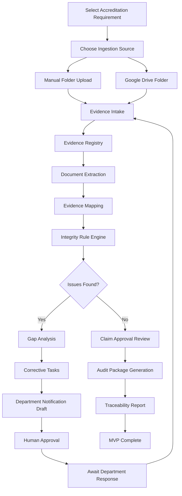

# ProofChain MVP Build Phases and Workflow

## Purpose

This document defines the practical build roadmap for the ProofChain MVP.

The goal is to create a strong base before implementation begins, so every feature supports the central ProofChain idea:

```text
Requirement -> Claim -> Evidence -> Verification -> Gap -> Task -> Approval -> Audit Package
```

ProofChain should first become a reliable evidence-governance system. AI features should improve extraction, mapping, and explanations, but the foundation must be deterministic, auditable, and easy to trust.

---

# 1. What To Focus On First

## 1.1 Strong Evidence Model

The evidence model is the base of the whole project.

Before building complex agents, dashboards, or integrations, ProofChain must clearly define:

- What an evidence item is
- Where it came from
- Which department owns it
- Which academic year it belongs to
- Which requirement it supports
- Which claim it supports
- Whether it passed verification
- Which gaps or contradictions were found
- Who approved or rejected it
- Which package included it

If the evidence model is weak, the rest of the system will become confusing.

## 1.2 One Excellent End-to-End Workflow

The MVP should focus on one complete workflow rather than many incomplete features.

The best first demo workflow is:

```text
CSE uploads event evidence
-> ProofChain extracts values
-> ProofChain maps files to C3.2.1
-> ProofChain detects count mismatch and missing signature
-> ProofChain creates tasks
-> Coordinator reviews notification draft
-> Corrected evidence is accepted
-> Audit package is generated
```

This single workflow will prove the value of the entire project.

## 1.3 Deterministic Rules Before Advanced AI

The first version should prioritize rules that are easy to verify:

- Duplicate file detection
- Missing document detection
- Participant count mismatch
- Academic year mismatch
- Missing approval signature
- Department mismatch
- Required evidence checklist completion

AI can be added for extraction and explanation, but the important validation decisions should first be rule-driven.

## 1.4 Traceability As The Signature Feature

ProofChain should always show why it made a decision.

Every finding should answer:

- Which file was checked?
- Which value was extracted?
- Which rule was applied?
- What failed?
- What correction is needed?
- Who approved the final result?

This is what makes the project different from a normal document chatbot.

## 1.5 Simple Architecture First

For the MVP, avoid overloading the base with too many databases or services.

Recommended first base:

- Frontend dashboard
- Backend API
- Evidence registry database
- Local file storage
- Document extraction service
- Rule engine
- Task and approval workflow
- Audit package generator

PostgreSQL is enough for the first version. Qdrant, Neo4j, MinIO, and advanced RAG can be added later.

---

# 2. MVP Build Principles

## 2.1 Evidence Before Generation

The system should never invent institutional facts.

AI may help read, classify, summarize, and explain, but final claims must be supported by evidence.

## 2.2 Human Control

Human approval is required for:

- Sending department notifications
- Accepting corrected evidence
- Approving claims
- Generating final audit packages
- Overriding failed checks

## 2.3 Controlled Autonomy

Agents should not behave like unrestricted chatbots.

Each agent or module should have:

- A clear input
- A clear output
- Limited permission
- A confidence score
- Source references
- Audit logs

## 2.4 Build For Demo And Future Production

The MVP should be demo-friendly, but not throwaway.

That means:

- Use realistic data structures
- Keep source tracking
- Keep audit logs
- Avoid hardcoding everything into the UI
- Make Google Drive a future-ready ingestion source

---

# 3. Core MVP Workflow

## 3.1 High-Level Workflow

```text
User selects requirement
-> User uploads folder or connects Drive folder
-> Files are registered
-> Files are extracted
-> Evidence is mapped
-> Rules are executed
-> Gaps are created
-> Tasks are assigned
-> Notifications are drafted
-> Human approves actions
-> Corrected evidence is reprocessed
-> Audit package is generated
-> Trace is recorded
```

## 3.2 Workflow Diagram



---

# 4. Phase 0: Project Foundation

## Goal

Create the clean base for the project before feature implementation.

## What We Build

- Repository structure
- Documentation folder
- Environment configuration template
- Data model definitions
- Sample dataset plan
- MVP workflow specification
- Basic architecture decisions

## Key Decisions

- Use one complete workflow first.
- Use manual upload first.
- Keep Google Drive as optional connector.
- Use deterministic rules first.
- Postpone Qdrant and Neo4j.

## Deliverables

- Project README
- MVP architecture document
- Build phases document
- Sample dataset structure
- Initial data schema draft

## Done Criteria

- Team understands the MVP scope.
- All core entities are defined.
- Build order is clear.
- No major feature ambiguity remains.

---

# 5. Phase 1: Evidence Registry and Ingestion

## Goal

Allow ProofChain to accept documents and create controlled evidence records.

## What We Build

- Manual file or folder upload
- Evidence ID generation
- File checksum generation
- Evidence metadata storage
- Department and requirement tagging
- Duplicate file detection
- Ingestion source tracking

## Supported Input

- PDF event reports
- PDF approval documents
- XLSX attendance sheets
- CSV attendance sheets
- Image evidence records, optional

## Output

Each uploaded file becomes an evidence record:

```json
{
  "evidence_id": "EVD-CSE-2026-00001",
  "original_filename": "AI_Workshop_Report.pdf",
  "department": "CSE",
  "academic_year": "2025-2026",
  "source_type": "manual_upload",
  "checksum": "sha256-value",
  "status": "registered"
}
```

## Done Criteria

- Files can be uploaded.
- Every file receives a unique evidence ID.
- Duplicate files are detected.
- Original file metadata is preserved.
- Evidence records appear in the dashboard or database.

---

# 6. Phase 2: Sample Dataset Creation

## Goal

Create realistic data for testing and demonstration.

## What We Build

Five department folders:

- CSE
- ECE
- EEE
- Mechanical
- Civil

Five accreditation requirements:

- C3.2.1 Industry interaction activities
- C5.1.3 Student enrichment programmes
- C6.3.2 Faculty development activities
- C7.1.1 Extension and outreach activities
- C1.2.1 Value-added courses

Sample files:

- 20 to 30 event reports
- 5 attendance spreadsheets
- 10 approval documents
- A few certificates
- A few photo evidence records

Injected problems:

- Count mismatch
- Missing approval
- Missing signature
- Duplicate report
- Duplicate student rows
- Wrong academic year
- Wrong department
- Incorrect mapping

## Done Criteria

- Dataset can trigger all MVP rules.
- Dataset supports a complete demo story.
- At least one department has clean evidence.
- At least one department has multiple unresolved gaps.

---

# 7. Phase 3: Document Extraction

## Goal

Extract structured information from evidence files.

## What We Build

- PDF text extraction
- Spreadsheet parsing
- Basic document type detection
- Field extraction
- Page or sheet references
- Extraction confidence score

## Fields To Extract

- Event title
- Event date
- Department
- Academic year
- Coordinator name
- Participant count
- Approval status
- Signature presence
- Student names or roll numbers from attendance sheets

## Output

```json
{
  "evidence_id": "EVD-CSE-2026-00001",
  "document_type": "event_report",
  "extracted_fields": {
    "event_title": "Industry Workshop on Agentic AI",
    "event_date": "2026-02-14",
    "department": "CSE",
    "reported_participant_count": 120
  },
  "source_references": {
    "event_date": "page 1",
    "reported_participant_count": "page 3"
  },
  "confidence": 0.91
}
```

## Done Criteria

- PDF values can be extracted.
- Spreadsheet participant counts can be calculated.
- Extracted values are stored.
- Extraction results include source references.

---

# 8. Phase 4: Evidence Mapping

## Goal

Map documents to accreditation requirements.

## What We Build

- Requirement checklist
- File-name based mapping
- Folder-based mapping
- Keyword-based mapping
- Document-type based mapping
- Mapping confidence score
- Manual mapping override

## Example

```text
AI_Workshop_Report_CSE.pdf
-> event_report
-> industry interaction activity
-> C3.2.1
-> confidence: 0.88
```

## Done Criteria

- Evidence can be mapped to one of five requirements.
- Weak mappings are flagged.
- User can correct a mapping.
- Mapping decisions are logged.

---

# 9. Phase 5: Integrity Rule Engine

## Goal

Detect missing, inconsistent, duplicate, or weak evidence.

## What We Build

Rules:

- Exact duplicate detection
- Required document checklist
- Participant count reconciliation
- Academic year validation
- Signature presence check
- Department consistency check
- Duplicate student row detection

## Example Finding

```json
{
  "finding_type": "count_mismatch",
  "severity": "high",
  "description": "Event report claims 120 participants, but attendance sheet contains 108 unique students.",
  "status": "open"
}
```

## Done Criteria

- At least five deterministic rules work.
- Contradictions are detected.
- Missing evidence is detected.
- Duplicate evidence is detected.
- Rule results appear in the dashboard.

---

# 10. Phase 6: Gap Analysis and Task Generation

## Goal

Convert verification problems into actionable tasks.

## What We Build

- Gap records
- Corrective task creation
- Department assignment
- Priority calculation
- Due date assignment
- Task status tracking

## Task Statuses

- Open
- Awaiting department response
- Submitted
- Rechecking
- Resolved
- Rejected

## Done Criteria

- Every major finding can create a gap.
- Gaps create department-specific tasks.
- Tasks show owner, priority, and due date.
- Resolved tasks can trigger re-verification.

---

# 11. Phase 7: Department Notification Workflow

## Goal

Prepare communication for departments without uncontrolled automation.

## What We Build

- Notification draft generation
- Department-specific issue summary
- Human approval before sending
- Notification status tracking
- Awaiting response metric

## MVP Behavior

For the first version, actual sending can be simulated or limited to internal notification drafts.

Later integrations:

- Email
- Google Chat
- Microsoft Teams
- Slack
- WhatsApp Business API

## Done Criteria

- Tasks can generate notification drafts.
- User can approve or reject draft messages.
- Departments awaiting response are tracked.
- Communication actions are logged.

---

# 12. Phase 8: Dashboard and Impact Metrics

## Goal

Show operational status and project value clearly.

## What We Build

Dashboard metrics:

- Evidence completeness percentage
- Number of unresolved evidence gaps
- Contradictions detected
- Duplicate evidence detected
- Departments awaiting response
- Average verification time
- Estimated manual hours saved
- Audit readiness score

## Recommended Main Views

- Executive dashboard
- Criterion workspace
- Evidence explorer
- Gap and task board
- Approval center
- Audit package page

## Done Criteria

- Dashboard updates after processing.
- Metrics use real system records.
- User can inspect evidence behind each metric.
- Audit readiness score is visible.

---

# 13. Phase 9: Human Approval Center

## Goal

Keep high-impact decisions under human control.

## What We Build

Approval queues for:

- Claim approval
- Notification sending
- Corrected evidence acceptance
- Final package generation
- Rule override

## Done Criteria

- Approval requests are created.
- User can approve or reject.
- Rejections can include comments.
- Approval decisions are logged.
- Final package cannot be generated without required approvals.

---

# 14. Phase 10: Audit Package Generation

## Goal

Generate a structured package that an accreditation coordinator can review.

## What We Build

Package output:

```text
audit_package/
  manifest.json
  evidence_index.xlsx
  requirement_summary.pdf
  findings_report.pdf
  traceability_report.pdf
  C3.2.1/
    event_reports/
    attendance_sheets/
    approval_documents/
    certificates/
    photos/
```

## Package Should Include

- Requirement summary
- Claims
- Evidence list
- Verification status
- Open and resolved gaps
- Approval history
- Checksums
- Traceability report

## Done Criteria

- User can generate package.
- Package includes evidence index.
- Manifest includes checksums.
- Traceability report is generated.
- Package generation is logged.

---

# 15. Phase 11: Google Drive Connector

## Goal

Allow ProofChain to ingest evidence from approved Google Drive folders.

## Why This Comes After Manual Upload

Google Drive integration requires external setup:

- Google Cloud project
- Drive API
- OAuth consent
- Client credentials
- Token storage
- Folder permissions

Manual upload should work first so the MVP is not blocked by OAuth.

## What We Build

- Connect Google Drive button
- OAuth authorization flow
- Folder ID or folder URL input
- File listing
- File metadata sync
- Read-only file download
- Change detection
- Re-ingestion for updated files

## Required OAuth Scope

```text
https://www.googleapis.com/auth/drive.readonly
```

## Drive Connector Workflow

```text
User connects Google Drive
-> User selects approved folder
-> ProofChain lists supported files
-> New files are registered
-> Changed files are versioned
-> Files enter the same extraction pipeline
```

## Done Criteria

- User can connect Drive.
- User can select or paste a folder ID.
- Supported files can be synced.
- Drive files become evidence records.
- Drive source ID is stored.
- Original Drive files are never modified.

---

# 16. Phase 12: Traceability and Agent Run Logs

## Goal

Make every ProofChain decision explainable.

## What We Build

- Agent run records
- Rule execution logs
- Source references
- Approval logs
- Evidence version history
- End-to-end claim trace

## Trace View Should Show

```text
Claim: 120 students attended Agentic AI workshop
Evidence:
  - Event report: says 120
  - Attendance sheet: shows 108 unique students
Rule:
  - CNT-001 participant count reconciliation failed
Gap:
  - Correct participant count required
Task:
  - Assigned to CSE coordinator
Approval:
  - Final correction accepted by IQAC coordinator
Package:
  - Included in C3.2.1 audit package
```

## Done Criteria

- User can open a trace for a claim.
- Trace shows files, extracted values, findings, tasks, and approvals.
- Every major workflow event is logged.

---

# 17. Final MVP Completion Criteria

The ProofChain MVP is complete when the system can:

1. Ingest documents manually.
2. Register each file as evidence.
3. Extract fields from PDF and spreadsheet files.
4. Map evidence to five accreditation requirements.
5. Detect missing and inconsistent evidence.
6. Detect duplicate evidence.
7. Generate tasks for departments.
8. Draft department notifications.
9. Track departments awaiting response.
10. Display dashboard impact metrics.
11. Require human approval for critical actions.
12. Generate an audit-ready package.
13. Show full traceability for every claim.
14. Support a clear path for Google Drive ingestion.

---

# 18. Recommended Immediate Focus

The perfect base for ProofChain should be built in this order:

1. Evidence data model
2. Requirement and claim model
3. Ingestion model
4. Extraction model
5. Rule engine model
6. Gap and task model
7. Approval model
8. Audit log model
9. Dashboard metric formulas
10. Package generation structure

Once these are clear, implementation becomes straightforward.

The strongest first version is not the one with the most agents. It is the one where every uploaded file can be traced all the way to an accreditation claim, a verification result, a human decision, and an audit package.

