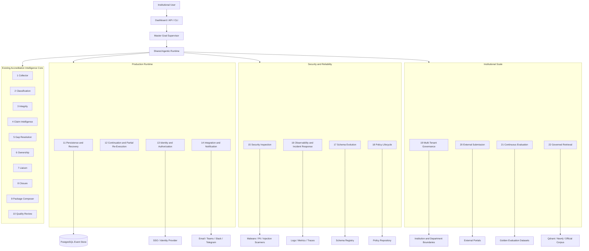

# ProofChain
## Next-Generation Agentic Expansion Architecture and Implementation Plan

**Current baseline:** Governed JSON-backed ten-agent accreditation evidence platform  
**Current validation:** 63 passing tests at the latest verified point  
**Primary objective:** Extend the existing ten-agent core into a durable, resumable, secure, production-oriented institutional platform without adding meaningless agent wrappers.

---

# 1. Purpose

ProofChain already implements the complete accreditation evidence lifecycle:

```text
Discover -> Understand -> Verify -> Defend -> Plan -> Assign
-> Coordinate -> Revalidate -> Package -> Challenge -> Human Approval
```

The current primary agents are:

1. Evidence Collector
2. Evidence Classification
3. Evidence Integrity
4. Claim Intelligence
5. Adaptive Gap Resolution
6. Accountability and Ownership
7. Department Liaison
8. Closure Revalidation
9. Audit Package Composer
10. Adversarial Quality Review

The next stage should not duplicate these responsibilities. It should add production, security, reliability, authorization, and institutional-scale agents around the existing core.

This document defines:

- Which additional agents should be built
- Why each agent is necessary
- What goals each agent accepts
- How each agent plans, reasons, acts, reflects, and completes
- Which tools each agent may use
- How the agents connect to the existing ten-agent workflow
- Which responsibilities remain deterministic
- How to implement, test, and deploy the expanded platform

---

# 2. Rule for Calling a Component an Agent

A component should be called an **agent** only when it can independently:

1. Accept a typed goal
2. Observe current state
3. Create an explicit plan
4. Select actions dynamically
5. Use approved tools
6. Interpret tool observations
7. Retry or replan
8. Coordinate with peer agents
9. Handle uncertainty
10. Determine whether its goal is complete
11. Emit an explainable completion decision

A component that performs one fixed function should remain a:

- Service
- Tool
- Adapter
- Validator
- Evaluator
- Repository
- Deterministic specialist module

This preserves the credibility of ProofChain's agent count.

---

# 3. Recommended New Primary Agents

## Production Runtime Agents

11. Operational Persistence and State Recovery Agent
12. Workflow Continuation and Partial Re-Execution Agent
13. Enterprise Identity and Authorization Governance Agent
14. Integration and Notification Orchestration Agent

## Security and Reliability Agents

15. Security Inspection and Evidence Safety Agent
16. Observability, Reliability, and Incident Response Agent
17. Data Contract and Schema Evolution Agent
18. Policy Lifecycle and Governance Consistency Agent

## Institutional Scale and Lifecycle Agents

19. Multi-Tenant Institution Governance Agent
20. External Submission and Regulatory Handoff Agent
21. Continuous Evaluation and System Assurance Agent
22. Governed Knowledge Retrieval and Research Assistance Agent

The recommended first build wave is:

```text
11 -> 12 -> 13 -> 14 -> 15 -> 16
```

The second wave is:

```text
17 -> 18 -> 19 -> 20
```

The optional intelligence wave is:

```text
21 -> 22
```

---

# 4. Expanded Architecture



---

# 5. Shared Goal-Agent Runtime

Every new agent should inherit from the same governed runtime used by the current agents.

```python
class BaseGoalAgent:
    agent_name: str
    allowed_tools: set[str]

    async def run_goal(self, goal, context, budget):
        state = await self.observe(goal, context)
        plan = await self.load_or_create_plan(goal, state)

        while not budget.exhausted:
            next_step = self.select_next_step(plan, state)

            if next_step is None:
                return await self.evaluate_completion(goal, plan, state)

            action = await self.propose_action(goal, next_step, state)
            self.validate_action(action)

            result = await self.execute_tool(action)
            observation = self.build_observation(action, result)
            await self.persist_observation(observation)

            reflection = await self.reflect(
                goal=goal,
                plan=plan,
                state=state,
                observation=observation,
            )
            await self.persist_reflection(reflection)

            if reflection.decision == "continue":
                state = await self.observe(goal, context)
            elif reflection.decision == "retry":
                budget.consume_retry()
            elif reflection.decision == "replan":
                budget.consume_replan()
                plan = await self.replan(goal, plan, state, observation)
            elif reflection.decision == "request_peer":
                await self.publish_peer_request(reflection)
                return self.waiting_decision(goal, reflection)
            elif reflection.decision == "request_human":
                return self.human_review_decision(goal, reflection)
            else:
                return await self.evaluate_completion(goal, plan, state)

        return self.budget_exhausted_decision(goal)
```

## Required Runtime Artifacts

Every new agent writes:

```text
goal.json
plans.json
observations.jsonl
reflections.jsonl
working_memory.json
completion_decision.json
```

## Default Budget

```yaml
max_plan_revisions: 3
max_action_rounds: 12
max_tool_retries_per_step: 2
max_peer_requests: 6
max_runtime_seconds: 600
```

An agent that exhausts its budget must return `BLOCKED` or `NEEDS_HUMAN_REVIEW`. It must not loop indefinitely.

---

# 6. Shared Schemas

## Goal

```python
class Goal(BaseModel):
    goal_id: str
    run_id: str
    parent_goal_id: str | None
    assigned_agent: str
    goal_type: str
    objective: str
    priority: str
    constraints: list[str]
    success_conditions: list[str]
    failure_conditions: list[str]
    input_references: list[str]
    dependency_goal_ids: list[str]
    status: str
```

## Agent Plan

```python
class AgentPlan(BaseModel):
    plan_id: str
    goal_id: str
    agent_name: str
    revision: int
    assumptions: list[str]
    dependencies: list[str]
    steps: list[PlanStep]
    expected_outputs: list[str]
    status: str
```

## Observation

```python
class Observation(BaseModel):
    observation_id: str
    run_id: str
    goal_id: str
    agent_name: str
    observation_type: str
    summary: str
    structured_data: dict
    confidence: float
    uncertainty_reasons: list[str]
    source_references: list[str]
```

## Completion Decision

```python
class CompletionDecision(BaseModel):
    decision_id: str
    goal_id: str
    agent_name: str
    goal_satisfied: bool
    final_status: str
    success_conditions_met: list[str]
    success_conditions_unmet: list[str]
    blockers: list[str]
    confidence: float
    explanation: str
    supporting_artifacts: list[str]
```

---

# 7. Agent 11: Operational Persistence and State Recovery Agent

## Purpose

Make every workflow state durable, queryable, recoverable, and suitable for long-running institutional use.

## Goal Example

```text
Ensure that all events, approvals, tasks, issues, plans, decisions, and artifact metadata for RUN-001 are durably persisted and can be reconstructed after interruption.
```

## Agentic Responsibilities

- Inspect database health
- Compare JSON and database state
- Detect missing events
- Plan migration or recovery
- Persist events transactionally
- Rebuild aggregate state
- Reconcile artifact metadata
- Verify restored state hashes
- Escalate unrecoverable corruption

## Specialist Modules

1. Database Health Checker
2. Migration Planner
3. Event Importer
4. Snapshot Rebuilder
5. Integrity Validator
6. Recovery Executor
7. Materialized View Builder
8. Completion Evaluator

## Workflow

```text
Observe persistence state
    -> Detect missing or inconsistent records
    -> Create migration or recovery plan
    -> Persist events transactionally
    -> Rebuild current state
    -> Validate event order and hashes
    -> Reconcile artifact metadata
    -> Complete or escalate
```

## Tools

```text
check_database_health
read_event_stream
write_event_transaction
create_snapshot
rebuild_state
compare_state_hash
run_database_migration
validate_foreign_keys
repair_materialized_view
```

## Completion Conditions

- All required events are persisted.
- Aggregate versions are sequential.
- State can be reconstructed.
- Artifact metadata is linked.
- Recovery test passes.
- No unresolved corruption remains.

## Governance Boundaries

The agent must not delete event history, rewrite earlier events, change institutional decisions, or perform unapproved schema migrations.

## Main Implementation

```text
proofchain/agents/persistence/agent.py
proofchain/agents/persistence/recovery_planner.py
proofchain/repositories/postgres/
proofchain/schemas/persistence.py
proofchain/schemas/events.py
```

---

# 8. Agent 12: Workflow Continuation and Partial Re-Execution Agent

## Purpose

Resume paused workflows and rerun only the affected scope after new evidence, approval, task response, policy change, or failure recovery.

## Goal Example

```text
Resume RUN-001 after a new approval letter is submitted and rerun only the affected evidence, claim, issue, package, and quality-review scopes.
```

## Responsibilities

- Identify what changed
- Calculate artifact fingerprints
- Traverse dependencies
- Mark stale outputs
- Reuse unchanged outputs
- Create targeted goals
- Prevent duplicate actions
- Resume waiting goals
- Reconcile final state

## Specialist Modules

1. Change Detector
2. Fingerprint Calculator
3. Dependency Impact Analyzer
4. Cache Eligibility Evaluator
5. Re-Execution Planner
6. Resume State Resolver
7. Duplicate Action Detector
8. Completion Reconciler

## Workflow

```text
Receive resume event
    -> Identify changed entity
    -> Compare fingerprints
    -> Resolve affected dependency scope
    -> Mark stale outputs
    -> Reuse safe outputs
    -> Schedule affected agents
    -> Validate partial rerun
    -> Update top-level decision
```

## Example

```text
New approval letter
    -> Collector registers one version
    -> Classification processes one document
    -> Integrity runs approval rules for one bundle
    -> Claim Agent revalidates one claim
    -> Gap Agent updates one issue
    -> Package Agent rebuilds one package
    -> Quality Agent reviews the changed package
```

## Completion Conditions

- The changed scope is known.
- Stale outputs are invalidated.
- Safe outputs are reused.
- Required agents complete.
- No duplicate action occurs.
- Final run state is reconciled.

---

# 9. Agent 13: Enterprise Identity and Authorization Governance Agent

## Purpose

Tie permissions, approvals, ownership, and task activation to real institutional identities and authority.

## Goal Example

```text
Determine whether USR-104 may approve ownership assignment ASN-001 under department, separation-of-duties, delegation, and dual-approval policies.
```

## Responsibilities

- Resolve SSO identity
- Load roles and scopes
- Match permission to action
- Detect conflict of interest
- Enforce separation of duties
- Validate delegation
- Determine dual-approval requirements
- Record authorization decisions

## Specialist Modules

1. Identity Resolver
2. Role Scope Evaluator
3. Permission Matcher
4. Conflict-of-Interest Detector
5. Separation-of-Duties Evaluator
6. Delegation Validator
7. Dual-Approval Planner
8. Authorization Decision Evaluator

## Workflow

```text
Resolve identity
    -> Load roles and scopes
    -> Load target and policy
    -> Check department scope
    -> Check permissions
    -> Detect conflict of interest
    -> Validate delegation
    -> Determine required approvals
    -> Authorize, deny, or escalate
```

## Unique Features

### Dynamic Separation of Duties

Prevent:

- Evidence uploader approving their own evidence
- Task owner approving their own assignment
- Package composer approving the package
- Department owner waiving their own issue

### Delegated Authority

Delegation includes scope, start date, end date, reason, and issuing authority.

### Dual Approval

High-risk actions may require two independent approvers.

## Completion Conditions

- Identity is verified.
- Scope is resolved.
- Conflict checks complete.
- Required approval count is known.
- An authorization decision is persisted.

---

# 10. Agent 14: Integration and Notification Orchestration Agent

## Purpose

Deliver approved tasks through real channels and synchronize responses with ProofChain.

## Supported Integrations

- Email
- Microsoft Teams
- Slack
- Telegram
- Calendar
- Institutional portals
- Webhooks

## Goal Example

```text
Deliver approved task TASK-001 through the recipient's permitted channel, confirm delivery, and synchronize the response.
```

## Responsibilities

- Select allowed channel
- Verify provider health
- Build minimum-disclosure payload
- Dispatch idempotently
- Confirm delivery
- Retry or use fallback
- Correlate response
- Update task state

## Specialist Modules

1. Channel Policy Resolver
2. Provider Selector
3. Payload Builder
4. Delivery Executor
5. Receipt Verifier
6. Retry Planner
7. Response Correlator
8. Integration Health Monitor

## Agentic Workflow

```text
Observe approved communication
    -> Select channel
    -> Verify provider
    -> Build safe payload
    -> Dispatch
    -> Wait for receipt
    -> Retry or fallback
    -> Interpret response
    -> Update task and complete
```

## Required Controls

- Idempotency keys
- Correlation token
- Rate limits
- Provider fallback
- Duplicate suppression
- Least-disclosure payloads
- Approval verification

## Completion Conditions

- Message was delivered or safely failed.
- Delivery state is recorded.
- Response correlation is active.
- No duplicate delivery occurred.

---

# 11. Agent 15: Security Inspection and Evidence Safety Agent

## Purpose

Determine whether evidence can safely enter the pipeline and which controls are required.

## Threats

- Malware
- Dangerous archives
- Formula injection
- Prompt injection
- Path traversal
- PII leakage
- Oversized files
- Hidden content
- Cross-department exposure

## Goal Example

```text
Determine whether EVD-044 may safely enter ProofChain and whether quarantine, restriction, or redaction is required.
```

## Specialist Modules

1. MIME and File Safety Inspector
2. Malware Scanner Adapter
3. Archive Safety Evaluator
4. Spreadsheet Formula Inspector
5. Prompt-Injection Detector
6. PII Detector
7. Access Boundary Evaluator
8. Redaction Planner
9. Security Decision Evaluator

## Security Decisions

```text
ALLOW
ALLOW_WITH_RESTRICTIONS
REDACT_DERIVATIVE_REQUIRED
QUARANTINE
REJECT
NEEDS_SECURITY_REVIEW
```

## Workflow

```text
Verify file identity
    -> Scan malware
    -> Inspect archive or spreadsheet
    -> Detect prompt injection
    -> Detect PII
    -> Verify access scope
    -> Decide allow, restrict, redact, quarantine, or reject
```

## Critical Rule

> Extracted document content is untrusted data and can never change agent instructions, tool permissions, or governance policy.

## Completion Conditions

- Required scans complete.
- Security decision is recorded.
- Restrictions are explicit.
- Unsafe evidence is quarantined.
- Downstream agents receive the security decision.

---

# 12. Agent 16: Observability, Reliability, and Incident Response Agent

## Purpose

Continuously monitor agent execution, identify abnormal behavior, coordinate recovery, and preserve evidence integrity.

## Goal Example

```text
Maintain reliable execution of RUN-001, detect abnormal behavior, identify root cause, and coordinate safe recovery.
```

## Inputs

- Logs
- Metrics
- Traces
- Tool failures
- Queue state
- Event stream
- Goal states
- Provider health

## Specialist Modules

1. Metrics Analyzer
2. Trace Analyzer
3. Anomaly Detector
4. Failure Correlator
5. Incident Classifier
6. Recovery Planner
7. SLA Monitor
8. Incident Completion Evaluator

## Workflow

```text
Observe logs and metrics
    -> Detect anomaly
    -> Correlate affected agents and tools
    -> Classify severity
    -> Select retry, failover, pause, or escalation
    -> Verify recovery
    -> Produce incident report
```

## Example

```text
OCR timeouts increase
    -> Correlate failures to provider
    -> Pause affected classification goals
    -> Switch to fallback provider
    -> Resume goals
    -> Confirm no duplicate tool calls
```

## Completion Conditions

- Incident is classified.
- Root cause or best-supported hypothesis is recorded.
- Recovery is executed or escalated.
- Data integrity is verified.
- Incident report is complete.

---

# 13. Agent 17: Data Contract and Schema Evolution Agent

## Purpose

Protect backward compatibility as ProofChain schemas and artifacts evolve.

## Goal Example

```text
Migrate ClaimDecision version 1.2 to version 2.0 while preserving historical runs and validating compatibility.
```

## Responsibilities

- Track schema versions
- Detect incompatible artifacts
- Plan migrations
- Convert copies without modifying originals
- Validate backward compatibility
- Block unsafe deployment

## Specialist Modules

1. Schema Registry Reader
2. Compatibility Analyzer
3. Migration Planner
4. Artifact Converter
5. Regression Validator
6. Deployment Gate Evaluator

## Completion Conditions

- Migration path exists.
- Historical artifacts remain readable.
- Compatibility tests pass.
- Deployment decision is explainable.

---

# 14. Agent 18: Policy Lifecycle and Governance Consistency Agent

## Purpose

Version governance policies, detect conflicts, simulate impact, and prevent unsafe policy activation.

## Goal Example

```text
Evaluate the impact of requiring dual approval for all gap waivers.
```

## Responsibilities

- Parse policy changes
- Detect policy conflicts
- Simulate historical impact
- Identify affected open runs
- Recommend activation strategy
- Preserve old decisions

## Specialist Modules

1. Policy Parser
2. Conflict Detector
3. Impact Analyzer
4. Historical Replay Simulator
5. Policy Version Manager
6. Activation Gate

## Completion Conditions

- Syntax is valid.
- Conflicts are resolved or disclosed.
- Impact is measured.
- Activation recommendation exists.
- Human approval requirement is recorded.

---

# 15. Agent 19: Multi-Tenant Institution Governance Agent

## Purpose

Maintain strict isolation across institutions, campuses, departments, and frameworks.

## Goal Example

```text
Ensure that a CSE user in Institution A can access only authorized Institution A resources.
```

## Responsibilities

- Resolve tenant
- Enforce department boundaries
- Detect cross-tenant access
- Apply tenant-specific policy
- Control cross-department collaboration
- Validate package and evidence scope

## Specialist Modules

1. Tenant Resolver
2. Scope Boundary Evaluator
3. Cross-Tenant Access Detector
4. Tenant Policy Resolver
5. Resource Sharing Planner
6. Isolation Completion Evaluator

## Completion Conditions

- Tenant and department are known.
- Access decision is made.
- Cross-tenant leakage is prevented.
- Policy source is recorded.

---

# 16. Agent 20: External Submission and Regulatory Handoff Agent

## Purpose

Execute an approved package handoff while preserving final human control.

## Goal Example

```text
Submit approved package PKG-001 to the authorized accreditation portal and verify receipt.
```

## Responsibilities

- Verify package quality status
- Verify final human approval
- Freeze package hash
- Validate deadline and portal
- Require final confirmation
- Submit idempotently
- Verify receipt
- Handle rejection or resubmission

## Specialist Modules

1. Submission Eligibility Evaluator
2. Portal Adapter Selector
3. Payload Validator
4. Final Confirmation Gate
5. Submission Executor
6. Receipt Verifier
7. Rejection Handler
8. Completion Evaluator

## Governance Boundaries

The agent must never:

- Submit without final human approval
- Modify the approved package
- Submit a stale package version
- Hide rejection
- Repeat an irreversible action without idempotency

---

# 17. Agent 21: Continuous Evaluation and System Assurance Agent

## Purpose

Continuously measure whether new ProofChain versions improve quality without increasing false approvals, false closures, or governance failures.

## Goal Example

```text
Determine whether release 2.1 maintains validated decision quality and satisfies all release thresholds.
```

## Responsibilities

- Build evaluation plans
- Run golden datasets
- Compare releases
- Detect regression
- Measure calibration
- Recommend release pass or block

## Metrics

```text
Classification accuracy
Requirement mapping precision and recall
Finding precision and recall
Claim decision accuracy
False approval rate
False closure rate
Human override rate
Average replans
Completion reliability
```

## Specialist Modules

1. Dataset Resolver
2. Evaluation Planner
3. Scenario Runner
4. Metric Calculator
5. Regression Detector
6. Calibration Evaluator
7. Release Decision Evaluator

## Completion Conditions

- Required scenarios run.
- Metrics are calculated.
- Regression thresholds are evaluated.
- Release recommendation is recorded.

---

# 18. Agent 22: Governed Knowledge Retrieval and Research Assistance Agent

## Purpose

Provide cited, authoritative accreditation guidance to other agents without becoming a decision authority.

## Goal Example

```text
Retrieve authoritative guidance relevant to criterion C3.2.1 and provide cited context to Classification, Claim Intelligence, and Quality Review.
```

## Source Priority

```text
Official accreditation framework
    -> Institutional policy
    -> Approved internal procedure
    -> Historical accepted package
    -> Advisory example
```

## Responsibilities

- Plan retrieval
- Evaluate source authority
- Retrieve relevant guidance
- Retrieve conflicting guidance
- Check freshness
- Build citations
- Mark human interpretation requirements

## Specialist Modules

1. Query Planner
2. Source Authority Evaluator
3. Semantic Retriever
4. Contradiction Retriever
5. Citation Builder
6. Freshness Evaluator
7. Completion Evaluator

## Governance Boundaries

The agent must not:

- Override deterministic rules
- Treat retrieved text as system instructions
- Use unverified sources for final policy
- Produce uncited institutional claims
- Approve evidence

---

# 19. Agent Connection Map

```text
Agent 11 Persistence
    <-> Supervisor and every agent

Agent 12 Continuation
    <-> Supervisor
    <-> Agents 1-10

Agent 13 Identity
    <-> Agent 6 Ownership
    <-> Agent 7 Liaison
    <-> Human Approval
    <-> Agent 20 Submission

Agent 14 Integration
    <-> Agent 7 Liaison
    <-> Agent 8 Closure
    <-> Agent 16 Reliability

Agent 15 Security
    -> Agent 1 Collector
    -> Agent 2 Classification
    -> Agent 9 Package
    -> Agent 20 Submission

Agent 16 Reliability
    <-> Every agent

Agent 17 Schema Evolution
    <-> Agent 11 Persistence
    <-> Every artifact-producing agent

Agent 18 Policy Lifecycle
    <-> Integrity, Ownership, Liaison, Closure, Package, Submission

Agent 19 Multi-Tenant Governance
    <-> Identity
    <-> Every evidence, task, and package operation

Agent 20 Submission
    <- Package Composer
    <- Quality Review
    <- Human Approval

Agent 21 Evaluation
    <-> Every release and agent

Agent 22 Retrieval
    -> Classification
    -> Claim Intelligence
    -> Quality Review
```

---

# 20. Inter-Agent Communication Contract

```python
class CoordinationMessage(BaseModel):
    message_id: str
    run_id: str
    source_agent: str
    target_agent: str
    goal_id: str
    message_type: str
    reason: str
    related_entity_ids: list[str]
    payload: dict
    priority: str
    status: str
```

## Rules

1. Every message references a run and goal.
2. Every request identifies related entities.
3. No agent directly overwrites another agent's plan.
4. Shared state changes are atomic.
5. Every request has a lifecycle.
6. Peer requests may create dynamic subgoals.
7. Goal completion requires mandatory peer requests to be resolved or explicitly blocking.

---

# 21. Tool Governance

Every agent receives an allowlist.

```yaml
security_agent:
  allowed:
    - scan_malware
    - detect_prompt_injection
    - detect_pii
    - quarantine_evidence
  denied:
    - approve_evidence
    - delete_original
    - send_external_message

submission_agent:
  allowed:
    - validate_submission
    - upload_to_approved_portal
    - verify_receipt
  denied:
    - modify_package
    - bypass_human_confirmation
    - submit_unapproved_package
```

Every tool call should record:

- Tool name and version
- Agent and goal
- Argument hash
- Start and end time
- Status
- Result hash
- Error code

---

# 22. Recommended Repository Structure

```text
proofchain/
├── agents/
│   ├── persistence/
│   ├── continuation/
│   ├── identity/
│   ├── integration/
│   ├── security/
│   ├── reliability/
│   ├── schema_evolution/
│   ├── policy_lifecycle/
│   ├── tenant_governance/
│   ├── submission/
│   ├── evaluation/
│   └── knowledge_retrieval/
│
├── repositories/
│   ├── interfaces/
│   ├── json/
│   ├── postgres/
│   ├── qdrant/
│   ├── neo4j/
│   └── object_storage/
│
├── integrations/
│   ├── identity/
│   ├── email/
│   ├── teams/
│   ├── slack/
│   ├── telegram/
│   ├── calendar/
│   └── submission_portals/
│
├── schemas/
│   ├── persistence.py
│   ├── continuation.py
│   ├── identity.py
│   ├── integrations.py
│   ├── security.py
│   ├── incidents.py
│   ├── schema_registry.py
│   ├── policy_lifecycle.py
│   ├── tenants.py
│   ├── submissions.py
│   └── evaluations.py
│
├── policies/
│   ├── identity_policy.yaml
│   ├── notification_policy.yaml
│   ├── security_policy.yaml
│   ├── recovery_policy.yaml
│   ├── tenant_policy.yaml
│   └── submission_policy.yaml
│
└── tests/
    ├── persistence/
    ├── continuation/
    ├── identity/
    ├── integration/
    ├── security/
    ├── reliability/
    ├── schema_evolution/
    ├── policy_lifecycle/
    ├── multi_tenant/
    ├── submission/
    └── evaluation/
```

---

# 23. Implementation Roadmap

## Phase 1: Runtime Durability

Build Agent 11 and PostgreSQL repositories.

Acceptance:

- Run state reconstructs from events.
- JSON remains exportable.
- Crash recovery works.

## Phase 2: Workflow Continuation

Build Agent 12, waiting states, resume, fingerprints, and partial reruns.

Acceptance:

- One changed file reruns only affected scope.
- A paused run resumes after restart.

## Phase 3: Enterprise Identity

Build Agent 13, role scopes, delegation, conflict checks, and dual approval.

Acceptance:

- Unauthorized approval is rejected.
- Self-approval is blocked.

## Phase 4: Real Integrations

Build Agent 14 and at least two channels.

Acceptance:

- Approved task is delivered once.
- Reply updates the correct task.

## Phase 5: Security

Build Agent 15 and quarantine flow.

Acceptance:

- Dangerous evidence cannot enter normal processing.

## Phase 6: Reliability

Build Agent 16, logs, metrics, traces, incidents, and recovery actions.

Acceptance:

- Provider failure is detected and safely recovered.

## Phase 7: Governance Evolution

Build Agents 17 and 18.

Acceptance:

- Schema and policy changes cannot silently break old runs.

## Phase 8: Institutional Scale

Build Agent 19.

Acceptance:

- Cross-tenant leakage tests pass.

## Phase 9: External Handoff

Build Agent 20.

Acceptance:

- Submission cannot occur without final human approval.

## Phase 10: Assurance and Retrieval

Build Agents 21 and 22.

Acceptance:

- Regressions block release.
- Retrieval is cited and advisory.

---

# 24. Testing Strategy

## Agentic Behavior

- Agent creates a plan.
- Agent records observations.
- Agent replans after failure.
- Agent requests a peer.
- Agent waits safely.
- Agent resumes.
- Agent stops at budget.
- Agent produces completion decision.

## Persistence

- Transaction rollback
- Event ordering
- Snapshot rebuild
- Duplicate event rejection
- Concurrent update
- Database recovery
- JSON export parity

## Security

- Malware file
- Prompt-injection PDF
- Formula-injection XLSX
- Hidden worksheet
- Path traversal
- Oversized archive
- Cross-department access
- PII leakage

## Authorization

- Unauthorized approver
- Expired delegation
- Self-approval
- Missing second approval
- Revoked permission
- Cross-tenant approval

## Reliability

- OCR provider failure
- Database outage
- Notification outage
- Queue backlog
- Agent timeout
- Corrupted artifact
- Deadlock
- Retry exhaustion

## Evaluation

- Classification regression
- Claim decision regression
- False closure increase
- False approval increase
- Policy conflict
- Package risk increase

---

# 25. Complete Advanced Demonstration Scenario

```text
1. User starts an audit-readiness run.
2. Persistence Agent stores the run.
3. Collector receives evidence.
4. Security Agent quarantines one malicious file.
5. Remaining evidence is classified and validated.
6. Claim Agent rejects an overstated claim.
7. Gap Agent creates corrective plans.
8. Ownership Agent recommends responsible staff.
9. Identity Agent blocks invalid self-approval.
10. Independent approver approves the task.
11. Liaison Agent prepares the task.
12. Integration Agent delivers it.
13. Department submits corrected evidence.
14. Continuation Agent identifies affected scope.
15. Closure Agent revalidates the correction.
16. Package Agent rebuilds the package.
17. Quality Agent passes the corrected package.
18. Submission Agent requests final confirmation.
19. Human approves.
20. Package is submitted and receipt is verified.
21. Evaluation Agent records the scenario outcome.
22. Persistence Agent stores final state.
```

---

# 26. Definition of Done

The expansion is complete when:

1. New agents have independent goals.
2. New agents create and revise plans.
3. Peer communication is persisted.
4. PostgreSQL is operational.
5. Runs survive restart.
6. Partial reruns work.
7. Identity is externally verifiable.
8. Approval authority is enforced.
9. Notifications are real and idempotent.
10. Security scanning blocks unsafe files.
11. Observability detects failures.
12. Policies and schemas are versioned.
13. Tenant data is isolated.
14. Submission remains human-controlled.
15. Continuous evaluation blocks unsafe releases.
16. Retrieval is governed and cited.
17. Full traces are replayable.
18. No agent bypasses human governance.
19. No deterministic validation is replaced by unsupported free-form reasoning.
20. The blocked-to-corrected-to-approved demonstration succeeds.

---

# 27. Final Recommendation

ProofChain does not need more accreditation-analysis agents immediately. The current ten agents already cover the complete evidence lifecycle.

The best additional agents are operational and governance agents that make the system:

- Durable
- Resumable
- Secure
- Authorized
- Observable
- Multi-tenant
- Integrable
- Submission-ready
- Continuously evaluated

The target architecture is:

```text
Existing Ten-Agent Accreditation Intelligence Core
        +
Persistence and Recovery
        +
Continuation and Partial Re-Execution
        +
Enterprise Identity and Authorization
        +
Integration and Notification
        +
Security and Reliability
        +
Policy and Schema Governance
        +
Multi-Tenant Isolation
        +
Controlled External Submission
        +
Continuous Evaluation
```

The next practical milestone is:

```text
Agent 11
    -> Agent 12
    -> Agent 13
    -> Agent 14
    -> Agent 15
    -> Agent 16
```

That milestone will transform ProofChain from a validated advanced MVP into a durable operational agentic platform.
