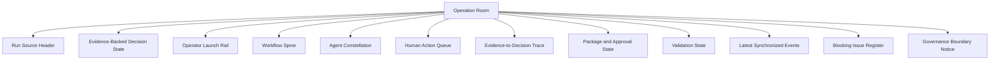
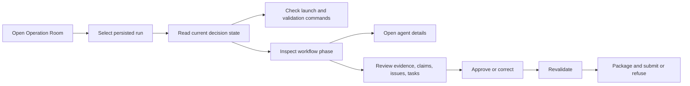

# ProofChain Operation Room Frontend Redesign and Implementation

## Purpose

The previous frontend was a conventional dashboard. It showed metrics and links, but it did not make the agentic workflow easy enough to understand. The redesigned frontend changes the main experience into a ProofChain Operation Room.

The goal of the Operation Room is to make the system transparent:

- what the user needs to start;
- what the user needs to validate;
- what evidence has been processed;
- which agents worked on each part;
- what is blocked;
- what human action is needed;
- what package and submission state exists;
- whether the platform is technically valid;
- why current readiness and projected readiness are different.

The frontend still uses live backend data from persisted run artifacts. It does not use frontend mock data for the operational screens.

## Main Route Change

The primary entry point is now:

```text
/operation-room
```

The old route still works for compatibility:

```text
/dashboard -> redirects to /operation-room
```

The root app route also opens:

```text
/ -> /operation-room
```

## Files Implemented or Modified

| File | Change |
|---|---|
| `frontend/app/operation-room/page.tsx` | New complete Operation Room experience |
| `frontend/app/dashboard/page.tsx` | Converted into redirect to `/operation-room` |
| `frontend/app/page.tsx` | Root redirect changed to `/operation-room` |
| `frontend/components/layout/sidebar.tsx` | Main navigation changed from Dashboard to Operation Room |
| `frontend/components/ui/command-palette.tsx` | Command palette now opens Operation Room |
| `frontend/app/layout.tsx` | Metadata updated from dashboard wording to operation-room wording |
| `frontend/lib/tokens.ts` | Navigation token updated to Operation Room |

## Design Direction

The new frontend concept is:

```text
Operation Room, not dashboard.
```

This means the first screen is not just a list of numbers. It is a live control surface that explains:

1. the current truth of the run;
2. the launch and validation commands;
3. the workflow spine;
4. the 22-agent architecture;
5. the evidence-to-decision trace;
6. the human action queue;
7. package, approval, and submission state;
8. governance validation state;
9. synchronized event activity;
10. blocking issues.

The layout is built for institutional operators, IQAC coordinators, department heads, and audit-preparation users who need clarity more than decoration.

## Page Architecture



## Section Designs

### 1. Run Source Header

Purpose:

Show that the frontend is reading a selected persisted run, not a static example.

Data used:

- run ID;
- department scope;
- framework;
- academic year;
- run status;
- refresh action.

Backend source:

```text
GET /ui-api/runs
GET /ui-api/runs/{run_id}
```

### 2. Evidence-Backed Decision State

Purpose:

Tell the user the current decision clearly before they inspect details.

Shows:

- domain decision;
- quality decision;
- external submission decision;
- verified readiness;
- projected readiness;
- agent completion count;
- evidence count;
- open issue count;
- event-chain count.

Important rule:

Projected readiness is clearly separated from verified readiness. The UI does not present projections as current proof.

Backend source:

```text
GET /ui-api/runs/{run_id}/metrics
GET /ui-api/runs/{run_id}/workflow-status
```

### 3. Operator Launch Rail

Purpose:

Make it obvious how to start and validate the project.

Shows command blocks for:

```powershell
proofchain run-complete ...
proofchain validate-run RUN-ID
proofchain validate-agentic-run RUN-ID
proofchain health-check --run-id RUN-ID
```

Design reason:

The user should not need to search documentation just to know how to run and validate the project.

### 4. Workflow Spine

Purpose:

Explain the complete ProofChain workflow in a visual sequence.

The spine is divided into six operational phases:

| Phase | Agents | Purpose |
|---|---:|---|
| Collect and understand | 1-3 | Evidence identity, extraction, classification, integrity |
| Reason and challenge | 4-5 | Claims, contradictions, canonical gaps, readiness impact |
| Assign and correct | 6-8 | Ownership, tasks, responses, targeted revalidation |
| Package and review | 9-10 | Manifest, exclusions, quality challenge, release risk |
| Govern and operate | 11-19 | Persistence, continuation, identity, policy, security, tenant controls |
| Submit and assure | 20-22 | Submission eligibility, golden scenarios, governed retrieval |

Each phase links to the correct detailed page.

### 5. Agent Constellation

Purpose:

Show all 22 agents in one structured view without forcing the user into a flat list.

Each agent card shows:

- agent number;
- short name;
- current status;
- decision reason or next action;
- link to the full agent detail page.

Each agent detail page still shows:

- goal;
- plan;
- steps;
- observations;
- reflections;
- actions;
- completion proof;
- decision explanation;
- model profile;
- checkpoints;
- coordination messages.

Backend source:

```text
GET /ui-api/runs/{run_id}/agents
GET /ui-api/runs/{run_id}/agents/{agent_id}
```

### 6. Human Action Queue

Purpose:

Make operator responsibility visible.

Shows:

- required human actions from workflow projection;
- pending approvals;
- approval subject;
- required approver;
- link to approval center.

This reinforces the governance boundary that human approvals are state transitions, not artifact rewrites.

Backend source:

```text
GET /ui-api/runs/{run_id}/workflow-status
GET /ui-api/runs/{run_id}/approvals
```

### 7. Evidence-to-Decision Trace

Purpose:

Show how raw evidence becomes an accreditation decision.

Trace rows:

- evidence records;
- claims evaluated;
- claims needing review;
- open canonical issues;
- active correction tasks.

Each row links to its detailed page.

Backend source:

```text
GET /ui-api/runs/{run_id}/evidence
GET /ui-api/runs/{run_id}/claims
GET /ui-api/runs/{run_id}/issues
GET /ui-api/runs/{run_id}/tasks
```

### 8. Package and Approval State

Purpose:

Make audit package readiness understandable.

Shows:

- package status;
- number of package items;
- quality score;
- pending approvals;
- external submission decision.

Backend source:

```text
GET /ui-api/runs/{run_id}/package
GET /ui-api/runs/{run_id}/approvals
GET /ui-api/runs/{run_id}/workflow-status
```

### 9. Validation State

Purpose:

Separate technical platform validity from accreditation readiness.

Shows:

- standard validation;
- agentic validation;
- persistence synchronization;
- technical completion;
- number of validated agent proofs.

Backend source:

```text
GET /ui-api/runs/{run_id}/governance
```

### 10. Latest Synchronized Events

Purpose:

Show the recent hash-linked workflow events.

Shows:

- sequence number;
- event type;
- agent or system owner;
- timestamp.

Backend source:

```text
GET /ui-api/runs/{run_id}/events
```

### 11. Blocking Issue Register

Purpose:

Explain why a run is blocked and what must be corrected.

Shows:

- issue title;
- criterion;
- issue status;
- owner;
- severity.

Backend source:

```text
GET /ui-api/runs/{run_id}/issues
```

### 12. Governance Boundary Notice

Purpose:

Protect the user from misunderstanding projected readiness.

The notice explicitly states that projected readiness is counterfactual until corrections, approvals, and revalidation pass.

## How the Operation Room Is Wired

The new page loads all required live resources through the existing provider:

```ts
const provider = getDataProvider();

await Promise.all([
  provider.getDashboardMetrics(runId),
  provider.getWorkflowStatus(runId),
  provider.getAgents(runId),
  provider.getEvents(runId, 120, 0),
  provider.getEvidence(runId),
  provider.getClaims(runId),
  provider.getIssues(runId),
  provider.getTasks(runId),
  provider.getApprovals(runId),
  provider.getPackage(runId),
  provider.getGovernance(runId),
]);
```

The frontend provider talks to the gateway. The gateway reads persisted run artifacts and projection services. No frontend mock dataset is used.

## User Workflow in the New Frontend



## Why This Is Clearer Than the Previous Dashboard

The previous dashboard mainly answered:

```text
What are the current metrics?
```

The new Operation Room answers:

```text
What has happened?
What is true right now?
Which agents proved it?
What should I inspect next?
What command starts the run?
What command validates the run?
What blocks readiness?
What human action is required?
Can the package be released?
Can external submission happen?
```

## Current Page Map After Redesign

| Page | Purpose |
|---|---|
| `/operation-room` | Main transparent operational command surface |
| `/dashboard` | Compatibility redirect to `/operation-room` |
| `/runs` | Select and inspect persisted runs |
| `/agents` | See all 22 agents grouped by architecture layer |
| `/agents/{agent_id}` | Inspect one agent goal, plan, proof, observations, and decisions |
| `/evidence` | Evidence registry and classification visibility |
| `/claims` | Claim defensibility and contradiction view |
| `/issues` | Canonical issue register |
| `/tasks` | Department correction and liaison tasks |
| `/approvals` | Human approval gates |
| `/runs/closure` | Closure and revalidation state |
| `/packages` | Audit package, manifest, quality review, package hash |
| `/governance` | Checkpoints, policies, event chain, model profiles, validation |
| `/system-health` | Technical platform health |
| `/settings` | Local configuration and operator context |

## Acceptance Criteria

The redesign is complete when:

- `/operation-room` loads live persisted run data.
- `/dashboard` redirects to `/operation-room`.
- Sidebar uses Operation Room as the main overview entry.
- Command palette opens Operation Room.
- The page shows start and validation commands.
- The page shows all 22 agents grouped into workflow phases.
- The page shows evidence, claims, issues, tasks, approvals, package, governance, and event state.
- The page separates technical validation from accreditation readiness.
- The page keeps verified readiness and projected readiness separate.
- Frontend lint passes.
- Frontend production build passes.

## Final Result

The frontend has been reshaped from a dashboard into an operation room. It now explains the project as a governed agentic workflow instead of a collection of cards. The user can open one screen and understand what to start, what to validate, what the agents completed, what remains blocked, what evidence supports the decision, and where to inspect every underlying artifact.
