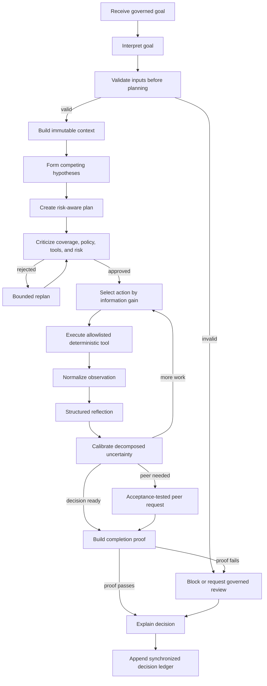

# ProofChain Phase 1 Cognition Foundation and Core Precision

## Implementation Status

Phase 1 is implemented and validated.

The implementation upgrades Agents 1-10 to a shared advanced cognition
architecture while preserving Agents 11-22 through an explicit compatibility
profile. Existing deterministic specialists remain authoritative. The
cognition layer decides what to do, records why, verifies whether the result is
sufficient, and refuses unsupported completion.

Validation baseline:

- Python compilation: passed
- Ruff lint: passed
- Automated tests: 88 passed
- Standard run validation: passed
- Advanced agentic validation: passed for all 10 primary agents
- Validated run: `RUN-20260727-7DB3`
- Run outcome: `blocked`, correctly preserving unresolved evidence and quality
  findings

## Runtime Architecture



`BaseGoalAgent` owns this lifecycle. Agent classes retain their deterministic
inputs, tools, output schemas, and domain completion policies.

## Shared Cognition Components

The following services were added under `proofchain/agentic`:

| Component | Responsibility |
|---|---|
| `cognition_profiles.py` | Selects advanced or compatibility behavior by agent |
| `goal_interpreter.py` | Normalizes objective, scope, constraints, prohibited actions, and ambiguity |
| `input_validator.py` | Checks deterministic input contracts, paths, schema version, and run scope |
| `context_builder.py` | Snapshots entities, artifacts, policies, rules, peer requests, and policy fingerprint |
| `hypothesis_manager.py` | Creates and updates explicit competing hypotheses |
| `planning_engine.py` | Enriches executable plans with risks, fallbacks, branches, and condition coverage |
| `plan_critic.py` | Rejects uncovered, unauthorized, unsafe, or policy-conflicting plans |
| `action_selector.py` | Selects eligible actions using expected information gain |
| `observation_normalizer.py` | Converts heterogeneous results into one quality-aware observation contract |
| `reflection_engine.py` | Records facts, progress, blockers, condition coverage, and next decision |
| `uncertainty_calibrator.py` | Separates input, tool, interpretation, decision, and completion confidence |
| `peer_negotiator.py` | Adds acceptance conditions and blocking semantics to peer requests |
| `contradiction_resolver.py` | Records cross-observation conflicts and targeted follow-up |
| `completion_prover.py` | Enforces input, condition, schema, blocker, peer, and policy completion gates |
| `decision_explainer.py` | Produces concise, auditable decision explanations |
| `experience_memory.py` | Returns only validated, reusable, policy-compatible prior cases |
| `state_machine.py` | Persists append-only cognition state transitions |
| `core_precision.py` | Produces domain-specific precision evidence for Agents 1-10 |
| `agentic_run_validator.py` | Validates artifact completeness and ledger synchronization |

## Versioned Schemas

Version `1.0.0` contracts were added for:

- Interpreted goals
- Input checks and validation results
- Agent context snapshots
- Explicit hypotheses
- Advanced plans and plan steps
- Plan critiques
- Normalized observations
- Structured reflections
- Decomposed uncertainty
- Acceptance-tested peer requests
- Contradiction resolutions
- Completion conditions and proofs
- Decision explanations
- Validated experience cases
- Cognition profiles and state transitions
- Core precision assessments
- Agentic evaluation scorecards

`ActionProposal` was extended compatibly with `step_id`, alternatives,
information gain, and reversibility. Existing constructors continue to work
because the new fields have defaults.

## Persistence and Synchronization

Each advanced goal writes canonical artifacts to:

```text
outputs/runs/{run_id}/agents/{agent_name}/{goal_id}/
```

The directory contains:

```text
cognition_profile.json
interpreted_goal.json
input_validation.json
context_snapshot.json
hypotheses.json
plans/plan_revision_{n}.json
critiques/critique_revision_{n}.json
action_selections.jsonl
normalized_observations.jsonl
structured_reflections.jsonl
uncertainty_assessments.jsonl
peer_requests.jsonl
contradiction_resolution.json
completion_proof.json
final_uncertainty.json
decision_explanation.json
core_precision_assessment.json
agentic_scorecard.json
experience_candidate.json
state_transitions.jsonl
```

Optional artifacts only appear when applicable. For example, a contradiction
record is created only when conflicting observations exist, and a peer request
stream is created only when the agent requests another agent.

Every final explanation is also appended to:

```text
outputs/runs/{run_id}/agent_decisions.jsonl
```

The advanced validator checks that each explanation references its completion
proof and exists in this run-level ledger.

## Completion Safety

A tool finishing is not proof of goal completion.

A positive completion requires:

1. Every success condition is evaluated.
2. Positive conditions are satisfied.
3. Mandatory inputs are valid, complete, current, and authorized.
4. The output schema is valid.
5. No unresolved blocker exists.
6. No blocking peer request remains unresolved.
7. No plan-critic policy conflict remains.
8. A completion proof is persisted.

If an agent reports `completed` or `completed_with_warnings` and these gates do
not pass, the completion prover changes the result to `blocked` or
`needs_human_review`. Original evidence and tool outputs are never altered.

## Decomposed Uncertainty Policy

The runtime records:

- Input confidence
- Tool confidence
- Interpretation confidence
- Decision confidence
- Completion confidence

Routing policy:

| Aggregate confidence | Automatic route |
|---|---|
| `>= 0.90` | Continue |
| `0.75-0.89` | Continue with warning |
| `0.50-0.74` | Retrieve context or ask a peer |
| `0.30-0.49` | Request human review |
| `< 0.30` | Prohibit a positive decision |

Deterministic blocking rules override confidence at every level.

## Agent 1-10 Precision Upgrades

### Agent 1: Evidence Collector

Unique capability: **Evidence Acquisition Strategy**

The precision artifact reports authorized source types, evidence categories,
checksum coverage, duplicate/version lineage, and source-exhaustion proof.

### Agent 2: Evidence Classification

Unique capability: **Extraction Strategy Planner**

It reports extraction strategy distribution, alternate classification
hypotheses, field provenance coverage, and human-review items.

### Agent 3: Evidence Integrity

Unique capability: **Verification Coverage Matrix**

It records each executed rule, finding count, blocking findings, supporting
evidence references, root-cause groups, and cross-scope summaries.

### Agent 4: Claim Intelligence

Unique capability: **Claim Fragility**

It measures atomic claim coverage, weak single-source dependence,
contradictions, confidence, and claim-lineage availability.

### Agent 5: Adaptive Gap Resolution

Unique capability: **Resolution Portfolio Optimizer**

It records strategies compared, expected success confidence, minimal resolution
set, readiness delta, counterfactual assumptions, and approval boundaries.

### Agent 6: Accountability and Ownership

Unique capability: **Explainable Responsibility Graph**

It records owner, backup, assignment confidence, workload/conflict signals,
backup depth, and unresolved ownership.

### Agent 7: Department Liaison

Unique capability: **Task Understandability Check**

Each task is checked for clear problem, action, closure evidence, submission
channel, and deadline. Approval-paused and delivery-failure counts are explicit.

### Agent 8: Closure Revalidation

Unique capability: **Closure Proof Bundle**

Each issue records evidence submission, registration, classification,
integrity-rule results, claim revalidation, closure policy, and final state.
Uploading evidence alone cannot close an issue.

### Agent 9: Audit Package Composer

Unique capability: **Reviewer Journey Planner**

The artifact records the reviewer order from requirement through closure,
evidence inclusion/exclusion, redundant hashes, reproducibility hash, and
privacy boundary.

### Agent 10: Adversarial Quality Review

Unique capability: **Independent Reproduction**

It records independent claim challenges, failed reproductions, broken
references, omitted findings, privacy findings, reviewer friction, and audit
failure risk.

## Agents 11-22 Compatibility

Agents 11-22 use profile `legacy-compatible`, version
`phase1-compat-1.0.0`.

This preserves:

- Existing deterministic execution
- Existing plans, observations, reflections, and completion records
- Existing Phase 1 production and Phase 2 institutional outputs
- Existing tests and CLI behavior

Their advanced cognition conversion is deliberately deferred to the next
migration phase.

## Validation

Run all validation locally:

```powershell
python -m compileall -q proofchain tests
python -m ruff check proofchain tests
python -m pytest -q
python -m proofchain.cli validate-run RUN-20260727-7DB3
python -m proofchain.cli validate-agentic-run RUN-20260727-7DB3
```

Observed results:

```text
Compilation: passed
Lint: passed
Tests: 88 passed
Standard validation: valid
Agentic validation: valid
Advanced agents validated: 10
Decision ledger entries: 10
```

The final run remained blocked because the sample evidence contains unresolved
findings, evidence gaps, claim uncertainty, closure failures, and adversarial
quality corrections. Preserving this result is evidence that the new cognition
layer did not manufacture audit readiness.

## Main Source Files

- `proofchain/agentic/base_goal_agent.py`
- `proofchain/agentic/advanced_cognition_runtime.py`
- `proofchain/agentic/cognition_profiles.py`
- `proofchain/agentic/core_precision.py`
- `proofchain/agentic/agentic_run_validator.py`
- `proofchain/repositories/advanced_cognition_repository.py`
- `proofchain/schemas/cognition.py`
- `proofchain/schemas/advanced_plans.py`
- `proofchain/schemas/completion_proofs.py`
- `proofchain/schemas/decision_explanations.py`
- `tests/cognition/test_cognition_components.py`
- `tests/cognition/test_advanced_runtime.py`

## Phase 1 Definition of Done

- [x] Advanced cognition schemas
- [x] Goal interpretation
- [x] Pre-plan input validation
- [x] Context construction
- [x] Explicit competing hypotheses
- [x] Advanced planning and criticism
- [x] Information-gain action selection
- [x] Normalized observations
- [x] Structured reflection
- [x] Decomposed uncertainty
- [x] Completion proofs and enforced refusal
- [x] Decision explanations
- [x] Synchronized agent decision ledger
- [x] Agent-specific precision for Agents 1-10
- [x] Compatibility profile for Agents 11-22
- [x] CLI validation command
- [x] Unit, regression, lint, compile, run, and synchronization validation
