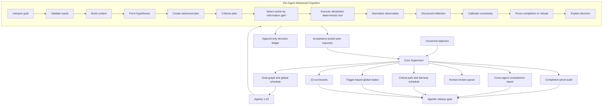

# ProofChain Phase 2 Platform-Wide Maturity and Global Assurance

## 1. Completion Status

Phase 2 is implemented and validated.

ProofChain now has:

- 22 primary agents on one advanced cognition profile
- 132 deterministic specialist modules
- 16 fingerprinted governance policies
- Per-goal advanced cognition artifacts
- Acceptance-tested peer request lifecycles
- Governed validated experience memory
- Cross-agent contradiction reporting
- Critical-path and fairness scheduling
- Trigger-based global replanning
- Supervisor completion-proof auditing
- Consolidated human-review routing
- 22 agentic behavior scorecards
- Agentic failure clustering and release gates

Validated demonstration:

```text
Run ID: RUN-20260727-49B5
Core accreditation status: blocked
Operational controls: completed
Institutional governance: completed_with_warnings
Primary agents represented: 22
Advanced goal executions: 23
Valid completion proofs: 23
Agentic scorecards: 22
Agentic release decision: PASS
Automated tests: 94 passed
```

The accreditation result remains blocked because the sample evidence still has
unresolved integrity, claim, closure, and quality findings. The `PASS` release
decision means the agentic architecture behaved safely; it does not claim that
the institution is audit-ready.

## 2. Complete Architecture



The cognition runtime proposes and evaluates work. Deterministic services remain
authoritative for extraction, validation, security, persistence, authorization,
submission, and other domain operations.

## 3. Mature Cognition Profile

All primary agents use:

```text
profile_name: advanced-cognition-platform
profile_version: phase2-2.0.0
schema_version: 1.0.0
```

The profile requires:

1. Goal interpretation
2. Pre-plan input validation
3. Context construction
4. Explicit hypotheses
5. Advanced planning
6. Plan criticism
7. Information-gain action selection
8. Normalized observations
9. Structured reflection
10. Decomposed uncertainty
11. Completion proof
12. Decision explanation

The legacy-compatible profile remains available for tests and external
extensions, but none of the 22 primary agents use it.

## 4. Full Agent Catalog

| Agent | Name | Unique precision capability |
|---|---|---|
| 1 | Evidence Collector | Evidence Acquisition Strategy |
| 2 | Evidence Classification | Extraction Strategy Planner |
| 3 | Evidence Integrity | Verification Coverage Matrix |
| 4 | Claim Intelligence | Claim Fragility |
| 5 | Adaptive Gap Resolution | Resolution Portfolio Optimizer |
| 6 | Accountability and Ownership | Explainable Responsibility Graph |
| 7 | Department Liaison | Task Understandability Check |
| 8 | Closure Revalidation | Closure Proof Bundle |
| 9 | Audit Package Composer | Reviewer Journey Planner |
| 10 | Adversarial Quality Review | Independent Reproduction |
| 11 | Persistence and Recovery | State Reconstruction Proof |
| 12 | Continuation and Partial Re-Execution | Minimal Safe Rerun Proof |
| 13 | Identity and Authorization | Authorization Explanation Graph |
| 14 | Integration and Notification | Delivery Correlation Proof |
| 15 | Security Inspection | Evidence Trust Envelope |
| 16 | Reliability and Incident Response | Recovery Safety Proof |
| 17 | Schema Evolution | Migration Compatibility Proof |
| 18 | Policy Lifecycle | Policy Counterfactual Simulator |
| 19 | Tenant Governance | Tenant Boundary Proof |
| 20 | External Submission | Submission Dry-Run Proof |
| 21 | Continuous Evaluation | Agentic Release Gate |
| 22 | Governed Knowledge Retrieval | Retrieval Provenance Proof |

## 5. Phase 2 Agent Workflows

### Agent 11: Persistence and Recovery

```text
Interpret persistence objective
  -> Validate backend and run state
  -> Form corruption and divergence hypotheses
  -> Criticize recovery plan
  -> Import and reconcile events
  -> Rebuild snapshot
  -> Compare source and reconstructed hashes
  -> Simulate recovery
  -> Emit State Reconstruction Proof
```

The precision artifact reports backend health, reconciled event count, snapshot
version, source/reconstructed hash match, corruption findings, recovery status,
and snapshot confidence.

### Agent 12: Continuation and Partial Re-Execution

```text
Validate fingerprints
  -> Detect changes
  -> Calculate dependency impact
  -> Test cache eligibility
  -> Predict duplicate actions
  -> Recalculate critical path
  -> Select minimal safe rerun
  -> Prove resume readiness
```

The result records changed, stale, and reusable entities, selected rerun agents,
estimated rerun cost, duplicate suppression, critical path, and reconciliation
requirements.

### Agent 13: Identity and Authorization

```text
Verify identity
  -> Resolve roles and tenant scope
  -> Validate delegation and effective time
  -> Evaluate conflicts
  -> Enforce separation of duties
  -> Count independent approvals
  -> Explain effective permissions
  -> Authorize, deny, or request approval
```

The explanation graph links subject, resource, role, delegation, permissions,
approval count, policy reasons, and separation-of-duties result.

### Agent 14: Integration and Notification

```text
Validate approval and disclosure scope
  -> Rank channels
  -> Predict provider success
  -> Build minimal payload
  -> Enforce idempotency
  -> Deliver through configured adapter
  -> Apply bounded fallback
  -> Correlate receipt or response
```

The proof includes selected channel, each attempt, correlation confidence,
fallback count, delivery receipt, and duplicate suppression.

### Agent 15: Security Inspection

```text
Validate path boundary
  -> Form suspicious-content hypotheses
  -> Inspect MIME and file limits
  -> Scan archives, formulas, prompts, and PII
  -> Apply sandbox adapter boundary
  -> Rank findings
  -> Allow, restrict, quarantine, or block
  -> Emit Evidence Trust Envelope
```

Every evidence item has a checksum, decision, findings, restrictions, quarantine
reference when applicable, and downstream trust instruction.

### Agent 16: Reliability and Incident Response

```text
Normalize telemetry
  -> Predict failure
  -> Rank incident hypotheses
  -> Calculate blast radius
  -> Simulate retry, failover, pause, and escalation
  -> Apply bounded recovery
  -> Verify data integrity
  -> Emit Recovery Safety Proof
```

The proof records affected sources, severity, hypothesis, action, recovery state,
retry/failover budgets, paused sources, and integrity verification.

### Agent 17: Schema Evolution

```text
Interpret version transition
  -> Build schema dependency graph
  -> Detect breaking changes
  -> Sample historical artifacts
  -> Plan migration and rollback
  -> Run conversion shadow test
  -> Verify original preservation
  -> Block or request deployment approval
```

No schema deployment occurs from planning alone. Breaking changes require
migration evidence and governed approval.

### Agent 18: Policy Lifecycle

```text
Parse proposed policy
  -> Detect ambiguity and conflicts
  -> Resolve effective-date risk
  -> Simulate historical cases
  -> Assess open-run impact
  -> Compare counterfactual outcomes
  -> Produce human-readable change record
  -> Govern activation
```

Historical decisions remain immutable. New policy versions affect work only
through an explicit activation decision and global replan record.

### Agent 19: Tenant Governance

```text
Prove subject tenant context
  -> Prove resource tenant context
  -> Compare department scope
  -> Validate grant
  -> Validate share approval and expiry
  -> Check data-residency and isolation policy
  -> Allow, deny, or request sharing approval
```

An `ALLOW` decision for cross-tenant access requires a valid applied share.
The release gate detects and blocks cross-tenant leakage.

### Agent 20: External Submission

```text
Freeze package hash
  -> Validate package path and payload
  -> Verify quality status
  -> Verify independent approvals
  -> Assess portal and deadline
  -> Execute dry run
  -> Require final confirmation
  -> Transmit idempotently only when eligible
  -> Verify receipt or produce resubmission plan
```

The default demonstration performs every validation step but does not transmit
because package quality and independent approval conditions are not satisfied.

### Agent 21: Continuous Evaluation

```text
Load scenarios and baselines
  -> Measure accuracy and calibration
  -> Detect false approvals and false closures
  -> Aggregate 22 cognition scorecards
  -> Cluster agentic failures
  -> Evaluate safety gates
  -> PASS, BLOCK, or request human review
```

Measured dimensions:

- Goal interpretation accuracy
- Input validation accuracy
- Plan completeness
- Plan-critique effectiveness
- Tool-selection accuracy
- Replan success rate
- Peer-request usefulness
- Uncertainty calibration
- Completion-proof accuracy
- Decision-explanation quality
- Human-escalation precision

### Agent 22: Governed Knowledge Retrieval

```text
Interpret query
  -> Validate approved sources
  -> Rank authority and relevance
  -> Verify freshness and checksum
  -> Retrieve diverse evidence
  -> Detect source contradictions
  -> Build cited advisory answer
  -> Disclose retrieval uncertainty
```

Retrieved material is advisory. It cannot override current evidence,
deterministic rules, policy, tenant boundaries, or human decisions.

## 6. Peer Negotiation Lifecycle

Peer requests now use:

```text
OPEN
  -> ACKNOWLEDGED
  -> ACCEPTED
  -> IN_PROGRESS
  -> RESOLVED
```

Alternative terminal routes are `DECLINED`, `EXPIRED`, and `CANCELLED`.
`NEEDS_CLARIFICATION` can return to `OPEN`.

Every request contains:

- Requested outcome
- Required inputs
- Related entities
- Acceptance conditions
- Satisfied acceptance conditions
- Priority and deadline
- Blocking status

`RESOLVED` is rejected unless every acceptance condition is satisfied. The
complete transition history is written to:

```text
outputs/runs/{run_id}/coordination/peer_requests.jsonl
```

## 7. Governed Experience Memory

Every agent writes an `experience_candidate.json`. Candidates are not reusable.

A case becomes reusable only when:

- Its outcome is successful and terminal
- Its completion proof is valid
- A named reviewer explicitly approves it
- Its tenant matches
- Its policy fingerprint matches
- It has not expired

Approval command:

```powershell
python -m proofchain.cli approve-experience-case RUN-ID `
  --agent operational_persistence `
  --goal GOAL-ID `
  --approved-by governance-reviewer `
  --tenant-id default-institution
```

The approval emits an `ExperienceCaseValidated` workflow event. During planning,
eligible cases may influence action ordering but can never override current
evidence, deterministic rules, policy, approvals, or tenant boundaries.

## 8. Completion Proof Correction

When an agent attempts a positive completion that cannot pass all gates:

1. The unsupported proof is preserved as `completion_proof_attempt.json`.
2. The positive decision is downgraded to `blocked` or
   `needs_human_review`.
3. A canonical refusal proof is generated as `completion_proof.json`.
4. The decision explanation links the canonical proof.
5. The supervisor audits the final proof and the intercepted attempt remains
   visible.

This preserves overclaim evidence without allowing it to become the terminal
decision.

## 9. Supervisor Global Assurance

Each supervisor stage invokes `GlobalAssuranceService`.

### Completion-Proof Audit

The supervisor checks:

- Expected and found proof counts
- Proof validity
- Decision/proof status agreement
- Decision-explanation linkage
- Missing proof goals

### Critical Path and Fairness

Goals are scored by:

- Priority
- Dependency depth
- Least-served agent
- Creation order

Multi-run queues use deterministic round-robin ordering so one run cannot starve
another.

### Global Replan Triggers

The service detects:

- Critical goal failure
- Policy version change
- Quality-review failure
- Security incident
- Tenant boundary change
- Submission deadline change
- Schema migration block
- New contradictory evidence

Each `GlobalReplanRecord` contains the trigger, reason, affected goals, changed
assumptions, invalidated steps, new scope, decision, and confirmation that
original artifacts were not changed.

### Human-Review Queue

Blocked and review-required decisions are consolidated with:

- Goal
- Agent
- Priority
- Reason
- Completion proof

### Agentic Release Gates

Release is blocked for:

- Invalid or missing completion proofs
- Missing required scorecards
- Cross-tenant leakage
- Submission without human control
- False peer-request resolution
- Unauthorized plans

## 10. Global Assurance Artifacts

Written under `outputs/runs/{run_id}`:

```text
completion_proof_audit.json
cross_agent_contradictions.json
critical_path_schedule.json
global_replans.json
human_review_queue.json
agentic_scorecards.json
agentic_failure_clusters.json
agentic_release_decision.json
supervisor_assurance_report.json
```

Per-goal artifacts remain under:

```text
outputs/runs/{run_id}/agents/{agent_name}/{goal_id}/
```

The cross-agent decision ledger remains:

```text
outputs/runs/{run_id}/agent_decisions.jsonl
```

## 11. Advanced Validation

`validate-agentic-run` now checks:

- Phase 2 profile and schema versions
- Required artifact presence
- Approved plan critique
- Action, observation, and reflection streams
- State-transition continuity and terminal state
- Canonical proof validity
- Proof/explanation linkage
- Decision-ledger linkage
- Peer acceptance conditions
- Deterministic uncertainty blocks

Generated resolution goals that were terminally routed without execution are
reported as warnings and are not misclassified as missing agent runs.

## 12. How to Run the Complete Project

### Install

```powershell
cd C:\SideQuest\ProofChain
python -m pip install -e ".[dev]"
```

### Run Agents 1-10

```powershell
python -m proofchain.cli run-pipeline `
  --source sample_data\departments `
  --departments CSE `
  --academic-year 2025-2026 `
  --requirements C3.2.1 C5.1.3 C6.3.2 C7.1.1 C1.2.1 `
  --objective "Validate the evidence through the 22-agent architecture." `
  --claim "CSE maintained complete evidence for criterion C3.2.1."
```

Record the returned `RUN-ID`.

### Run Agents 11-16

```powershell
python -m proofchain.cli run-phase-one RUN-ID
```

### Run Agents 17-22

```powershell
python -m proofchain.cli run-phase-two RUN-ID `
  --tenant-id default-institution `
  --department-id CSE
```

### Validate

```powershell
python -m proofchain.cli validate-run RUN-ID
python -m proofchain.cli validate-agentic-run RUN-ID
Get-Content outputs\runs\RUN-ID\agentic_release_decision.json
```

## 13. Validation Results

Commands executed:

```powershell
python -m compileall -q proofchain tests
python -m ruff check proofchain tests
python -m pytest -q
python -m proofchain.cli validate-run RUN-20260727-49B5
python -m proofchain.cli validate-agentic-run RUN-20260727-49B5
```

Results:

```text
Compilation: passed
Lint: passed
Tests: 94 passed
Standard run validation: valid
Advanced agentic validation: valid
Advanced executions validated: 23
Distinct primary scorecards: 22
Completion proof audit: 23/23 valid
Decision mismatches: 0
Agentic release decision: PASS
```

The single pytest warning is an operating-system permission warning for
`.pytest_cache`. It does not affect test execution or application behavior.

## 14. Main Implementation Files

```text
proofchain/agentic/advanced_cognition_runtime.py
proofchain/agentic/cognition_profiles.py
proofchain/agentic/core_precision.py
proofchain/agentic/peer_negotiator.py
proofchain/agentic/experience_memory.py
proofchain/agentic/global_assurance.py
proofchain/agentic/scheduler.py
proofchain/agentic/completion_prover.py
proofchain/agentic/agentic_run_validator.py
proofchain/repositories/advanced_cognition_repository.py
proofchain/repositories/json_coordination_repository.py
proofchain/schemas/global_assurance.py
proofchain/agents/supervisor.py
proofchain/production/supervisor.py
proofchain/production/phase_two_supervisor.py
tests/cognition/test_phase_two_maturity.py
```

## 15. Phase 2 Definition of Done

- [x] Agents 11-22 use advanced cognition
- [x] All 22 agents emit advanced artifacts
- [x] Peer requests use acceptance-tested state transitions
- [x] Contradictions are resolved or escalated
- [x] Global replans record trigger, assumptions, invalidated steps, and scope
- [x] Experience memory admits only approved, current, compatible cases
- [x] Supervisors validate every canonical completion proof
- [x] All documented global replan triggers are implemented
- [x] Critical-path and multi-run fairness are implemented and tested
- [x] Agent 21 receives 22 cognition scorecards
- [x] Agentic release gates block unsafe regressions
- [x] Human approval, security, tenant, and submission boundaries remain active
- [x] Core, operational, and institutional runs complete and validate
- [x] Compilation, lint, prior tests, and Phase 2 tests pass
