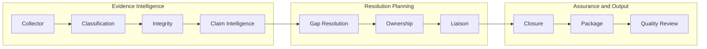
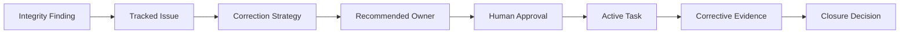
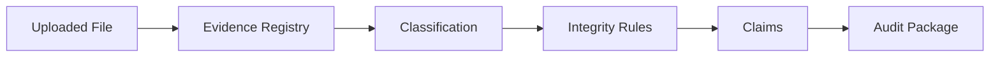
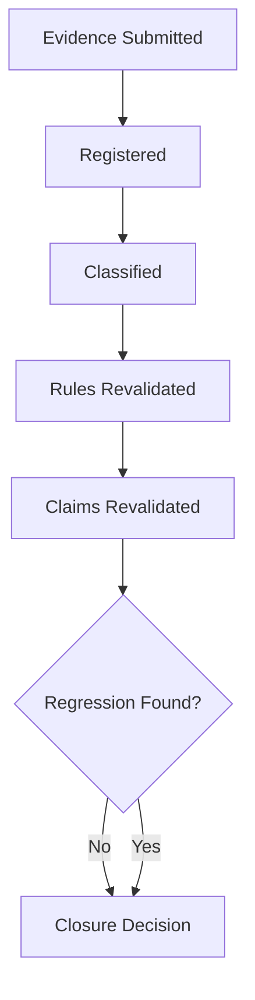
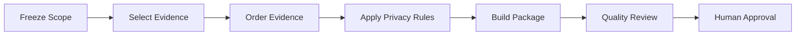
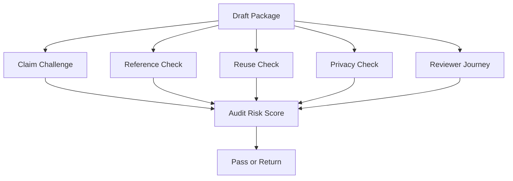

# ProofChain UI
## Clarity, Dashboard, Motion, and Agent-Transparency Upgrade Plan

**Project:** ProofChain — Governed Accreditation Evidence Intelligence Platform  
**Current Frontend:** Next.js + Tailwind CSS + FastAPI UI Gateway  
**Goal:** Make the UI calmer, clearer, more unique, and easier for clients to understand without changing the existing ProofChain backend.

---

# 1. Purpose

The existing frontend already provides:

- Executive readiness dashboard
- Agent Collaboration Center
- Goal graph and message flow
- Evidence explorer
- Claim defensibility workspace
- Canonical issue center
- Task and liaison workspace
- Approval center
- Closure revalidation
- Package and quality review
- Governance and system health
- SSE event streaming
- Replay controls
- Governed CLI actions through the UI Gateway

The next stage should improve **clarity**, not add more unrelated screens.

The redesigned UI must help a client immediately answer:

```text
What is happening now?
What has already been completed?
What is blocked?
Why is it blocked?
What must I do next?
Which agent is responsible?
What will happen after I act?
How close are we to audit readiness?
```

---

# 2. Current Design Assessment

## Keep

- Existing Next.js architecture
- Tailwind design system
- Framer Motion support
- Responsive app shell
- Dark mode
- Semantic status badges
- SSE event stream
- Replay controller
- Agent detail drawer
- Secure UI Gateway
- Allowlisted CLI command execution
- Existing backend artifacts and workflows

## Improve

- Information hierarchy
- Dashboard focus
- Plain-language explanations
- Agent collaboration visibility
- Issue and task clarity
- Approval impact explanations
- Motion consistency
- Diagram focus
- Role-based views
- Progressive disclosure of technical information

---

# 3. New Design Direction

## Theme

**Institutional Evidence Command Center**

The product should feel:

```text
Calm
Precise
Transparent
Institutional
Modern
Trustworthy
Action-oriented
```

It should not feel:

```text
Crowded
Over-animated
Game-like
Chatbot-like
Developer-only
Generic admin dashboard
```

## Core Visual Chain

```text
Goal
  ↓
Agent
  ↓
Evidence
  ↓
Decision
  ↓
Issue
  ↓
Action
  ↓
Verification
  ↓
Package
```

Use this chain consistently across dashboard, diagrams, detail pages, and animations.

---

# 4. Universal Page Hierarchy

Every major page should follow the same hierarchy.

## Level 1 — Current Meaning

One plain-language sentence.

Example:

```text
ProofChain completed evidence analysis but cannot mark this run audit-ready because seven blocking issues remain.
```

## Level 2 — What Needs Attention

Show no more than three urgent actions.

## Level 3 — Workflow Progress

Show completed, active, waiting, blocked, and future stages.

## Level 4 — Supporting Detail

Show evidence, findings, agents, and tasks.

## Level 5 — Technical Trace

Keep hashes, raw JSON, tool versions, execution logs, and code provenance inside an advanced view.

---

# 5. Dashboard Redesign

The dashboard should have five clear zones:

```text
A. Current State
B. Next Best Actions
C. Agent Journey
D. Blocking Issues
E. Evidence Readiness
```

## Proposed Layout

```text
┌─────────────────────────────────────────────────────────────────────┐
│ RUN CONTEXT                                                         │
│ CSE · AY 2025–2026 · RUN-20260727-0F23 · BLOCKED                   │
│ Last updated 2 minutes ago                                          │
├─────────────────────────────────────────────────────────────────────┤
│ CURRENT STATE                                                       │
│ Analysis is complete. Seven blocking issues prevent audit readiness.│
│ Verified readiness 73%          Projected after fixes 96%           │
├─────────────────────────────────────────────────────────────────────┤
│ NEXT BEST ACTIONS                                                   │
│ 1. Approve owner for missing approval letter              [Review] │
│ 2. Resolve participant count mismatch                    [Inspect]  │
│ 3. Rebuild package after closure                         [Pending]  │
├─────────────────────────────────────────────────────────────────────┤
│ AGENT JOURNEY                                                       │
│ Discover ✓ → Understand ✓ → Verify ! → Defend ! → Plan ✓           │
│ → Assign ✓ → Coordinate ○ → Revalidate ✕ → Package ◐ → Challenge ↩ │
├──────────────────────────────────┬──────────────────────────────────┤
│ TOP BLOCKERS                     │ HUMAN ATTENTION                  │
│ Missing approval letter          │ 9 pending approvals             │
│ Participant mismatch             │ 3 claim reviews                 │
│ Missing signature                │ 2 quality corrections           │
├──────────────────────────────────┴──────────────────────────────────┤
│ REQUIREMENT READINESS                                               │
│ C3.2.1  ███████░░░ 73%  2 blockers                                 │
│ C5.1.3  █████████░ 91%  1 blocker                                  │
└─────────────────────────────────────────────────────────────────────┘
```

## Current State Hero

Replace many equal cards with one dominant status panel.

Show:

- Run status
- Plain-language explanation
- Verified readiness
- Projected readiness
- Main blocking reason
- Last update
- Primary action

## Next Best Actions

Show only the top three actions.

Each item contains:

- Action
- Why it matters
- Responsible person or role
- Due date
- Expected impact
- CTA

## Metric Grouping

Group metrics into:

```text
Readiness
Risk
Human Work
```

Keep lower-priority metrics behind:

```text
View operational details
```

---

# 6. New “What Happened / What Now / What Later” Component

Add a universal component named:

```text
ProcessClarityPanel
```

Example:

```text
WHAT HAPPENED
ProofChain classified 15 documents and found 9 integrity findings.

WHAT NEEDS TO HAPPEN NOW
Approve the ownership recommendation and obtain a signed approval letter.

WHAT HAPPENS AFTER THAT
The Closure Agent will revalidate the new evidence and the package will be rebuilt.
```

Use it on:

- Dashboard
- Agent detail
- Issue detail
- Claim detail
- Task detail
- Closure page
- Package page
- Quality-review page

---

# 7. Agent Collaboration Center Redesign

Keep the existing modes:

- Pipeline
- Goal Graph
- Message Flow

Add a new default mode:

## Story Mode

```text
1. Collector found 15 evidence files.
2. Classification understood all 15 documents.
3. Integrity found 9 problems.
4. Claim Intelligence rejected part of the claim.
5. Gap Resolution created 9 corrective actions.
6. Ownership identified responsible users.
7. Liaison is waiting for approval.
8. Closure cannot proceed until new evidence is submitted.
9. Package is currently a draft.
10. Quality Review requested two corrections.
```

This is easier for non-technical clients than a raw node graph.

## Agent Stage Card

Each card should show only:

```text
Agent name
Purpose
Current status
What it completed
What it found
What it needs next
```

Example:

```text
Claim Intelligence
Status: Needs review

What it did:
Validated one institutional claim.

What it found:
The evidence supports 108 students, not 120.

What it needs:
Human approval of the defensible wording.
```

## Agent Drawer Simplification

Replace ten default tabs with four top-level tabs:

```text
Summary
Work
Collaboration
Technical
```

### Summary

- Goal
- Status
- Outcome
- Confidence
- Why it matters

### Work

- Plan
- Completed steps
- Observations
- Decision

### Collaboration

- Peer requests
- Dependencies
- Messages
- Human requests

### Technical

Contains:

- Artifacts
- Execution rounds
- Model/config
- Live trace
- Resource usage
- Code provenance
- Hashes

---

# 8. Agent Flow Diagram



When an agent is selected:

- Dim unrelated agents
- Highlight upstream dependencies
- Highlight downstream impact
- Animate active message paths
- Show blocking edges in red
- Show completed edges in green
- Show waiting edges in amber

Use clear edge labels:

```text
provides evidence
requests clarification
creates issue
requires approval
triggers revalidation
returns correction
```

---

# 9. Goal Graph Improvements

The Goal Graph must answer:

```text
What is the main goal?
Which subgoals exist?
Which are complete?
Which are blocked?
Why?
```

## Goal Header

```text
Top-level goal:
Determine whether C3.2.1 is audit-ready.

Current result:
Not complete.

Reason:
Two mandatory subgoals are blocked.
```

## Goal Node

Show:

- Goal title
- Assigned agent
- Status
- Success-condition progress
- Blocker count

## Focus Mode

Clicking a goal should isolate:

- Parent
- Selected goal
- Dependencies
- Child goals
- Blocking conditions

---

# 10. Message Flow Improvements

Keep raw JSON only in Technical View.

Default message format:

```text
Claim Intelligence asked Integrity:

“Please verify whether the attendance sheet contains 108 unique students.”

Integrity responded:

“Confirmed. Four duplicate rows were excluded.”
```

Each message card should contain:

- Source agent
- Target agent
- Request
- Reason
- Result
- Status
- Duration
- Related evidence

---

# 11. Canonical Issue Center Improvements

## Default View

Use a prioritized action list instead of opening on Kanban.

```text
Critical
1. Missing approval letter
2. Participant count contradiction

High
3. Missing signature
4. Duplicate evidence

Medium
5. Incomplete trainer profile
```

## Issue Summary

Show:

```text
Problem
Why it matters
Current owner
Required action
Current state
Expected readiness improvement
```

## Issue Lifecycle Diagram



---

# 12. Claim Workspace Improvements

Use a side-by-side comparison.

```text
ORIGINAL CLAIM
120 students participated.

VERIFIED EVIDENCE
108 unique students are supported.

STATUS
Partially supported.

RECOMMENDED DEFENSIBLE WORDING
108 unique students participated according to verified attendance evidence.
```

Use expandable atomic claim rows:

```text
Department          Supported
Activity count      Contradicted
Participant count   Contradicted
Academic year       Supported
```

Use both text and color:

```text
Strong support
Moderate support
Weak support
Contradicted
Not evaluated
```

---

# 13. Evidence Explorer Improvements

## Default Columns

Show only:

- Evidence name
- Type
- Requirement
- Integrity status
- Current version
- Last updated

Move technical details into the evidence drawer:

- Full SHA-256
- Raw path
- Tool version
- Classification internals
- Technical metadata

## Evidence Trust Card

```text
Evidence Trust
File safety: Safe
Integrity: Warning
Classification: High confidence
Current version: v2
Used by: 2 claims
```

## Evidence Lineage



---

# 14. Task Workspace Improvements

Every task should answer:

```text
What is wrong?
What must be done?
What evidence must be submitted?
Who is responsible?
When is it due?
What happens after submission?
```

## Task Progress

```text
Drafted
Awaiting approval
Activated
Delivered
Acknowledged
Evidence submitted
Under revalidation
Resolved
```

## What Happens After Submission

```text
1. Collector registers the evidence.
2. Classification interprets it.
3. Integrity reruns affected rules.
4. Closure decides whether the issue is resolved.
```

---

# 15. Approval Center Improvements

Before approval, display:

```text
You are approving:
Activation of ownership assignment ASN-001.

This will:
Create a task for the CSE accreditation coordinator.

This will not:
Approve the underlying evidence.
Close the issue.
Change the institutional claim.
```

Also show:

- Conflict of interest
- Required role
- Target version
- Target hash
- Expiry
- Downstream effect

The frontend must wait for:

```text
ApprovalRecorded
StateTransitionAuthorized
```

before displaying the action as approved.

---

# 16. Closure Workspace Improvements

Use the page question:

```text
Did the new evidence actually resolve the issue?
```

Show:

```text
Issue status: Partially resolved
Conditions passed: 2 of 3
Readiness impact: +9%
Regression detected: Yes
```

## Closure Flow



---

# 17. Package Workspace Improvements

## Package Banner

```text
Package status: Draft ready for correction

Included evidence: 14
Excluded evidence: 1
Unresolved warnings: 2
Quality score: 72/100
```

## Package Journey



## Package Difference

For rebuilt packages, show:

- Added files
- Removed files
- Changed claim wording
- New warnings
- Resolved quality findings
- New package hash

---

# 18. Quality Review Improvements

Show the decision first:

```text
Quality decision:
RETURN FOR CORRECTION
```

Then explain:

```text
Why:
1. Claim wording is stronger than supporting evidence.
2. One unresolved warning is missing from the package.
```

Show correction routing:

```text
Finding 1 → Claim Intelligence
Finding 2 → Package Composer
```

## Quality Review Diagram



---

# 19. Motion Design System

Animations should explain state change, not decorate the interface.

## Principles

```text
Subtle
Fast
Purposeful
Consistent
Interruptible
Accessible
```

## Durations

```text
Micro interaction: 120–160 ms
Button state: 160–200 ms
Card expansion: 200–260 ms
Drawer: 240–320 ms
Page transition: 220–300 ms
Graph focus: 300–420 ms
Success confirmation: 400–600 ms
```

## Easing

```text
Enter: cubic-bezier(0.16, 1, 0.3, 1)
Exit: cubic-bezier(0.4, 0, 1, 1)
State change: cubic-bezier(0.2, 0, 1)
```

---

# 20. Button Animations

## Hover

- Move upward by 1 px
- Increase shadow slightly
- Increase contrast
- Duration: 140 ms

## Pressed

- Scale to 0.98
- Reduce shadow
- Duration: 90 ms

## Loading

Preserve button width and use meaningful labels:

```text
Approving…
Validating run…
Building package…
```

## Success

- Animate check icon
- Transition to verified green
- Change state only after backend confirmation

## Error

- One brief 3 px horizontal shake
- Show inline error
- Do not repeat animation continuously

---

# 21. Component Animations

## Metric Cards

- Fade in
- Move upward 8 px
- Stagger by 40 ms

When updated:

- Brief background highlight
- Animate number
- Show event-source tooltip

## Agent Cards

Running:

- Soft breathing border

Waiting:

- One amber edge shimmer when state begins

Completed:

- Small check animation

Blocked:

- Static red left border
- No flashing

## Peer Message

- Animate a small message token from source to target
- Show summary tooltip
- Stop after delivery

## Replan

- Old plan fades slightly
- Revision badge updates
- New steps slide into place
- Show “Plan revised because…” explanation

---

# 22. Page Transitions

Use:

```text
Opacity: 0 → 1
Y: 6 px → 0
Duration: 220 ms
```

Keep the sidebar and top bar stable.

Animate only workspace content.

---

# 23. Replay Animations

During replay:

- Highlight current event
- Highlight related agent
- Open related entity panel
- Animate metric changes
- Animate issue transitions
- Show new goals appearing
- Lock completed goals

Replay must remain read-only.

---

# 24. Reduced Motion

Respect `prefers-reduced-motion`.

In reduced-motion mode:

- Remove scale effects
- Remove moving edge particles
- Replace movement with opacity
- Disable auto-scroll
- Preserve all status clarity

---

# 25. New Reusable Components

```text
ProcessClarityPanel
CurrentStateHero
NextBestActions
AgentStoryTimeline
AgentStageCard
AgentDependencyFocus
GoalSatisfactionMap
HumanReadableMessageCard
IssueLifecycleDiagram
EvidenceTrustCard
ClaimComparisonPanel
TaskClarityCard
ApprovalImpactPreview
ClosureProofPanel
PackageJourney
QualityCorrectionRoute
BackendEventConfirmation
TechnicalDetailDisclosure
```

---

# 26. Suggested Component Structure

```text
frontend/components/
├── clarity/
│   ├── process-clarity-panel.tsx
│   ├── current-state-hero.tsx
│   ├── next-best-actions.tsx
│   └── what-happens-next.tsx
├── agents/
│   ├── agent-story-timeline.tsx
│   ├── agent-stage-card.tsx
│   ├── agent-focus-graph.tsx
│   └── human-readable-message-card.tsx
├── goals/
│   ├── goal-satisfaction-map.tsx
│   └── focused-goal-graph.tsx
├── issues/
│   ├── issue-lifecycle-diagram.tsx
│   ├── issue-action-card.tsx
│   └── issue-priority-list.tsx
├── evidence/
│   ├── evidence-trust-card.tsx
│   └── evidence-lineage.tsx
├── claims/
│   ├── claim-comparison-panel.tsx
│   └── atomic-claim-accordion.tsx
├── tasks/
│   ├── task-clarity-card.tsx
│   └── task-progress-timeline.tsx
├── approvals/
│   ├── approval-impact-preview.tsx
│   └── approval-event-confirmation.tsx
├── closure/
│   ├── closure-proof-panel.tsx
│   └── before-after-evidence.tsx
├── packages/
│   ├── package-journey.tsx
│   └── package-difference-view.tsx
└── quality/
    ├── quality-decision-hero.tsx
    └── correction-route.tsx
```

---

# 27. Design Tokens

```css
:root {
  --surface-page: #f6f8fb;
  --surface-panel: #ffffff;
  --surface-muted: #f1f5f9;

  --text-primary: #0f172a;
  --text-secondary: #475569;
  --text-muted: #64748b;

  --status-complete: #16a34a;
  --status-running: #2563eb;
  --status-waiting: #d97706;
  --status-blocked: #dc2626;
  --status-review: #7c3aed;

  --motion-fast: 140ms;
  --motion-normal: 220ms;
  --motion-slow: 320ms;

  --ease-enter: cubic-bezier(0.16, 1, 0.3, 1);
  --ease-exit: cubic-bezier(0.4, 0, 1, 1);
}
```

---

# 28. Framer Motion Example

```typescript
export const buttonMotion = {
  idle: { y: 0, scale: 1 },
  hover: {
    y: -1,
    transition: { duration: 0.14 },
  },
  tap: {
    scale: 0.98,
    transition: { duration: 0.09 },
  },
};

export const panelMotion = {
  hidden: { opacity: 0, y: 8 },
  visible: {
    opacity: 1,
    y: 0,
    transition: {
      duration: 0.22,
      ease: [0.16, 1, 0.3, 1],
    },
  },
};
```

---

# 29. Operational and Technical Views

Add a global toggle:

```text
Operational View
Technical View
```

## Operational View

Shows:

- Plain language
- Current state
- Next actions
- Agent story
- Issues
- Approvals
- Tasks
- Readiness

## Technical View

Shows:

- Hashes
- Raw events
- JSON payloads
- Code provenance
- Tool versions
- Model configuration
- Execution rounds

Default to Operational View.

---

# 30. Role-Based Views

## IQAC Administrator

Prioritize:

- Overall readiness
- Blocking issues
- Approvals
- Package quality
- Governance

## Department Coordinator

Prioritize:

- Department issues
- Assigned tasks
- Missing evidence
- Due dates
- Claim corrections

## Evidence Owner

Prioritize:

- What to submit
- Why it is required
- Deadline
- Submission status
- Validation result

## Reviewer

Prioritize:

- Claims
- Evidence lineage
- Package
- Quality findings

Do not show every module equally to every role.

---

# 31. Client-Friendly Terminology

| Technical Term | Client-Friendly Label |
|---|---|
| Canonical issue | Tracked issue |
| Completion decision | Final agent result |
| Peer request | Agent request |
| Artifact fingerprint | Version signature |
| Counterfactual readiness | Projected readiness after fixes |
| Revalidation | Check submitted correction |
| Contradiction | Conflicting evidence |
| Synchronization checkpoint | Verified workflow handoff |
| Resolution portfolio | Recommended correction plan |

Keep technical terms in tooltips.

---

# 32. Notification Improvements

Group notifications by required action:

```text
Needs your approval
3 items

Needs evidence
2 tasks

System update
Package review completed
```

Each notification should answer:

- What happened?
- Why does it matter?
- What action is needed?

Do not notify users for every tool call.

---

# 33. Accessibility and Cognitive Load

Maintain WCAG 2.2 AA.

Additional rules:

- One dominant action per section
- Maximum three urgent actions
- No more than two nested tab levels
- No more than eight visible table columns
- Plain-language summaries for diagrams
- Do not rely on color alone
- Keep status words visible
- Support 200% zoom
- Avoid auto-playing motion

---

# 34. Backend Safety

Do not change the current backend.

Maintain:

```text
Frontend
    -> UI Gateway
    -> Existing read-only artifacts
    -> Existing allowlisted commands
```

The frontend must not:

- Edit JSON files
- Change issue state directly
- Mark approvals locally
- Modify claims
- Trigger arbitrary commands
- Write into backend output folders
- Invent completion states

All UI state changes must come from backend artifacts or events.

---

# 35. Implementation Phases

## Phase 1 — Clarity Foundation

Build:

- Current State Hero
- Next Best Actions
- Process Clarity Panel
- Operational/Technical mode
- Simplified hierarchy

## Phase 2 — Dashboard Redesign

Build:

- New dashboard layout
- Agent journey
- Top blocker panel
- Human attention queue
- Requirement readiness

## Phase 3 — Agent Transparency

Build:

- Story Mode
- Simplified drawer
- Focused diagrams
- Human-readable messages
- Dependency highlighting

## Phase 4 — Issue, Claim, and Task Clarity

Build:

- Issue lifecycle
- Claim comparison
- Task clarity cards
- What Happens Next panels

## Phase 5 — Approval, Closure, and Package Clarity

Build:

- Approval impact preview
- Closure proof
- Package journey
- Quality correction route

## Phase 6 — Motion System

Build:

- Button variants
- Panel transitions
- Agent-flow animation
- Replay animation
- Reduced-motion mode

## Phase 7 — Role-Based Views

Build:

- IQAC dashboard
- Coordinator dashboard
- Evidence-owner view
- Reviewer view

## Phase 8 — Testing

- Usability
- Accessibility
- Motion
- E2E
- Backend event confirmation

---

# 36. Testing Plan

## Usability Tasks

Ask a new user to:

1. Identify why a run is blocked.
2. Find the next required action.
3. Identify the responsible owner.
4. Trace one claim to evidence.
5. Explain what happens after approval.
6. Identify why quality review failed.

Target:

```text
Each task should take less than 30 seconds.
```

## Motion Tests

- No animation changes backend state
- Reduced-motion works
- Loading buttons preserve width
- Agent edge animation stops
- State transitions wait for backend confirmation

## Clutter Tests

- No more than six headline metrics
- One dominant CTA per section
- Technical detail collapsed by default
- Graph focus mode available
- Tables use progressive disclosure

---

# 37. Success Metrics

## Clarity

- Time to identify blocker
- Time to find next action
- Time to understand agent responsibility
- Time to trace claim to evidence

## Trust

- User understanding of decision reasons
- User confidence in agent transparency
- Reduction in support questions
- Reduction in accidental actions

## Operational

- Approval completion time
- Task acknowledgement time
- Issue-resolution time
- Quality-correction turnaround

---

# 38. Definition of Done

The clarity upgrade is complete when:

1. The dashboard explains current state in one sentence.
2. The top three actions are visible immediately.
3. Completed, current, blocked, and future work are clearly separated.
4. Agent collaboration is understandable without raw logs.
5. Technical detail remains available but secondary.
6. Major pages show What Happened, What Now, and What Later.
7. Agent messages are human-readable.
8. Claims are compared with verified evidence.
9. Issues show the full lifecycle.
10. Tasks explain exactly what must be submitted.
11. Approvals explain downstream effects.
12. Closure shows before and after.
13. Package review clearly explains failure.
14. Motion communicates state change.
15. Reduced-motion mode works.
16. The UI remains uncrowded.
17. Backend state is never directly modified.
18. UI actions wait for backend confirmation.
19. Accessibility checks pass.
20. A first-time client understands the workflow without technical help.

---

# 39. Final Recommendation

The current frontend is functionally complete.

The next redesign should transform it from:

```text
Many pages, cards, tabs, and technical details
```

into:

```text
Current state
    -> Next action
    -> Agent journey
    -> Evidence
    -> Human decision
    -> Future outcome
```

The most valuable additions are:

```text
Current State Hero
Next Best Actions
What Happened / What Now / What Later
Agent Story Mode
Focused Diagrams
Issue Lifecycle
Approval Impact Preview
Closure Proof
Package Journey
Purposeful Motion System
```

The final dashboard should feel like a calm institutional command center that explains the complete evidence journey while preserving the existing ProofChain backend and technical traceability.
